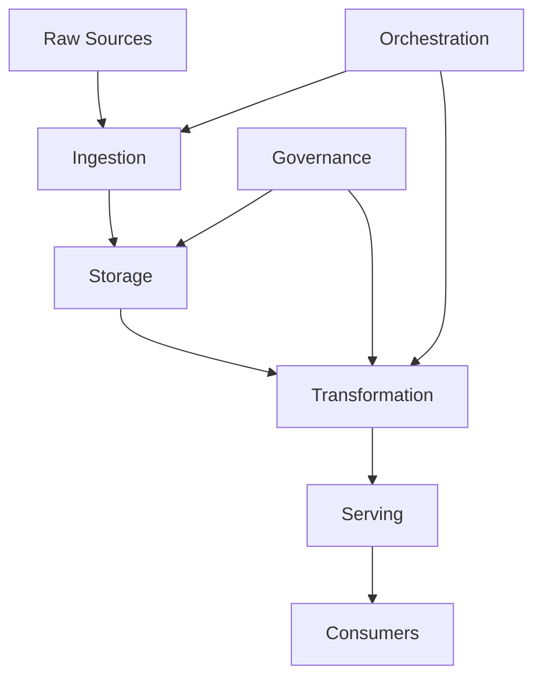

# The Data Engineering Landscape

## What problem does this solve?

Raw data is useless at scale. A company generating 10TB/day of events cannot let analysts query it directly — it is unstructured, unclean, and too slow. Data engineers build the systems that move, transform, store, and serve data reliably.

## How it works

| Layer | Tools |
|-------|-------|
| **Raw Sources** | DBs, APIs, Events, Files |
| **Ingestion** | Fivetran, Airbyte, Kafka, Debezium |
| **Storage** | Data Lake, Lakehouse, Warehouse |
| **Transformation** | Spark, dbt, SQL |
| **Serving** | Snowflake, Databricks SQL, BI Tools |
| **Consumers** | Analysts, Scientists, Apps |
| **Orchestration** | Airflow, Workflows |
| **Governance** | Unity Catalog, Great Expectations |

### Roles

| Role | Primary Tools | Focus |
|------|--------------|-------|
| Data Engineer | Spark, Airflow, dbt | Pipelines, infra, ingestion |
| Analytics Engineer | dbt, SQL | Transformation, serving layer |
| Data Scientist | Python, MLflow | ML models, experimentation |
| ML Engineer | Databricks, K8s | Model serving, feature platforms |
| Platform Engineer | Terraform, K8s | Infrastructure, governance |

## Real-world scenario

A retail company has 50 source systems. Without DE: analysts manually download CSV exports and join in Excel. With DE: all 50 sources ingest nightly into a lakehouse, transform into star schema tables, serve to Tableau dashboards refreshing every morning.

## What goes wrong in production

- **Silent schema breaks** — upstream changes a column type; pipeline runs, outputs NULLs. Fix: schema registry + contracts.
- **No monitoring** — jobs fail at 2am, nobody knows until 9am. Fix: SLA alerting on job completion.
- **Data silos** — each team pipes the same source differently. Fix: central platform team, shared ingestion layer.
- **No lineage** — wrong dashboard, no way to trace root cause. Fix: OpenLineage from day one.

## References
- [Fundamentals of Data Engineering — Reis & Housley](https://www.oreilly.com/library/view/fundamentals-of-data/9781098108298/)
- [Designing Data-Intensive Applications — Kleppmann](https://dataintensive.net/)
- [DAMA DMBOK](https://www.dama.org/cpages/body-of-knowledge)
