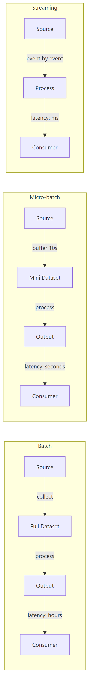

# Batch vs Streaming Processing

## What problem does this solve?

Not all data pipelines have the same latency requirements. Choosing wrong — streaming when batch suffices, or batch when freshness matters — wastes money or breaks SLAs.

## How it works

### Batch Processing
Data accumulates over a period (hours, days), then is processed all at once. Simple, cheap, high throughput. Latency = interval between runs.

### Streaming Processing
Data is processed record-by-record or in micro-batches as it arrives. Complex, more expensive, low latency. Latency = seconds to milliseconds.

### Micro-batch
Spark Structured Streaming processes data in small batches (seconds). Sits between pure streaming and batch. Good enough for most "near real-time" requirements.

## Decision Matrix

| Dimension | Batch | Micro-batch | Streaming |
|-----------|-------|-------------|-----------|
| Latency requirement | Hours acceptable | Minutes acceptable | Seconds required |
| Complexity | Low | Medium | High |
| Cost | Low | Medium | High |
| Fault tolerance | Easy | Medium | Hard |
| Use case | Nightly reports | Dashboards | Fraud detection, alerting |
| Tools | Spark batch, dbt | Spark Structured Streaming | Flink, Kafka Streams |

## Real-world scenario

An e-commerce company runs:
- **Batch**: nightly revenue report aggregating all orders from the day (acceptable 6am delivery)
- **Micro-batch**: inventory dashboard refreshing every 60 seconds (analysts need "near real-time")
- **Streaming**: fraud scoring per transaction as it hits payment gateway (must block card in <500ms)

## What goes wrong in production

- **Over-engineering with streaming** — team builds Kafka pipeline for a report that runs once a day. Streaming added cost and complexity for zero benefit.
- **Batch too slow for the use case** — fraud detection runs hourly batch; fraudulent transactions go through for 59 minutes.
- **Micro-batch checkpoint bloat** — checkpoints grow unbounded and slow down recovery. Set retention policies.

## References
- [Designing Data-Intensive Applications Ch. 10-11](https://dataintensive.net/)
- [Jay Kreps — Questioning the Lambda Architecture](https://www.oreilly.com/radar/questioning-the-lambda-architecture/)
- [Spark Structured Streaming Guide](https://spark.apache.org/docs/latest/structured-streaming-programming-guide.html)
