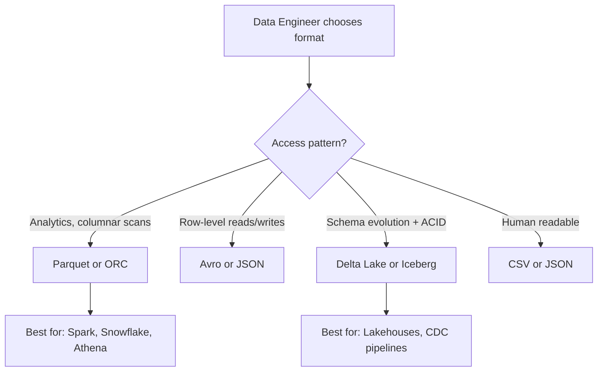

# Storage Concepts for Data Engineers

## What problem does this solve?

Picking the wrong storage type kills performance and inflates cost. Object storage, block storage, and file formats each have different characteristics that determine where they fit in a data platform.

## How it works

### Storage Types

| Type | Examples | Characteristics | Use in DE |
|------|---------|----------------|-----------|
| Object Storage | S3, ADLS Gen2, GCS | Infinitely scalable, cheap, eventually consistent, no random writes | Data lake, lakehouse foundation |
| Block Storage | EBS, Azure Disk | Fast random I/O, expensive, fixed size | Database volumes, OS disks |
| File Storage (NAS) | EFS, Azure Files | Shared filesystem, POSIX-compliant | Shared config, small datasets |
| Data Warehouse (managed) | Snowflake, BigQuery | Fully managed, columnar, auto-scaling compute | Analytics serving |

### File Formats

### Columnar vs Row Storage

**Row storage (CSV, JSON, Avro):**
- Entire row stored together
- Fast for: reading full records, inserts/updates
- Slow for: aggregations on few columns across millions of rows

**Columnar storage (Parquet, ORC):**
- Each column stored together
- Fast for: analytical queries (SUM, AVG, GROUP BY)
- Enables: column pruning (skip unread columns), compression per column
- Typical 10x compression vs CSV

## Cloud Object Storage Comparison

| Feature | AWS S3 | Azure ADLS Gen2 | GCP GCS |
|---------|--------|-----------------|---------|
| Hierarchical namespace | No (emulated) | Yes (native) | No (emulated) |
| POSIX ACLs | No | Yes | No |
| Databricks integration | Native | Native | Native |
| Snowflake external stage | Yes | Yes | Yes |
| Egress cost | High | High | High |

## Real-world scenario

A data team stored all processed data as CSV on S3. 500GB table, analysts running `SELECT SUM(revenue) FROM orders`. Query scans all 500GB, costs $2.50/query on Athena, takes 4 minutes. Migration to Parquet: same query scans 12GB (column pruning), costs $0.06, takes 18 seconds.

## What goes wrong in production

- **Small files problem** — streaming writes 1KB Parquet files every second; after a day you have 86,400 tiny files. Spark performance collapses. Fix: OPTIMIZE / compaction jobs.
- **Wrong format for CDC** — using Parquet for UPSERT pipelines; every update rewrites entire partition. Fix: Delta Lake or Iceberg for MERGE operations.
- **No partitioning** — 5TB unpartitioned table; every query scans all 5TB. Fix: partition by date/region at write time.

## References
- [AWS S3 Documentation](https://docs.aws.amazon.com/s3/)
- [Azure ADLS Gen2 Documentation](https://learn.microsoft.com/en-us/azure/storage/blobs/data-lake-storage-introduction)
- [GCP Cloud Storage Documentation](https://cloud.google.com/storage/docs)
- [Apache Parquet Documentation](https://parquet.apache.org/docs/)
