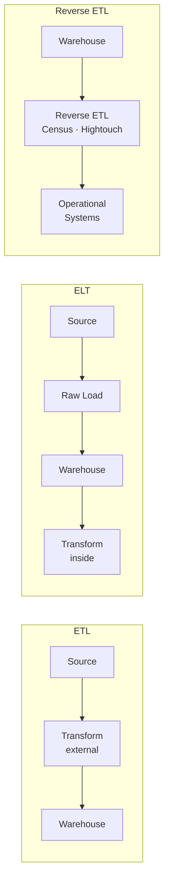

# Data Pipeline Patterns: ETL, ELT, Reverse ETL

## What problem does this solve?

The order and location of transformation determines cost, flexibility, and latency. Getting this wrong means rebuilding pipelines when requirements change.

## How it works

### ETL — Extract, Transform, Load
Transform data *before* loading into the destination. Traditional approach, born when warehouse storage was expensive.

```
Source → [Extract] → Staging Area → [Transform] → [Load] → Warehouse
```

**When to use:** Legacy systems, strict data residency requirements, destination has limited compute.

### ELT — Extract, Load, Transform
Load raw data first, transform inside the destination using its compute. Modern approach enabled by cheap cloud storage and scalable MPP warehouses.

```
Source → [Extract] → [Load] → Data Lake/Warehouse → [Transform with dbt/Spark]
```

**When to use:** Modern cloud data stack (Snowflake, Databricks), need raw data preserved, transformation requirements change often.

### Reverse ETL
Move transformed data *out* of the warehouse back into operational systems (CRM, marketing tools, product DB).

```
Warehouse/Lakehouse → [Reverse ETL Tool] → Salesforce · HubSpot · Product DB
```

**When to use:** Activating analytics data in operational workflows (e.g., customer health scores in Salesforce).



## Comparison

| Dimension | ETL | ELT | Reverse ETL |
|-----------|-----|-----|-------------|
| Transform location | External | Inside destination | Inside destination |
| Raw data preserved? | No | Yes | N/A |
| Schema flexibility | Low | High | Medium |
| Tools | Informatica, SSIS | dbt, Spark | Census, Hightouch |
| Best for | Legacy, regulated | Modern cloud | Activation use cases |

## Real-world scenario

**ETL (legacy):** Bank runs nightly Informatica jobs that extract from 8 core banking systems, transform into regulatory format, and load to Oracle DW. Changing a transformation requires DBA approval and 2-week release cycle.

**ELT (modern):** SaaS company uses Fivetran to land raw Stripe, Salesforce, and Postgres data into Snowflake. dbt runs transformations in Snowflake compute. Analytics engineers can ship new models in hours.

**Reverse ETL:** Same company uses Census to sync customer health scores from Snowflake back to Salesforce, so sales reps see ML-computed churn risk directly in their CRM.

## What goes wrong in production

- **ELT without governance** — raw data lands in the lake with no schema enforcement; analysts query wrong tables, trust breaks down.
- **ETL bottleneck** — transform server becomes a single point of failure; one slow job blocks the entire pipeline.
- **Reverse ETL rate limits** — pushing 500K records to Salesforce API hits daily limits; operations fail silently.

## References
- [Fivetran ELT Guide](https://www.fivetran.com/blog/elt-vs-etl)
- [dbt Documentation](https://docs.getdbt.com/)
- [Census Reverse ETL](https://www.getcensus.com/blog/what-is-reverse-etl)
