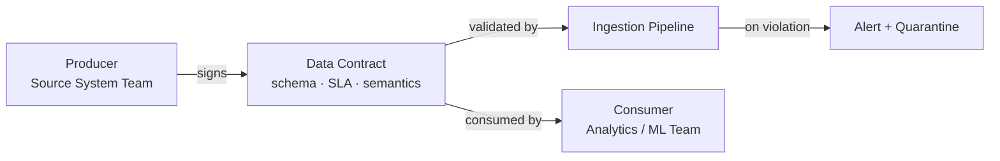

# Data Contracts

## What problem does this solve?

Pipelines break because upstream teams change schemas without warning. Data contracts are formal agreements between data producers and consumers that define the structure, semantics, and SLAs of a dataset — making breaking changes explicit and detectable.

## How it works

A data contract specifies:
- **Schema**: column names, types, nullability
- **Semantics**: what each field means
- **SLA**: freshness, availability, volume expectations
- **Owner**: who is accountable for the data



## Contract Structure (YAML example)

```yaml
# contracts/orders.yaml
id: orders-v2
version: "2.1.0"
owner: platform-team@company.com
description: "All customer orders from the e-commerce platform"

schema:
  - name: order_id
    type: STRING
    required: true
    unique: true
    description: "UUID, primary key"
  - name: customer_id
    type: STRING
    required: true
  - name: order_total
    type: DECIMAL(10,2)
    required: true
    checks:
      - order_total >= 0
  - name: created_at
    type: TIMESTAMP
    required: true

sla:
  freshness_hours: 1        # data must arrive within 1 hour of event
  availability_percent: 99.5
  volume:
    min_rows_per_day: 10000
    max_rows_per_day: 5000000

breaking_change_policy:
  notice_days: 14
  approval_required: [consumer-team-1, consumer-team-2]
```

## Enforcing contracts in a pipeline

```python
# Great Expectations enforcement at ingestion
import great_expectations as gx

context = gx.get_context()
suite = context.get_expectation_suite("orders_contract_v2")

# Validate incoming data against contract
results = context.run_checkpoint(
    checkpoint_name="orders_ingestion_checkpoint",
    validations=[{
        "batch_request": batch_request,
        "expectation_suite_name": "orders_contract_v2"
    }]
)

if not results["success"]:
    # Quarantine bad records, alert owner
    quarantine_bad_records(results)
    alert_contract_owner("orders-v2", results)
    raise ContractViolationError("Orders contract violated")
```

## Real-world scenario

An analytics team builds a revenue dashboard from the `orders` table. Without a contract, the payments team renames `order_total` to `total_amount` during a routine refactor. Dashboard shows $0 revenue for 4 hours before anyone notices. **With a contract**: the breaking change is detected at the ingestion checkpoint within minutes, the pipeline quarantines the bad batch, and the payments team is automatically notified of the violation before it ever reaches the dashboard.

## What goes wrong in production

- **Contracts exist but aren't enforced** — a YAML file nobody checks. Fix: validate at ingestion, block pipeline on violation.
- **No versioning** — v1 and v2 consumers exist simultaneously; can't evolve schema. Fix: semantic versioning + compatibility matrix.
- **Contracts too rigid** — adding a new optional column triggers violation. Fix: distinguish breaking vs non-breaking changes.

## References
- [Andrew Jones — Data Contracts](https://andrew-jones.com/blog/data-contracts/)
- [Data Contract Specification (open standard)](https://datacontract.com/)
- [Confluent Schema Registry](https://docs.confluent.io/platform/current/schema-registry/index.html)
