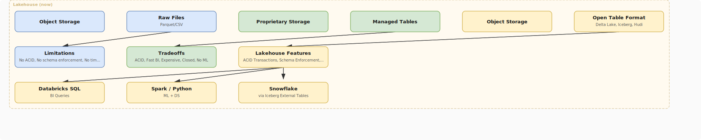

# Lakehouse Architecture

## What problem does this solve?

Data warehouses are fast but expensive and closed. Data lakes are cheap and flexible but lack ACID guarantees and performance. The lakehouse combines both: open table formats (Delta, Iceberg) on cheap object storage, with warehouse-grade performance and ACID transactions.

## How it works

<!-- Editable: open diagrams/00-foundations--06-lakehouse-architecture.drawio.svg in draw.io -->



### Key Properties of a Lakehouse

| Property | How achieved |
|----------|-------------|
| ACID transactions | Transaction log (Delta _delta_log, Iceberg metadata) |
| Schema enforcement | Table format schema validation at write |
| Time travel | Immutable snapshots in transaction log |
| Scalable compute | Separate compute from storage |
| Open format | Parquet + metadata layer; any engine can read |
| BI + ML on same data | One copy serves both workloads |

## Medallion Architecture (standard pattern)

```
Bronze (Raw)     →    Silver (Cleaned)    →    Gold (Serving)
────────────────       ─────────────────       ──────────────
- Raw ingestion        - Deduplication         - Aggregations
- Schema-on-read       - Type casting          - Star schema
- Immutable            - Null handling         - Business logic
- Append-only          - Schema-on-write       - Optimised for BI
- Full history         - PII masked            - dbt models
```

## Comparison

| Dimension | Data Lake | Data Warehouse | Lakehouse |
|-----------|-----------|---------------|-----------|
| Storage cost | Low | High | Low |
| Query performance | Low | High | High |
| ACID | No | Yes | Yes |
| ML support | Yes | Limited | Yes |
| Open format | Yes | No | Yes |
| Schema enforcement | Optional | Strict | Configurable |
| Examples | S3 + raw Parquet | Snowflake, Redshift | Databricks, Delta Lake |

## Real-world scenario

A fintech company had two systems: a Redshift DW for BI (fast, expensive, closed, no ML) and an S3 data lake for ML (slow, no schema, engineers only). The two systems drifted apart — different numbers for the same metric. Migration to Delta Lake on S3 with Databricks: one copy of data serves both BI (Databricks SQL) and ML (Spark/Python). Numbers match because there's one source of truth.

## What goes wrong in production

- **Swamp not lake** — landing everything in Bronze with no governance, no cataloguing. Analysts can't find data. Fix: Unity Catalog or Snowflake Horizon from day one.
- **Gold layer too wide** — one massive Gold table tries to serve every use case. 500 columns, nobody knows what they mean. Fix: purpose-built Gold tables per domain.
- **Compute-storage coupling** — teams spin up always-on clusters to query lake. Costs explode. Fix: serverless SQL endpoints, auto-termination.

## References
- [Databricks Lakehouse Paper — CIDR 2021](https://www.cidrdb.org/cidr2021/papers/cidr2021_paper17.pdf)
- [Databricks Medallion Architecture](https://www.databricks.com/glossary/medallion-architecture)
- [Delta Lake Documentation](https://docs.delta.io/latest/index.html)
- [Apache Iceberg Documentation](https://iceberg.apache.org/docs/latest/)
