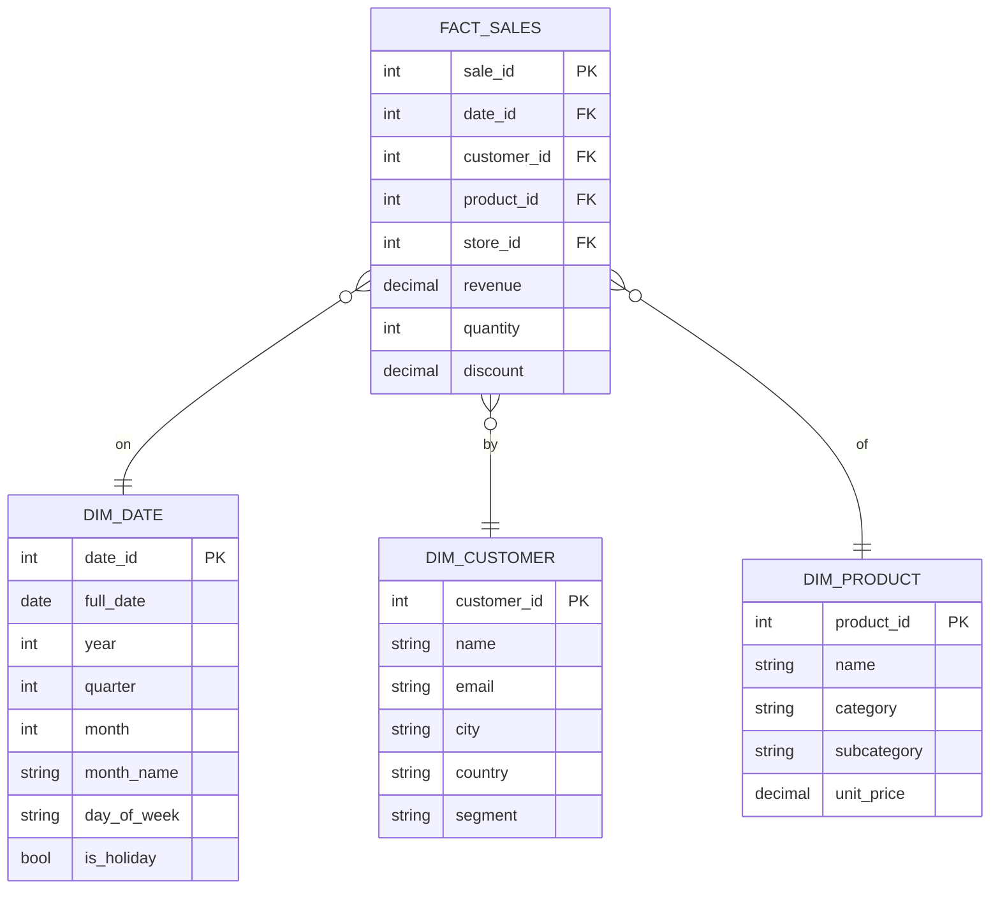

# Star Schema (Kimball Dimensional Modeling)

## What problem does this solve?
Normalised OLTP schemas are optimised for writes, not reads. Analysts need to answer business questions fast — "revenue by region by product category last quarter." A star schema makes these queries simple, fast, and intuitive.

## How it works



### Facts vs Dimensions

| | Fact Table | Dimension Table |
|-|-----------|----------------|
| Contains | Measurements / metrics | Descriptive attributes |
| Grain | One row per event/transaction | One row per entity |
| Size | Very large (billions of rows) | Smaller (thousands–millions) |
| Updates | Append-only usually | Changes over time (SCD) |
| Examples | orders, page_views, payments | customer, product, date, store |

### Surrogate Keys
Dimensions use integer surrogate keys (not business keys like email or SKU). Reasons:
- Insulates fact table from source system changes
- Supports SCD Type 2 (multiple versions of a dimension row)
- Integer joins are faster than string joins

```sql
-- Query: revenue by product category, last quarter
SELECT
    p.category,
    SUM(f.revenue) AS total_revenue
FROM fact_sales f
JOIN dim_product p ON f.product_id = p.product_id
JOIN dim_date d ON f.date_id = d.date_id
WHERE d.year = 2025 AND d.quarter = 4
GROUP BY p.category
ORDER BY total_revenue DESC;
```

## Real-world scenario
E-commerce company: 500M fact rows, 5 dimensions. Analysts query in Snowflake or Databricks SQL. Star schema allows the query above to run in <10 seconds via partition pruning on `dim_date` and column pruning on columnar storage.

## What goes wrong in production
- **Missing date dimension** — joining on raw timestamp prevents partition pruning. Always materialise a `dim_date`.
- **Too many dimensions (galaxy schema)** — fact table with 20 FK columns. Hard to query, hard to maintain. Split into multiple subject-area stars.
- **Degenerate dimensions inline** — putting `order_status` directly in the fact instead of a dim. Fine for low-cardinality, but loses extensibility.

## References
- [Kimball Group — The Data Warehouse Toolkit](https://www.kimballgroup.com/data-warehouse-business-intelligence-resources/books/data-warehouse-dw-toolkit/)
- [Kimball — Fact Table Design](https://www.kimballgroup.com/2008/11/fact-tables/)
