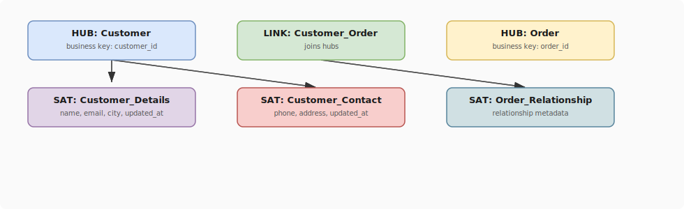

# Data Vault 2.0 Concepts

## What problem does this solve?
Kimball and Inmon models require rebuilding when source systems change. Data Vault is designed for agility — you can add new sources without touching existing structures. It also preserves full raw history with full auditability, making it ideal for regulated industries.

## How it works

Data Vault has three core entity types:

<!-- Editable: open diagrams/01-data-modeling--04-data-vault-concepts.drawio.svg in draw.io -->



### Hubs — Business Keys
Store unique business keys. Never change. One row per unique business entity.

```sql
CREATE TABLE hub_customer (
    customer_hk     VARCHAR NOT NULL PRIMARY KEY,  -- MD5/SHA hash of business key
    customer_bk     VARCHAR NOT NULL,               -- raw business key (e.g., "CUST-001")
    load_date       TIMESTAMP NOT NULL,
    record_source   VARCHAR NOT NULL                -- "CRM", "ERP", etc.
);
```

### Links — Relationships
Capture associations between hubs. Immutable — never updated.

```sql
CREATE TABLE link_customer_order (
    customer_order_hk  VARCHAR NOT NULL PRIMARY KEY,  -- hash of both BKs
    customer_hk        VARCHAR NOT NULL REFERENCES hub_customer,
    order_hk           VARCHAR NOT NULL REFERENCES hub_order,
    load_date          TIMESTAMP NOT NULL,
    record_source      VARCHAR NOT NULL
);
```

### Satellites — Descriptive Attributes
Store all descriptive data with full history. One row per change.

```sql
CREATE TABLE sat_customer_details (
    customer_hk     VARCHAR NOT NULL REFERENCES hub_customer,
    load_date       TIMESTAMP NOT NULL,
    load_end_date   TIMESTAMP,              -- null = current row
    record_source   VARCHAR NOT NULL,
    name            VARCHAR,
    email           VARCHAR,
    city            VARCHAR,
    hash_diff       VARCHAR NOT NULL,       -- detects attribute changes
    PRIMARY KEY (customer_hk, load_date)
);
```

## Loading pattern

```python
# PySpark: load hub (idempotent)
from pyspark.sql import functions as F

raw_customers = spark.table("bronze.crm_customers")

hub_rows = raw_customers.select(
    F.md5(F.col("customer_id").cast("string")).alias("customer_hk"),
    F.col("customer_id").alias("customer_bk"),
    F.current_timestamp().alias("load_date"),
    F.lit("CRM").alias("record_source")
).dropDuplicates(["customer_hk"])

# Merge into hub (insert-only, never update)
from delta.tables import DeltaTable
DeltaTable.forName(spark, "silver.hub_customer").alias("h") \
    .merge(hub_rows.alias("s"), "h.customer_hk = s.customer_hk") \
    .whenNotMatchedInsertAll().execute()
```

## Data Vault vs Kimball

| Dimension | Data Vault | Kimball Star |
|-----------|-----------|-------------|
| Auditability | Full — every load tracked | Partial |
| Schema change agility | High — add satellites without breaking | Medium |
| Query complexity | High — many joins needed | Low — intuitive for analysts |
| Serving layer | Needs Information Mart on top | Is the serving layer |
| Best for | Raw/integration layer | Gold/serving layer |

## Real-world scenario
Insurance company ingests from 15 source systems. New system added mid-year — in Kimball, this required schema changes. In Data Vault: add a new satellite and a new record_source tag. Existing queries unaffected.

## What goes wrong in production
- **Querying Data Vault directly** — business users struggle with the join complexity. Always build a Business Vault / Information Mart (star schema) on top.
- **Wrong hash algorithm** — mixing MD5 and SHA-256 for hash keys breaks joins across tables. Standardise across the whole vault.

## References
- [Dan Linstedt — Building a Scalable Data Warehouse with Data Vault 2.0](https://www.sciencedirect.com/book/9780128025109)
- [Data Vault Alliance Standards](https://datavaultalliance.com/news/dv-2-0-standards/)
- [AutomateDV (dbt package for Data Vault)](https://automate-dv.readthedocs.io/en/latest/)
