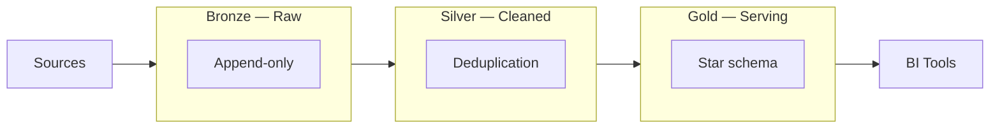

# Medallion Architecture (Bronze / Silver / Gold)

## What problem does this solve?
Without layering, data engineers either overwrite raw data (losing auditability) or analysts query messy raw data (getting wrong answers). Medallion architecture separates concerns: raw ingestion, cleaning, and serving are distinct layers with different ownership and guarantees.

## How it works



| Node | Details |
|------|---------|
| **Sources** | DBs, APIs, Events |
| **Append-only** (Bronze) | Schema-on-read, Full history, No transformations |
| **Deduplication** (Silver) | Type casting, Null handling, PII masked, Schema enforced |
| **Star schema** (Gold) | Aggregations, Business logic, Optimised for BI/ML |
| **BI Tools** | ML Models, APIs |

### Layer Responsibilities

| Layer | Purpose | Who owns | Data format | ACID? |
|-------|---------|----------|-------------|-------|
| Bronze | Raw ingestion, full history | Data Engineering | Delta (raw) | Yes |
| Silver | Cleaned, deduplicated, typed | Data Engineering | Delta | Yes |
| Gold | Business-ready serving tables | Analytics Engineering | Delta / Iceberg | Yes |

### Bronze Rules
- Append-only where possible
- Never delete raw data
- Store exactly as received (schema-on-read)
- Tag with `ingest_timestamp` and `source_system`

### Silver Rules
- Schema enforced (schema-on-write)
- One authoritative row per entity per event
- PII masked or tokenised
- Data quality checks passed (or quarantined)

### Gold Rules
- Named for business consumption (e.g., `fact_orders`, `dim_customer`)
- Owned by Analytics Engineers via dbt
- SLAs defined for freshness
- Documented in data catalogue

## Code example (PySpark, Bronze → Silver)

```python
from pyspark.sql import functions as F
from pyspark.sql.types import *
from delta.tables import DeltaTable

# Read Bronze (raw)
bronze = spark.readStream \
    .format("delta") \
    .table("bronze.crm_customers")

def process_to_silver(df, epoch_id):
    clean = df \
        .dropDuplicates(["customer_id", "updated_at"]) \
        .withColumn("email", F.lower(F.trim(F.col("email")))) \
        .withColumn("phone", F.regexp_replace(F.col("phone"), r"[^0-9+]", "")) \
        .filter(F.col("customer_id").isNotNull()) \
        .withColumn("_ingest_ts", F.current_timestamp())

    # Merge into Silver (SCD Type 1 upsert)
    DeltaTable.forName(spark, "silver.customers").alias("t") \
        .merge(clean.alias("s"), "t.customer_id = s.customer_id") \
        .whenMatchedUpdateAll() \
        .whenNotMatchedInsertAll() \
        .execute()

bronze.writeStream \
    .foreachBatch(process_to_silver) \
    .option("checkpointLocation", "/checkpoints/crm_customers_silver") \
    .start()
```

## Real-world scenario
Fintech company: 50 source systems land in Bronze. Silver dedups and masks card numbers. Gold has `fact_transactions`, `dim_merchant`, `dim_customer` — served to Tableau (BI) and the fraud ML model (Databricks ML). Same Silver tables serve both Gold consumers. One source of truth.

## What goes wrong in production
- **Gold too wide** — one 500-column Gold table tries to serve everyone. Queries are slow, documentation is impossible. Fix: purpose-built Gold tables per domain/use case.
- **Skipping Bronze** — writing transformed data directly. When transformation logic is wrong, you have no raw data to reprocess from.
- **Silver re-doing Bronze work** — complex parsing in Silver that should have been Bronze ingestion. Keep Bronze simple.

## References
- [Databricks Medallion Architecture](https://www.databricks.com/glossary/medallion-architecture)
- [dbt Project Structure Best Practices](https://docs.getdbt.com/best-practices/how-we-structure/1-guide-overview)
