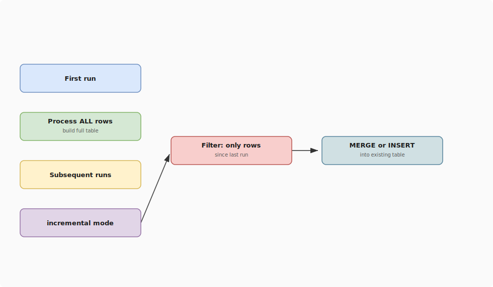

# dbt Incremental Models

## What problem does this solve?
Full table refreshes on 500M-row fact tables take 30+ minutes and cost significant compute. Incremental models process only new/changed rows, reducing run time from 30 minutes to 30 seconds.

## How it works

<!-- Editable: open diagrams/01-data-modeling--07-incremental-models.drawio.svg in draw.io -->



### Strategies

| Strategy | Behaviour | When to use |
|----------|-----------|-------------|
| `append` | INSERT new rows only | Immutable events, no late arrivals |
| `merge` | UPSERT by unique key | Records can update (orders, users) |
| `delete+insert` | DELETE partition + INSERT | Partition-level corrections |
| `insert_overwrite` | Overwrite whole partition | Databricks/Spark, large partitions |

### Append strategy (simplest)
```sql
-- models/marts/fact_events.sql
{{
  config(
    materialized='incremental',
    incremental_strategy='append'
  )
}}

SELECT
    event_id,
    user_id,
    event_type,
    occurred_at
FROM {{ ref('stg_events') }}


  WHERE occurred_at > (SELECT MAX(occurred_at) FROM {{ this }})

```

### Merge strategy (most common)
```sql
-- models/marts/fact_orders.sql
{{
  config(
    materialized='incremental',
    incremental_strategy='merge',
    unique_key='order_id',
    merge_update_columns=['status', 'updated_at', 'total_amount']
  )
}}

SELECT
    order_id,
    customer_id,
    status,
    total_amount,
    created_at,
    updated_at
FROM {{ ref('stg_orders') }}


  WHERE updated_at > (SELECT MAX(updated_at) FROM {{ this }})

```

### Databricks (insert_overwrite)
```sql
{{
  config(
    materialized='incremental',
    incremental_strategy='insert_overwrite',
    partition_by={'field': 'event_date', 'data_type': 'date'},
    file_format='delta'
  )
}}
```

## Real-world scenario
E-commerce fact_orders table: 800M rows, 3 years history. Full refresh: 45 minutes, $12 compute cost. Incremental (merge on order_id, filtering updated_at > last run): 90 seconds, $0.40. Orders that are updated (status changes from "placed" to "shipped") are correctly merged. Net result: 97% cost reduction, always-fresh data.

## What goes wrong in production
- **Late-arriving data outside the filter window** — incremental filters on `updated_at > last run`, but a record arrives 3 days late with an old `updated_at`. It never gets processed. Fix: use a lookback window (`updated_at > last_run - INTERVAL 3 DAY`) or periodic full-refresh.
- **Unique key not actually unique** — merge creates duplicate rows. Always test `unique` on the key column.
- **Forgetting `--full-refresh` after schema change** — adding a column to incremental model doesn't affect the existing table. Run `dbt run --full-refresh --select model_name`.

## References
- [dbt Incremental Models](https://docs.getdbt.com/docs/build/incremental-models)
- [dbt Incremental Strategies](https://docs.getdbt.com/docs/build/incremental-strategy)
