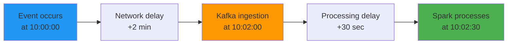

# Event Time vs Processing Time

## What problem does this solve?
Streaming systems deal with two clocks: when an event *happened* vs when the system *processed* it. Confusing them produces wrong aggregations — especially for windowed analytics.

## How it works



| Clock | What it measures | Controlled by |
|-------|-----------------|---------------|
| Event time | When the event actually occurred | The producing system |
| Ingestion time | When Kafka/broker received it | Network + producer |
| Processing time | When your job processed it | Your cluster, backlog |

### Why it matters: wrong aggregation

```
You want: "How many payments per minute based on when payment was made?"

Using processing time:
  10:02 window → 150 payments  (some from 10:00, some from 10:01 — wrong!)

Using event time:
  10:00 window → 100 payments  (exactly the payments made at 10:00 — correct)
  10:01 window → 95 payments
```

### Spark Structured Streaming: event time windows

```python
from pyspark.sql import functions as F

payments_stream = spark.readStream \
    .format("kafka") \
    .option("kafka.bootstrap.servers", "broker:9092") \
    .option("subscribe", "payments") \
    .load() \
    .select(F.from_json(F.col("value").cast("string"), schema).alias("data")) \
    .select("data.*")

windowed = payments_stream \
    .withWatermark("event_timestamp", "5 minutes") \  # allow 5 min late data
    .groupBy(
        F.window(F.col("event_timestamp"), "1 minute"),  # event-time window
        F.col("currency")
    ) \
    .agg(F.sum("amount").alias("total_amount"))

windowed.writeStream.format("delta").outputMode("append") \
    .option("checkpointLocation", "/chk/payments_agg").start()
```

## Real-world scenario
Mobile app: users often go offline and actions are buffered locally. A user makes a purchase at 10:00 while underground. Phone reconnects at 10:45. Event arrives in Kafka at 10:45 but `event_timestamp` = 10:00. Processing time window would put it in the 10:45 bucket. Event time window with a 60-minute watermark correctly attributes it to the 10:00 bucket.

## What goes wrong in production
- **No watermark set** — Spark holds state for all late events forever, memory grows unboundedly. Always set a watermark.
- **Watermark too tight** — watermark of 30 seconds on a mobile app where events can arrive 30 minutes late. Most late events are dropped. Tune watermark to P99 latency of your producers.
- **Using processing time for regulatory reporting** — regulators want event time. Using processing time means transactions shift between reporting periods.

## References
- [Google Dataflow / Beam Paper](https://research.google/pubs/pub43864/)
- [Spark Structured Streaming — Handling Late Data](https://spark.apache.org/docs/latest/structured-streaming-programming-guide.html#handling-late-data-and-watermarking)
- [Flink Time Concepts](https://nightlies.apache.org/flink/flink-docs-stable/docs/concepts/time/)
