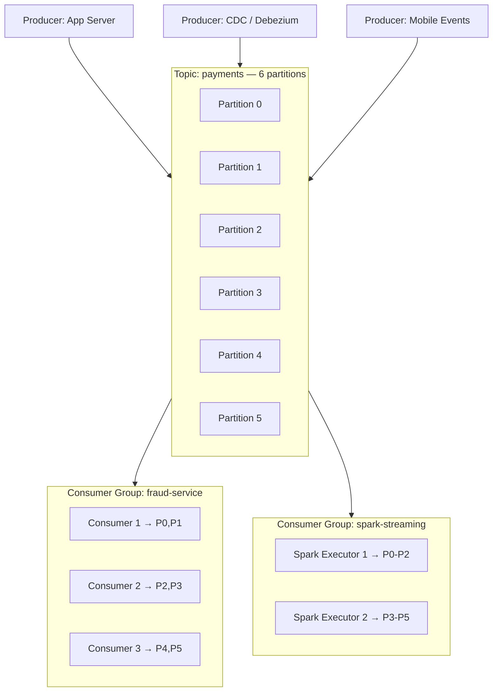

# Apache Kafka Architecture

## What problem does this solve?
Systems need to communicate asynchronously at high throughput without tight coupling. Kafka is a distributed commit log that decouples producers from consumers, retains messages durably, and scales to millions of events/second.

## How it works



### Core Concepts

| Concept | Description |
|---------|-------------|
| **Topic** | Named category of messages. Logical grouping. |
| **Partition** | Ordered, immutable sequence of records within a topic. Unit of parallelism. |
| **Offset** | Position of a record within a partition. Monotonically increasing. |
| **Consumer Group** | Set of consumers sharing work. Each partition assigned to one consumer. |
| **Broker** | Kafka server. Stores partition data. Cluster = multiple brokers. |
| **Replication Factor** | Number of broker copies per partition. RF=3 survives 2 broker failures. |

### Retention
Kafka retains messages by time or size — not by whether consumers have read them.
```
# Keep 7 days of data regardless of consumers
retention.ms=604800000
# Or keep 100GB
retention.bytes=107374182400
```

### Partitioning strategy
```python
from confluent_kafka import Producer

# Messages with same key go to same partition (ordering guarantee)
producer.produce(
    topic='payments',
    key='customer_123',    # same customer → same partition → ordered
    value=json.dumps(payment_event)
)
```

## Performance numbers (reference)
- Single broker throughput: ~100MB/s write
- End-to-end latency: <10ms (producer → consumer)
- Retention: days to months of data
- Partitions per topic: 1–thousands (more = more parallelism, more overhead)

## Real-world scenario
Fintech: 50K payment events/second peak. Topic `payments` with 24 partitions across 6 brokers (4 partitions/broker). Fraud detection consumer group has 24 consumers (one per partition) for maximum parallelism. Spark Structured Streaming uses 24 executors. Both read the same topic independently — Kafka fans out for free.

## What goes wrong in production
- **Too few partitions** — you can increase partitions but message ordering per key is broken. Plan partition count upfront: target partitions ≥ max consumers you'll ever want.
- **Consumer group rebalancing** — one slow consumer triggers rebalance, all consumers pause. Fix: `max.poll.interval.ms`, `session.timeout.ms` tuning.
- **Log compaction misunderstood** — `cleanup.policy=compact` keeps only latest value per key. Old values are deleted. Don't use for append-only event logs.

## References
- [Apache Kafka Documentation](https://kafka.apache.org/documentation/)
- [Confluent Kafka Fundamentals](https://developer.confluent.io/courses/apache-kafka/get-started-hands-on/)
