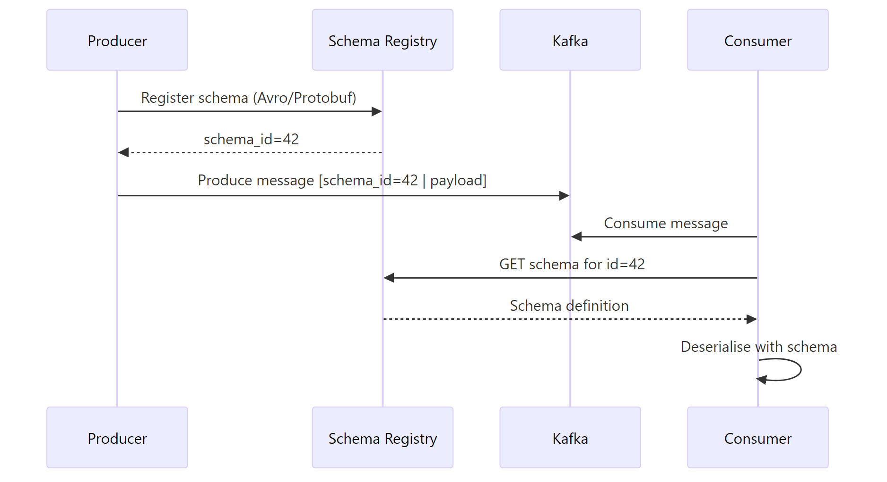

# Kafka Schema Registry

## What problem does this solve?
Without schema enforcement, producers can change message structure silently, breaking all consumers. Schema Registry enforces a contract on every message: producers validate before sending, consumers validate before deserialising.

## How it works



### Compatibility Modes

| Mode | Allowed changes | Breaks consumers? |
|------|----------------|------------------|
| `BACKWARD` | Add optional fields, delete fields | No (new consumers can read old data) |
| `FORWARD` | Delete optional fields, add fields | No (old consumers can read new data) |
| `FULL` | Add/delete optional fields only | No (both directions safe) |
| `NONE` | Anything | Possibly |

### Avro schema example

```json
{
  "type": "record",
  "name": "Payment",
  "namespace": "com.company.payments",
  "fields": [
    {"name": "payment_id", "type": "string"},
    {"name": "customer_id", "type": "string"},
    {"name": "amount", "type": "double"},
    {"name": "currency", "type": "string"},
    {"name": "timestamp", "type": "long", "logicalType": "timestamp-millis"},
    {"name": "metadata", "type": ["null", "string"], "default": null}
  ]
}
```

### Python producer with schema registry

```python
from confluent_kafka import Producer
from confluent_kafka.schema_registry import SchemaRegistryClient
from confluent_kafka.schema_registry.avro import AvroSerializer
from confluent_kafka.serialization import SerializationContext, MessageField

sr_client = SchemaRegistryClient({"url": "http://schema-registry:8081"})
avro_serializer = AvroSerializer(sr_client, schema_str, to_dict=lambda obj, ctx: obj.__dict__)

producer = Producer({"bootstrap.servers": "broker:9092"})

producer.produce(
    topic="payments",
    key=str(payment.payment_id),
    value=avro_serializer(payment, SerializationContext("payments", MessageField.VALUE))
)
```

### Spark consumer with schema registry

```python
from pyspark.sql import functions as F

# Using spark-avro + schema registry
payments = spark.readStream \
    .format("kafka") \
    .option("kafka.bootstrap.servers", "broker:9092") \
    .option("subscribe", "payments") \
    .load()

# Deserialise Avro (schema embedded via schema registry magic bytes)
from databricks.sdk.runtime import *
payments_decoded = payments \
    .select(F.from_avro(F.col("value"), schema_str).alias("data")) \
    .select("data.*")
```

## Real-world scenario
12 microservices produce to the `orders` topic. Without registry: team A renames `order_total` to `total_amount`. Team B's Spark job breaks silently — null values in `order_total`. With BACKWARD compatibility enforced: team A's schema change is **rejected** by the registry before deployment because removing a field violates backward compatibility. They must add the new name and deprecate the old.

## What goes wrong in production
- **NONE compatibility** — any schema breaks consumers. Always use BACKWARD as minimum.
- **Schema registry as SPOF** — consumers cache schemas but producers cannot produce if registry is down. Make it highly available (multi-node setup).
- **JSON without registry** — teams use JSON thinking it's flexible. One bad deploy adds an unexpected field, downstream type inference breaks. Use Avro or Protobuf.

## References
- [Confluent Schema Registry Documentation](https://docs.confluent.io/platform/current/schema-registry/index.html)
- [Azure Event Hubs Schema Registry](https://learn.microsoft.com/en-us/azure/event-hubs/schema-registry-overview)
