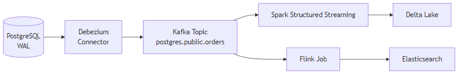

# Change Data Capture (CDC) Concepts

## What problem does this solve?
Nightly full table dumps are slow and expensive for large tables. CDC captures only what changed in the source database — inserts, updates, deletes — and streams them in near real-time to the data platform.

## How it works

### Log-based CDC (preferred)
Reads the database's write-ahead log (WAL/binlog/redo log) — the same log used for replication. No queries on source tables; zero additional load.



### Query-based CDC
Polls the source table periodically: `SELECT * WHERE updated_at > last_poll_time`. Adds load to source, misses deletes, requires `updated_at` column.

### Comparison

| | Log-based (Debezium) | Query-based |
|-|---------------------|-------------|
| Source load | Near zero | High (frequent queries) |
| Captures deletes? | Yes | No |
| Latency | Milliseconds | Minutes |
| Requires column | No | `updated_at` required |
| Complexity | Higher setup | Simple |
| Use for | Production, large tables | Small tables, legacy systems |

### CDC event structure (Debezium)

```json
{
  "op": "u",              // c=create, u=update, d=delete, r=snapshot
  "before": {             // row state before change (null for inserts)
    "order_id": 1001,
    "status": "placed"
  },
  "after": {              // row state after change (null for deletes)
    "order_id": 1001,
    "status": "shipped"
  },
  "source": {
    "db": "ecommerce",
    "table": "orders",
    "ts_ms": 1704067200000,
    "lsn": 12345678        // log sequence number
  }
}
```

### Applying CDC to Delta Lake

```python
from pyspark.sql import functions as F
from delta.tables import DeltaTable

def apply_cdc(batch_df, epoch_id):
    # Separate inserts/updates from deletes
    upserts = batch_df.filter(F.col("op").isin(["c", "u", "r"]))
    deletes = batch_df.filter(F.col("op") == "d")

    # Apply upserts
    if not upserts.isEmpty():
        DeltaTable.forName(spark, "silver.orders").alias("t") \
            .merge(upserts.select("after.*").alias("s"), "t.order_id = s.order_id") \
            .whenMatchedUpdateAll() \
            .whenNotMatchedInsertAll() \
            .execute()

    # Apply deletes (soft-delete pattern)
    if not deletes.isEmpty():
        delete_ids = deletes.select(F.col("before.order_id").alias("order_id"))
        DeltaTable.forName(spark, "silver.orders").alias("t") \
            .merge(delete_ids.alias("s"), "t.order_id = s.order_id") \
            .whenMatchedUpdate(set={"is_deleted": F.lit(True), "deleted_at": F.current_timestamp()}) \
            .execute()

spark.readStream.format("kafka") \
    .option("subscribe", "postgres.public.orders") \
    .load() \
    .select(F.from_json("value", cdc_schema).alias("cdc")).select("cdc.*") \
    .writeStream.foreachBatch(apply_cdc) \
    .option("checkpointLocation", "/chk/orders_cdc") \
    .start()
```

## Real-world scenario
Retailer: `orders` table in PostgreSQL, 2M updates/day (status changes as orders are packed, shipped, delivered). Nightly full dump: 8GB, takes 45 minutes, source DB load spikes. Debezium CDC: streams only the ~2M changed rows, latency <5 seconds, zero source load, Silver Delta table always current.

## What goes wrong in production
- **WAL retention too short** — if your CDC connector falls behind and WAL is purged, you lose changes. Set WAL retention >= 24 hours buffer.
- **Schema changes on source** — new column added to source table. Debezium handles most cases, but `ALTER TABLE DROP COLUMN` can break consumers. Use schema registry evolution.
- **Initial snapshot vs streaming gap** — Debezium takes initial snapshot (full table read) then switches to streaming. If snapshot takes 6 hours on a busy table, there's a gap window. Use `snapshot.mode=initial` carefully.

## References
- [Debezium Documentation](https://debezium.io/documentation/reference/stable/)
- [Databricks CDC Blog](https://www.databricks.com/blog/2021/06/09/how-to-simplify-cdc-with-delta-lakes-change-data-feed.html)
- [Snowflake Streams (native CDC)](https://docs.snowflake.com/en/user-guide/streams-intro)
