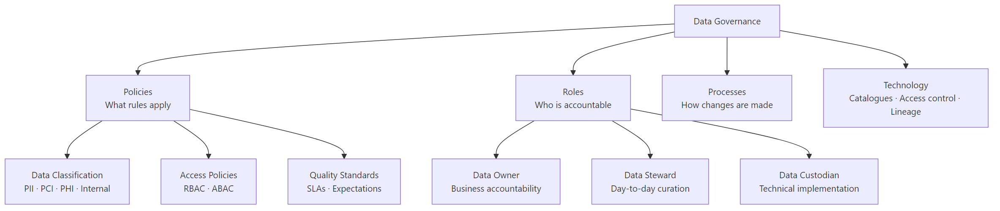

# What is Data Governance?

## What problem does this solve?
Without governance, data is untrustworthy, ungoverned PII creates regulatory risk, nobody knows who owns what, and "data swamps" replace useful data lakes. Governance makes data trustworthy, compliant, and discoverable.

## How it works

Data governance is the system of policies, processes, roles, and technologies that ensure data is managed as a strategic asset.

### The Four Pillars

| Pillar | What it covers | Examples |
|--------|---------------|---------|
| **Data Quality** | Accuracy, completeness, freshness | DQ rules, automated tests, SLAs |
| **Data Security** | Access control, masking, encryption | RBAC, column masking, PII detection |
| **Data Lineage** | Where data comes from, where it goes | OpenLineage, DataHub, Unity Catalog |
| **Data Discovery** | Finding and understanding data | Data catalogue, documentation, tags |

### Governance Roles

**Data Owner** — Business executive accountable for a data domain. Approves access requests, sets retention policy, responsible for accuracy.

**Data Steward** — Day-to-day domain expert. Curates metadata, resolves data quality issues, answers "what does this column mean?"

**Data Custodian** — Technical implementer. Builds pipelines, configures access controls, runs quality checks.

**Data Consumer** — Analyst/scientist/app. Requests access, reports quality issues, provides feedback.

## Federated vs Centralised Governance

| Model | Description | Best for |
|-------|------------|---------|
| Centralised | Central team controls all data, all policies | Small orgs, high compliance |
| Federated | Domain teams own data; central team owns standards | Large orgs, data mesh |
| Hybrid | Central standards, domain implementation | Most enterprises |

## Real-world scenario
Bank with no governance: 3 definitions of "active customer" across 5 teams, board-level reporting shows different numbers depending on the source. Regulatory audit finds PII stored in unsecured S3 buckets. With governance: one canonical `dim_customer` owned by the CRM domain team, `is_active` defined in the data catalogue, PII classified and masked at the platform level, access request workflow enforced.

## What goes wrong in production
- **Governance as an afterthought** — retrofitting governance onto 500 undocumented tables is painful. Build it from day one.
- **Too centralised** — central team becomes bottleneck for every access request. Federated model with clear standards scales better.
- **Governance without tooling** — spreadsheet-based data dictionaries nobody updates. Invest in a catalogue (DataHub, Unity Catalog, Collibra).

## References
- [DAMA DMBOK — Data Governance](https://www.dama.org/cpages/body-of-knowledge)
- [DGPO Data Governance Framework](https://datagovernance.com/the-data-governance-framework/)
- [Zhamak Dehghani — Data Mesh](https://www.oreilly.com/library/view/data-mesh/9781492092384/)
