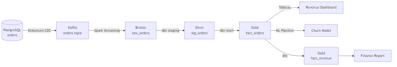

# Data Lineage

## What problem does this solve?
When a dashboard shows wrong numbers, how do you find the root cause? When a source table is deprecated, what breaks? Lineage answers: "where does this data come from, what transformed it, and where does it go?"

## How it works



### Lineage levels

| Level | Granularity | Example |
|-------|------------|---------|
| **Dataset lineage** | Table → Table | `raw_orders` feeds `stg_orders` |
| **Column lineage** | Column → Column | `stg_orders.total` derived from `raw_orders.amount * raw_orders.quantity` |
| **Job lineage** | Job → Dataset | Airflow DAG `orders_etl` produces `fact_orders` |

### OpenLineage standard

OpenLineage is an open specification for lineage events. Emitters in Spark, dbt, Airflow, Flink all emit the same event format to a compatible backend (DataHub, Marquez).

```json
{
  "eventType": "COMPLETE",
  "eventTime": "2024-01-15T10:30:00Z",
  "run": {"runId": "abc-123"},
  "job": {"namespace": "spark", "name": "silver.orders"},
  "inputs": [{"namespace": "delta", "name": "bronze.raw_orders"}],
  "outputs": [{"namespace": "delta", "name": "silver.orders"}]
}
```

### Enabling lineage in Databricks (Unity Catalog)

Unity Catalog captures column-level lineage automatically for SQL and DataFrame operations — no instrumentation needed.

```python
# Run any transformation — lineage captured automatically
spark.sql("""
    INSERT INTO silver.orders
    SELECT order_id, customer_id, total_amount * 1.09 AS total_with_tax
    FROM bronze.raw_orders
    WHERE status = 'confirmed'
""")

# Query lineage via API
import requests
response = requests.get(
    "https://<workspace>.azuredatabricks.net/api/2.0/lineage-tracking/column-lineages",
    headers={"Authorization": f"Bearer {token}"},
    json={"table_name": "silver.orders", "column_name": "total_with_tax"}
)
```

### Enabling lineage in dbt (to DataHub)

```yaml
# packages.yml
packages:
  - package: datahub-project/datahub_dbt
    version: 0.2.0
```

```bash
# Emit dbt lineage to DataHub after each run
dbt run && datahub ingest -c datahub_dbt.yml
```

## Real-world scenario
CFO asks why revenue dropped 12% in the dashboard. Without lineage: 3-day investigation manually tracing SQL across 15 tables. With DataHub lineage: engineer opens the revenue dashboard in DataHub, sees it reads from `fact_revenue`, which reads from `fact_orders`, which reads from `stg_orders`, which reads from `raw_orders`. Clicks `raw_orders` — sees last successful load was 36 hours ago (source outage). Root cause found in 5 minutes.

## What goes wrong in production
- **Lineage only at dataset level** — column-level is needed for "which upstream column broke this report column?" Dataset-level just shows table dependencies.
- **Lineage not capturing dynamic SQL** — string-concatenated SQL in Python bypasses automatic lineage capture. Use parameterised SQL or dbt models.
- **Stale lineage** — lineage captured at deploy time, not run time. A job that reads from different tables based on config shows wrong lineage. Runtime lineage (OpenLineage) is more accurate.

## References
- [OpenLineage Specification](https://openlineage.io/docs/)
- [DataHub Documentation](https://datahubproject.io/docs/)
- [Unity Catalog — Data Lineage](https://docs.databricks.com/en/data-governance/unity-catalog/data-lineage.html)
