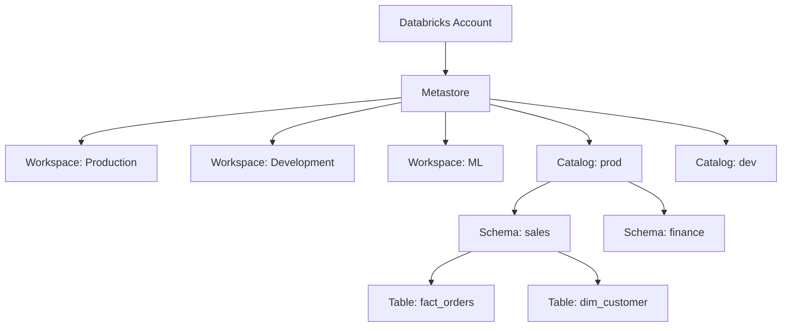

# Unity Catalog Overview

## What problem does this solve?
Before Unity Catalog, each Databricks workspace had its own Hive metastore — siloed, no cross-workspace governance, no column-level security, no lineage. Unity Catalog provides one governance layer across all workspaces, clouds, and personas.

## How it works



| Node | Details |
|------|---------|
| **Metastore** | one per region |

### Three-Level Namespace
`catalog.schema.table`
- **Catalog** — top-level container (replaces database in Hive)
- **Schema** — logical grouping (equivalent to schema/database)
- **Table/View** — the actual data object

```sql
-- Old (Hive): database.table
SELECT * FROM sales.orders;

-- New (Unity Catalog): catalog.schema.table
SELECT * FROM prod.sales.orders;

-- Create objects
CREATE CATALOG dev;
CREATE SCHEMA dev.sandbox;
CREATE TABLE dev.sandbox.test_orders AS SELECT * FROM prod.sales.fact_orders LIMIT 1000;
```

### RBAC in Unity Catalog

```sql
-- Grant on catalog (inherits to all schemas and tables)
GRANT USE CATALOG ON CATALOG prod TO `analysts`;

-- Grant on schema
GRANT USE SCHEMA ON SCHEMA prod.sales TO `analysts`;

-- Grant on table
GRANT SELECT ON TABLE prod.sales.fact_orders TO `analysts`;
GRANT MODIFY ON TABLE prod.sales.fact_orders TO `data_engineers`;

-- Revoke
REVOKE SELECT ON TABLE prod.sales.fact_orders FROM `analysts`;

-- Check privileges
SHOW GRANTS ON TABLE prod.sales.fact_orders;
```

### Row-level Security

```sql
-- Create row filter function
CREATE FUNCTION prod.security.country_filter(country STRING)
RETURN IS_ACCOUNT_GROUP_MEMBER('global_analysts')
    OR (country = current_user_country());  -- custom UDF returning user's country

-- Apply to table
ALTER TABLE prod.sales.fact_orders
SET ROW FILTER prod.security.country_filter ON (ship_country);

-- Analysts in 'singapore_team' group only see Singapore rows automatically
```

### Column Masking

```sql
-- Mask credit card numbers for non-admins
CREATE FUNCTION prod.security.mask_card(card_number STRING)
RETURN CASE
    WHEN IS_ACCOUNT_GROUP_MEMBER('pci_admins') THEN card_number
    ELSE CONCAT('****-****-****-', RIGHT(card_number, 4))
END;

ALTER TABLE prod.payments.transactions
ALTER COLUMN card_number SET MASK prod.security.mask_card;
```

### Audit Logging

```sql
-- Query audit logs (Unity Catalog system tables)
SELECT
    event_time,
    user_identity.email AS user,
    request_params.table_full_name AS table_accessed,
    action_name
FROM system.access.audit
WHERE action_name = 'commandSubmit'
  AND event_time >= CURRENT_TIMESTAMP - INTERVAL 24 HOURS
ORDER BY event_time DESC;
```

## Real-world scenario
Financial services firm: 3 Databricks workspaces (Prod, Dev, ML). Before UC: each workspace had its own ACLs, no way to enforce that Dev engineers couldn't access Prod customer PII, no lineage, no catalogue. After UC: one metastore, masking policies applied at the platform level so customer PII is masked in Dev automatically, column lineage from Bronze → Gold tracked automatically, access requests go through UC GRANT workflows with audit trail.

## What goes wrong in production
- **Forgetting `USE CATALOG`** — old Hive SQL using 2-level namespace fails silently or queries wrong catalog. Update all SQL to 3-level namespace.
- **Legacy credential passthrough** — deprecated in UC. Migrate to storage credentials + external locations.
- **Metastore region mismatch** — metastore must be in the same region as the storage account (ADLS/S3/GCS). Cross-region lineage tracking has latency.

## References
- [Unity Catalog Documentation](https://docs.databricks.com/en/data-governance/unity-catalog/index.html)
- [UC Privileges Reference](https://docs.databricks.com/en/data-governance/unity-catalog/manage-privileges/index.html)
- [UC Row Filters and Column Masks](https://docs.databricks.com/en/data-governance/unity-catalog/row-and-column-filters.html)
- [Azure Databricks UC Setup](https://learn.microsoft.com/en-us/azure/databricks/data-governance/unity-catalog/)
