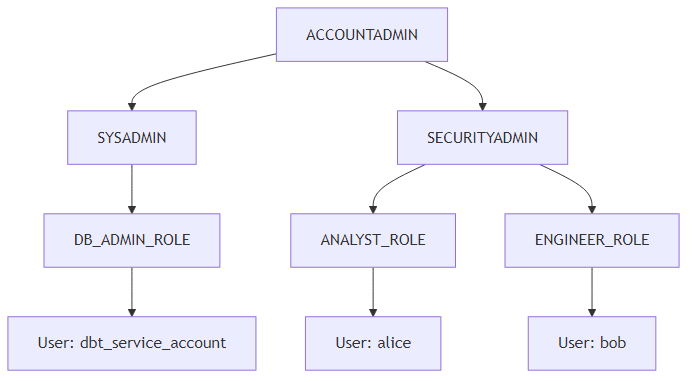

# Snowflake RBAC

## What problem does this solve?
Snowflake's access model is role-based — users don't have direct privileges, roles do. Understanding how to structure roles prevents both under-provisioning (engineers can't do their jobs) and over-provisioning (analysts can see PII they shouldn't).

## How it works



### System Roles

| Role | Purpose | Should humans use? |
|------|---------|-------------------|
| `ACCOUNTADMIN` | Billing, account-level settings | Only for account management |
| `SECURITYADMIN` | Role management, grants | Security team only |
| `SYSADMIN` | Create databases, warehouses | Platform team |
| `PUBLIC` | Default for all users | Read-only on public objects |

### Custom role hierarchy pattern

```sql
-- Create custom roles
CREATE ROLE analyst_role;
CREATE ROLE engineer_role;
CREATE ROLE pci_admin_role;

-- Grant object privileges to roles
GRANT USAGE ON DATABASE prod TO ROLE analyst_role;
GRANT USAGE ON SCHEMA prod.sales TO ROLE analyst_role;
GRANT SELECT ON ALL TABLES IN SCHEMA prod.sales TO ROLE analyst_role;
GRANT SELECT ON FUTURE TABLES IN SCHEMA prod.sales TO ROLE analyst_role;

-- Engineers can write
GRANT INSERT, UPDATE ON ALL TABLES IN SCHEMA prod.sales TO ROLE engineer_role;

-- Role hierarchy (analyst inherits through SECURITYADMIN)
GRANT ROLE analyst_role TO ROLE sysadmin;

-- Assign roles to users
GRANT ROLE analyst_role TO USER alice;
GRANT ROLE engineer_role TO USER bob;
```

### Dynamic Data Masking

```sql
-- Policy: mask email unless user has pii_admin role
CREATE MASKING POLICY email_mask AS (email VARCHAR)
RETURNS VARCHAR ->
    CASE
        WHEN CURRENT_ROLE() IN ('PCI_ADMIN_ROLE', 'SYSADMIN') THEN email
        ELSE REGEXP_REPLACE(email, '.+@', '***@')
    END;

-- Apply to column
ALTER TABLE prod.customers.customer_dim
MODIFY COLUMN email SET MASKING POLICY email_mask;

-- Analyst queries: alice@company.com → ***@company.com
-- Admin queries: alice@company.com (unmasked)
```

### Row Access Policies

```sql
-- Policy: users only see their region's data
CREATE ROW ACCESS POLICY region_filter AS (region VARCHAR)
RETURNS BOOLEAN ->
    CURRENT_ROLE() = 'GLOBAL_ANALYST'
    OR region = (
        SELECT user_region FROM prod.security.user_region_mapping
        WHERE username = CURRENT_USER()
    );

ALTER TABLE prod.sales.fact_orders
ADD ROW ACCESS POLICY region_filter ON (ship_region);
```

## Real-world scenario
Global retailer: 12 regional analyst teams. Each should only see their region's data. Without row access policies: 12 separate views, manual maintenance, engineers forget to update when schema changes. With row access policy: one policy on `fact_orders`, regional filter applied automatically based on the user's mapping in `user_region_mapping`. New region = add one row to the mapping table.

## What goes wrong in production
- **Everything under ACCOUNTADMIN** — accidental DROP DATABASE becomes possible. Principle of least privilege.
- **No FUTURE GRANTS** — new tables created after the GRANT are not covered. Always add `GRANT SELECT ON FUTURE TABLES IN SCHEMA`.
- **Masking policy bypassed by cloning** — `CREATE TABLE new_table CLONE masked_table` — clone inherits structure but NOT masking policies. Policies must be reapplied.

## References
- [Snowflake RBAC Documentation](https://docs.snowflake.com/en/user-guide/security-access-control-overview)
- [Snowflake Dynamic Data Masking](https://docs.snowflake.com/en/user-guide/security-column-ddm-use)
- [Snowflake Row Access Policies](https://docs.snowflake.com/en/user-guide/security-row-intro)
- [Snowflake Horizon Governance](https://docs.snowflake.com/en/guides-overview-govern)
