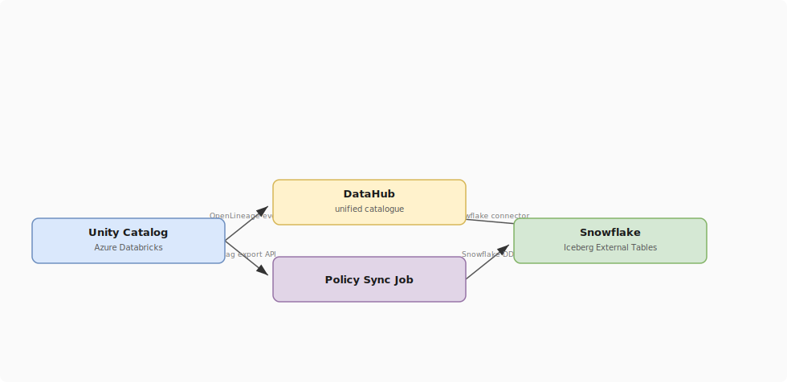

# Cross-Platform Governance: Databricks + Snowflake

## What problem does this solve?
Organisations using both Databricks (for ML and Spark ETL) and Snowflake (for SQL analytics) need consistent governance — data classified as CONFIDENTIAL in Databricks Unity Catalog should also be masked in Snowflake, and lineage should be traceable across both platforms.

## How it works

<!-- Editable: open diagrams/03-governance--06-cross-platform-governance.drawio.svg in draw.io -->



### Governance alignment checklist

| Capability | Databricks (UC) | Snowflake (Horizon) | Sync needed? |
|---|---|---|---|
| Column masking | Column mask functions | Dynamic Data Masking policies | Yes — apply equivalent policies |
| Row filtering | Row filter functions | Row access policies | Yes — equivalent logic |
| Object tagging | UC tags (key-value) | Object tags + system tags | Yes — export UC tags |
| Audit logging | system.access.audit | snowflake.account_usage.access_history | No — each platform has its own |
| Lineage | UC column lineage | Access history (not full lineage) | DataHub bridges both |
| RBAC | GRANT statements | GRANT statements + roles | Manual alignment |

### Zero-copy data access via Delta UniForm

```sql
-- Databricks: enable UniForm on shared Gold tables
ALTER TABLE prod.gold.fact_orders
    SET TBLPROPERTIES ('delta.universalFormat.enabledFormats' = 'iceberg');

-- Snowflake: create external Iceberg table (reads from Azure/GCS)
CREATE EXTERNAL VOLUME adls_vol
    STORAGE_LOCATIONS = (
        (NAME = 'adls-prod'
         STORAGE_PROVIDER = 'AZURE'
         STORAGE_BASE_URL = 'azure://mystorageacct.blob.core.windows.net/gold/'
         AZURE_TENANT_ID = 'xxx')
    );

CREATE ICEBERG TABLE prod_sf.gold.fact_orders
    EXTERNAL_VOLUME = 'adls_vol'
    CATALOG = 'OBJECT_STORE'
    BASE_LOCATION = 'fact_orders/';

-- Apply Snowflake governance on top (same rules as UC)
ALTER TABLE prod_sf.gold.fact_orders
    ADD ROW ACCESS POLICY region_access ON (ship_region);
```

### DataHub as unified lineage layer

```yaml
# datahub-recipe-combined.yml — ingest from both platforms
# Run daily: datahub ingest -c datahub-recipe-combined.yml

# Source 1: Databricks Unity Catalog
sources:
  - type: databricks
    config:
      workspace_url: https://prod.azuredatabricks.net
      token: ${DATABRICKS_TOKEN}
      include_table_lineage: true
      include_column_lineage: true

  - type: snowflake
    config:
      account_id: myaccount.us-east-1
      username: datahub_svc
      password: ${SNOWFLAKE_PASSWORD}
      role: DATAHUB_ROLE
      warehouse: DATAHUB_WH
      include_table_lineage: true
      include_usage_stats: true

sink:
  type: datahub-rest
  config:
    server: http://datahub-gms:8080
    token: ${DATAHUB_TOKEN}
```

## What goes wrong in production

- **Tag schema mismatch** — UC uses `data_classification = 'CONFIDENTIAL'` but Snowflake uses `sensitivity = 'high'`. Establish a single tagging taxonomy before implementing on either platform.
- **UniForm Iceberg metadata not updating** — Snowflake external Iceberg table may see stale snapshot after Delta write. Trigger a manual refresh: `ALTER ICEBERG TABLE fact_orders REFRESH`.
- **Lineage gap at the boundary** — DataHub sees lineage *within* each platform independently. The logical data flow across the UniForm bridge must be manually added via DataHub API or a custom lineage emitter.

## References
- [Delta UniForm](https://docs.databricks.com/en/delta/uniform.html)
- [Snowflake External Iceberg Tables](https://docs.snowflake.com/en/user-guide/tables-iceberg-create)
- [DataHub Multi-Source Ingestion](https://datahubproject.io/docs/metadata-ingestion/)
- [Unity Catalog Tags](https://docs.databricks.com/en/data-governance/unity-catalog/tags.html)
