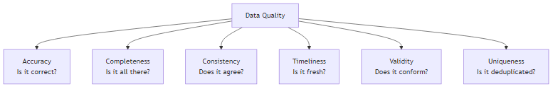

# Data Quality Dimensions

## What problem does this solve?
"Bad data" is vague. Without a taxonomy, teams argue about what quality means and measure it inconsistently. The six dimensions give a shared vocabulary and measurable definitions.

## The Six Dimensions



### 1. Accuracy
Data correctly represents reality.
- Measure: % of records matching ground truth (e.g., verified address database)
- Example failure: Customer `city = "Snagpore"` (typo), or `order_total = 0` for a real £500 order

### 2. Completeness
All expected data is present.
- Measure: `1 - (NULL count / total count)` per column
- Example failure: 30% of orders missing `customer_id` because a mobile app wasn't sending it

```sql
-- Completeness check
SELECT
    COUNT(*) AS total_rows,
    COUNT(customer_id) AS non_null_customer_id,
    ROUND(COUNT(customer_id) * 100.0 / COUNT(*), 2) AS completeness_pct
FROM silver.orders;
```

### 3. Consistency
Data agrees across systems and tables.
- Measure: % of cross-system records matching
- Example failure: `orders.total = 150` but `payments.amount = 145` for the same transaction

```sql
-- Consistency check: order totals vs payment amounts
SELECT COUNT(*) AS inconsistent_records
FROM silver.orders o
JOIN silver.payments p ON o.order_id = p.order_id
WHERE ABS(o.total_amount - p.amount) > 0.01;
```

### 4. Timeliness
Data is available when needed.
- Measure: lag between event occurrence and availability in serving layer
- Example failure: yesterday's sales data not in the dashboard by 8am for the morning standup

```sql
-- Timeliness check: is data fresh?
SELECT
    MAX(event_timestamp) AS latest_event,
    TIMESTAMPDIFF(HOUR, MAX(event_timestamp), CURRENT_TIMESTAMP()) AS lag_hours
FROM silver.orders;
```

### 5. Validity
Data conforms to defined formats, ranges, and rules.
- Measure: % of records passing all business rules
- Example failure: `email = "not-an-email"`, `age = -5`, `status = "CANCELLED_PENDING"` (invalid enum)

```sql
-- Validity checks
SELECT COUNT(*) AS invalid_emails
FROM silver.customers
WHERE email NOT REGEXP '^[a-zA-Z0-9._%+-]+@[a-zA-Z0-9.-]+\.[a-zA-Z]{2,}$';

SELECT COUNT(*) AS negative_amounts
FROM silver.orders
WHERE total_amount < 0;
```

### 6. Uniqueness
No unintended duplicates.
- Measure: % of records that are unique on the expected key
- Example failure: Kafka consumer processes same payment twice → duplicate row in `fact_payments`

```sql
-- Uniqueness check
SELECT order_id, COUNT(*) AS cnt
FROM silver.orders
GROUP BY order_id
HAVING cnt > 1;
```

## Building a DQ Scorecard

```sql
-- Composite quality score per table per day
SELECT
    'silver.orders'                             AS table_name,
    CURRENT_DATE                                AS check_date,
    COUNT(*)                                    AS total_rows,
    ROUND(COUNT(customer_id)*100.0/COUNT(*),1)  AS completeness_pct,
    (SELECT COUNT(*) FROM silver.orders o JOIN silver.payments p ON o.order_id = p.order_id WHERE ABS(o.total_amount - p.amount) > 0.01) AS consistency_failures,
    ROUND((1 - COUNT(CASE WHEN total_amount < 0 THEN 1 END)*1.0/COUNT(*))*100,1) AS validity_pct,
    (SELECT COUNT(*) FROM (SELECT order_id, COUNT(*) c FROM silver.orders GROUP BY order_id HAVING c > 1)) AS duplicate_keys
FROM silver.orders;
```

## Real-world scenario
E-commerce company ran DQ scorecard for first time: completeness 87% (13% missing `postal_code`), validity 94% (6% invalid email formats from old data migration), uniqueness 99.97% (230 duplicate order IDs from a Kafka replay incident). Three actionable issues found in one query. Prioritised: duplicate order IDs first (revenue impact), then email validity (marketing impact), then postal_code (shipping impact).

## What goes wrong in production
- **Measuring quality but not acting on it** — DQ dashboard nobody uses. Connect quality scores to pipeline SLAs and on-call alerts.
- **Checking quality only in Gold** — bad data should be caught at Bronze ingestion, not after it's already in analyst-facing tables.

## References
- [DAMA DMBOK — Data Quality Chapter 13](https://www.dama.org/cpages/body-of-knowledge)
- [TDWI Data Quality Dimensions](https://tdwi.org/articles/2017/08/01/data-quality-dimensions-primer.aspx)
