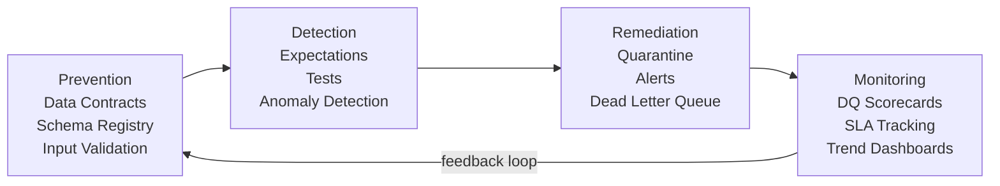

# Data Quality Framework Design

## What problem does this solve?
Ad-hoc quality checks are inconsistent, hard to scale, and invisible. A DQ framework standardises how quality is defined, measured, enforced, and reported across all pipelines.

## The Four Layers



### Layer 1: Prevention
Stop bad data from entering the platform.
- **Data contracts**: schema agreements between producers and consumers
- **Schema registry**: Avro/Protobuf schema validation at Kafka produce time
- **Source validation**: input validation at ingestion (null checks, type checks)

### Layer 2: Detection
Catch bad data that slips through.
- **Schema tests** (dbt): not_null, unique, accepted_values, referential integrity
- **Statistical tests** (Great Expectations): row count in expected range, mean within 2 std devs
- **Freshness checks**: source data arrived within SLA window
- **Custom SQL tests**: business rule checks (e.g., `order_total > 0`)

### Layer 3: Remediation
Handle detected bad data without crashing pipelines.
- **Quarantine pattern**: route bad records to a `_quarantine` table, continue pipeline with clean records
- **Dead letter queue**: Kafka DLQ for messages that fail schema validation
- **Alert + manual review**: page the on-call team for high-severity violations
- **Auto-remediation**: simple fixes (trim whitespace, cast types) applied automatically

### Layer 4: Monitoring
Track quality over time to detect degradation.
- **DQ scorecard table**: daily snapshot of all dimensions per table
- **SLA dashboard**: % of tables meeting freshness SLA
- **Anomaly trending**: is the null rate for `customer_id` trending up?

## Quarantine pattern implementation

```python
from pyspark.sql import functions as F
from delta.tables import DeltaTable

def ingest_with_quarantine(df, target_table, quarantine_table, rules):
    """
    Apply quality rules and route bad records to quarantine.
    Returns (clean_count, quarantine_count)
    """
    # Build combined filter expression
    good_filter = F.lit(True)
    for rule_name, rule_expr in rules.items():
        df = df.withColumn(f"_fail_{rule_name}", ~rule_expr)

    fail_cols = [c for c in df.columns if c.startswith("_fail_")]
    has_failure = F.expr(" OR ".join(fail_cols))

    clean = df.filter(~has_failure).drop(*fail_cols)
    quarantine = df.filter(has_failure) \
        .withColumn("_quarantine_ts", F.current_timestamp()) \
        .withColumn("_quarantine_table", F.lit(target_table))

    # Write clean records to target
    clean.write.format("delta").mode("append").saveAsTable(target_table)

    # Write bad records to quarantine
    quarantine.write.format("delta").mode("append").saveAsTable(quarantine_table)

    return clean.count(), quarantine.count()

# Usage
rules = {
    "not_null_order_id": F.col("order_id").isNotNull(),
    "positive_amount": F.col("amount") > 0,
    "valid_status": F.col("status").isin(["placed", "shipped", "delivered", "cancelled"])
}

clean_count, bad_count = ingest_with_quarantine(
    df=raw_orders,
    target_table="silver.orders",
    quarantine_table="silver.orders_quarantine",
    rules=rules
)

if bad_count / (clean_count + bad_count) > 0.05:  # >5% bad records
    alert_oncall(f"HIGH: {bad_count} records quarantined from orders ingestion")
```

## Real-world scenario
Payments pipeline: 50K events/hour. One day a source system sends `amount = null` for 8% of events. Without framework: nulls land in Silver, analysts see $0 revenue, incident takes 4 hours to diagnose. With framework: quarantine catches all 4,000 null-amount records in Bronze, pipeline continues with valid 46K records, alert fires immediately to platform team, source team notified within 5 minutes.

## What goes wrong in production
- **Quarantine ignored** — records land in quarantine, nobody reviews them, data gap grows silently. Set SLAs on quarantine queue review.
- **Framework adds 3x pipeline complexity** — start with dbt tests + a simple quarantine. Add anomaly detection when scale justifies it.

## References
- [Great Expectations Documentation](https://docs.greatexpectations.io/)
- [dbt Testing Documentation](https://docs.getdbt.com/docs/build/data-tests)
- [Monte Carlo Data Observability](https://www.montecarlodata.com/blog-what-is-data-observability/)
