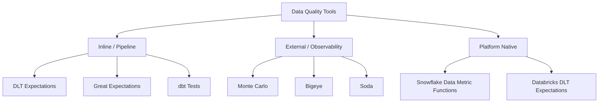

# Data Quality Tools Overview

## What problem does this solve?
Dozens of data quality tools exist. Choosing the right one depends on where your data lives, who owns quality rules, and how automated your pipelines need to be. This guide maps the tool landscape and gives decision criteria.

## Tool Landscape



| Node | Details |
|------|---------|
| **DLT Expectations** | Databricks pipelines |
| **Great Expectations** | any platform |
| **dbt Tests** | SQL transformations |
| **Monte Carlo** | ML anomaly detection |
| **Bigeye** | automated monitoring |
| **Soda** | YAML-defined checks |

## Tool Comparison

| Tool | Best for | Where rules live | Automated anomaly detection | Cost |
|------|----------|-----------------|----------------------------|------|
| **DLT Expectations** | Databricks streaming + batch pipelines | Python decorator | No (threshold-based) | Included in Databricks |
| **Great Expectations** | Python-first teams, any data source | Python / JSON | No (threshold-based) | Open-source |
| **dbt Tests** | SQL-first analytics engineering | YAML + SQL | No (threshold-based) | Open-source |
| **Monte Carlo** | Enterprise observability, ML anomaly detection | UI + config | Yes (ML-based) | Paid SaaS |
| **Bigeye** | Automated monitoring with zero config | Auto-learned | Yes | Paid SaaS |
| **Soda** | YAML-defined checks across any platform | YAML | No | Open-source + paid |
| **Snowflake DMF** | Snowflake-native teams | SQL | No | Included in Snowflake |

## Decision Framework

```
Are you running Databricks pipelines?
├── Yes → DLT Expectations (built-in, zero overhead)
│         + Great Expectations for complex checks

Are you doing dbt transformations on Snowflake/BigQuery?
└── Yes → dbt Tests (built-in, co-located with models)

Do you need automated anomaly detection without writing thresholds?
└── Yes → Monte Carlo or Bigeye (learns baselines automatically)

Do you need cross-platform DQ with one tool?
└── Yes → Great Expectations (supports Spark, Snowflake, BigQuery, Pandas)
          or Soda (YAML-based, multi-platform)

Are you Snowflake-only with no Python team?
└── Yes → Snowflake Data Metric Functions (native, no extra tool)
```

## Soda — YAML-based checks

```yaml
# checks.yml — define quality rules in YAML (no Python needed)
checks for silver.payments:
  - row_count > 0
  - missing_count(payment_id) = 0
  - duplicate_count(payment_id) = 0
  - min(amount) > 0
  - max(amount) < 1000000
  - invalid_count(currency) = 0:
      valid values: [USD, EUR, GBP, SGD, JPY]
  - anomaly detection for row_count  # ML-based (Soda Cloud)
  - schema:
      name: payments_schema
      columns:
        - name: payment_id
          type: VARCHAR
        - name: amount
          type: DOUBLE
```

```bash
# Run checks
soda scan -d snowflake_prod -c soda-config.yml checks.yml
```

## Monte Carlo — ML-based observability

Monte Carlo continuously monitors your data warehouse and automatically detects anomalies without manually defining thresholds. It learns the baseline distribution of your tables and alerts when something deviates.

**What Monte Carlo monitors automatically:**
- Row count anomalies (sudden drop = pipeline failure, sudden spike = duplication)
- Null rate changes (column starts returning NULLs)
- Distribution shifts (mean/percentile drift)
- Schema changes (column added/removed/renamed)
- Freshness (table not updated when expected)

**Integration with Databricks/Snowflake:**
- Connect via read-only service account
- Automatic table profiling on connection
- Lineage imported from dbt manifests or direct metadata

> Monte Carlo is the right choice when you want observability without writing rules — it alerts on things you didn't know to check for.

## References
- [Great Expectations](https://docs.greatexpectations.io/)
- [dbt Tests](https://docs.getdbt.com/docs/build/tests)
- [Soda Documentation](https://docs.soda.io/)
- [Monte Carlo](https://www.montecarlodata.com/docs/)
- [Bigeye](https://docs.bigeye.com/)
- [Snowflake Data Metric Functions](https://docs.snowflake.com/en/user-guide/data-quality-intro)
