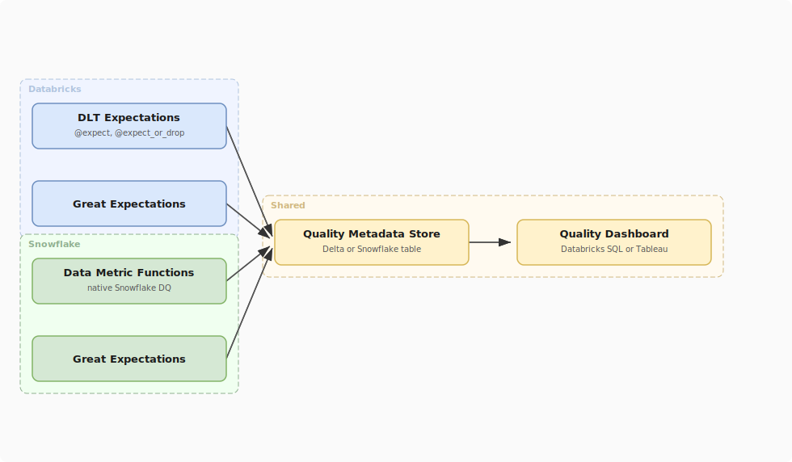

# Cross-Platform Data Quality: Databricks + Snowflake

## What problem does this solve?
Most organisations use both Databricks (for ML and Spark-based ETL) and Snowflake (for SQL analytics and BI). Data quality rules need to work consistently across both platforms — the same standard, different engines.

## How it works

<!-- Editable: open diagrams/04-data-quality--06-cross-platform-dq.drawio.svg in draw.io -->



### Strategy: define once, measure on both platforms

The core idea is a shared quality metadata schema where both platforms write results:

```sql
-- Central quality results table (can live in Databricks Delta or Snowflake)
CREATE TABLE data_quality.results (
    check_id          STRING,
    check_name        STRING,
    table_name        STRING,
    column_name       STRING,
    platform          STRING,   -- 'databricks' or 'snowflake'
    run_timestamp     TIMESTAMP,
    rows_evaluated    BIGINT,
    rows_failed       BIGINT,
    pass_rate         DOUBLE,
    status            STRING,   -- 'PASS' / 'WARN' / 'FAIL'
    threshold_warn    DOUBLE,
    threshold_fail    DOUBLE
);
```

### Databricks side — DLT expectations writing to shared table

```python
import dlt
from pyspark.sql import functions as F

@dlt.table(name="silver_payments_with_quality")
@dlt.expect("valid_amount", "amount > 0")
@dlt.expect("not_null_id", "payment_id IS NOT NULL")
def silver_payments_with_quality():
    return dlt.read_stream("bronze_payments")

# After DLT run, query event log and write to shared quality table
quality_results = spark.sql("""
    SELECT
        uuid() AS check_id,
        expectations.name AS check_name,
        'silver.payments' AS table_name,
        NULL AS column_name,
        'databricks' AS platform,
        timestamp AS run_timestamp,
        details:flow_progress:metrics:num_output_rows AS rows_evaluated,
        details:flow_progress:data_quality:dropped_records AS rows_failed
    FROM event_log('pipeline-id')
    WHERE event_type = 'flow_progress'
      AND size(details:flow_progress:data_quality:expectations) > 0
""")

quality_results.write.format("delta").mode("append") \
    .table("data_quality.results")
```

### Snowflake side — Data Metric Functions

```sql
-- Snowflake native DQ (available GA as of 2024)
CREATE DATA METRIC FUNCTION dq.not_null_rate(arg_t TABLE(col STRING))
    RETURNS NUMBER
    AS $$
        SELECT RATIO_TO_REPORT(COUNT(col)) OVER () FROM arg_t WHERE col IS NOT NULL
    $$;

-- Schedule metric collection
ALTER TABLE prod.silver.sf_payments
    SET DATA_METRIC_SCHEDULE = 'TRIGGER_ON_CHANGES';

ALTER TABLE prod.silver.sf_payments
    ADD DATA METRIC FUNCTION dq.not_null_rate ON (payment_id);

-- Write results to shared quality table (via stored procedure)
CALL dq.write_quality_results(
    'prod.silver.sf_payments',
    'snowflake',
    CURRENT_TIMESTAMP()
);
```

### Unified quality dashboard

```sql
-- Cross-platform quality overview
SELECT
    platform,
    table_name,
    check_name,
    AVG(pass_rate) AS avg_pass_rate,
    MIN(pass_rate) AS min_pass_rate,
    COUNT(*) AS runs_last_7d,
    SUM(CASE WHEN status = 'FAIL' THEN 1 ELSE 0 END) AS failures
FROM data_quality.results
WHERE run_timestamp >= CURRENT_TIMESTAMP - INTERVAL 7 DAYS
GROUP BY 1, 2, 3
ORDER BY min_pass_rate ASC;  -- worst quality first
```

## References
- [Databricks DLT Expectations](https://docs.databricks.com/en/delta-live-tables/expectations.html)
- [Snowflake Data Metric Functions](https://docs.snowflake.com/en/user-guide/data-quality-intro)
- [Great Expectations Multi-Backend](https://docs.greatexpectations.io/docs/guides/connecting_to_your_data/database/snowflake/)
