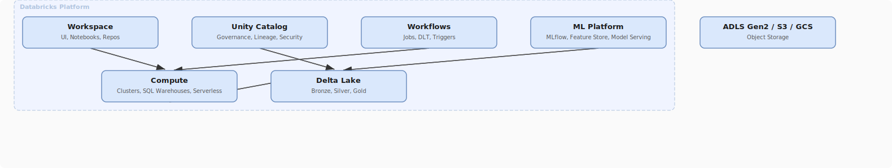

# Databricks Platform Overview

## What problem does this solve?
Running Apache Spark in production requires managing clusters, installing dependencies, handling failures, securing data, and wiring together storage, compute, and orchestration. Databricks collapses all of that into a single managed platform so data engineers, data scientists, and analysts work from one unified environment.

## How it works

<!-- Editable: open diagrams/05-databricks--01-databricks-platform-overview.drawio.svg in draw.io -->



### Core components

| Component | Purpose | Replaces |
|-----------|---------|---------|
| Notebooks | Interactive development (Python, SQL, Scala, R) | Jupyter + manual cluster management |
| Clusters | Managed Apache Spark compute | Self-managed YARN / K8s Spark |
| Delta Lake | ACID lakehouse storage format | Plain Parquet, Hive |
| Unity Catalog | Centralised governance and lineage | Per-workspace Hive metastores |
| Workflows (Jobs) | Pipeline orchestration | Cron + manual Spark-submit |
| Delta Live Tables | Declarative pipeline framework | Custom pipeline boilerplate |
| SQL Warehouses | Serverless SQL for analysts | Separate BI database |
| MLflow | ML experiment tracking and model registry | Custom tracking scripts |
| Repos | Git-integrated version control | Manual notebook exports |

### Databricks vs raw Apache Spark

| | Apache Spark | Databricks |
|---|---|---|
| Cluster management | Manual (YARN, K8s, Standalone) | Fully managed, auto-scaling |
| Delta Lake | Open-source (separate install) | Built-in, native, optimised |
| Notebooks | Not included | First-class (collaborative, real-time) |
| Optimisations | Standard JVM Spark | Photon engine, optimised I/O, DBR |
| Governance | DIY | Unity Catalog (RBAC, lineage, masking) |
| Cost | Infrastructure only | DBU licensing + infrastructure |
| Support | Community / commercial options | Databricks SLA-backed support |

### Databricks Runtime (DBR)

DBR is Databricks's packaged distribution of Spark + Delta Lake + Python + libraries. Each DBR version pins specific component versions:

```
DBR 14.3 LTS:
├── Apache Spark 3.5.0
├── Delta Lake 3.1
├── Python 3.11
├── Scala 2.12
├── Java 11
└── Pre-installed: pandas, scikit-learn, MLflow, Delta, PyArrow
```

**Specialised runtimes:**
- **DBR ML**: Adds PyTorch, TensorFlow, XGBoost, Hugging Face
- **DBR Photon**: Enables the C++ vectorised execution engine (included in Premium)
- **DBR GPU**: CUDA drivers + GPU-accelerated ML libraries

### Photon Engine

Photon is a native C++ vectorised execution engine that replaces JVM-based Spark execution for SQL and DataFrame operations. It processes data in columnar batches rather than row-by-row, using SIMD CPU instructions.

```
Standard Spark execution:     Photon execution:
──────────────────────────    ──────────────────────────────
JVM bytecode                  Native C++ code
Row-at-a-time processing      Columnar batch processing
JVM GC overhead               No GC (native memory)
~100MB/s per core (typical)   ~1GB/s per core (typical, SQL)
```

Operations Photon accelerates: GROUP BY, ORDER BY, JOIN, FILTER, aggregate functions, window functions, file scans (Parquet, Delta).

Operations Photon does NOT accelerate: Python UDFs, custom ML model inference, operations not yet implemented in Photon (check DBR release notes).

## Real-world scenario

Retail company: 3 analysts using Jupyter notebooks on a shared server, 2 data engineers running custom Spark-submit scripts on an on-premises Hadoop cluster, 1 ML engineer managing model training on a separate EC2 instance. No shared governance, no lineage, no unified access control.

After Databricks: one workspace, analysts use SQL Warehouses for BI queries, engineers use job clusters for ETL, ML engineer uses DBR ML clusters for training and MLflow for experiment tracking. Unity Catalog enforces column masking on PII for analysts. One lineage graph from raw ingestion to ML model output.

## What goes wrong in production

- **Using all-purpose clusters for production jobs** — all-purpose clusters accumulate state, notebook variables, and installed packages between runs. Job clusters start clean every time. Always use job clusters in production.
- **Ignoring DBR LTS vs ML vs standard** — deploying an ML notebook on standard DBR missing PyTorch. Always check runtime compatibility before deploying.
- **Photon expectations on Python UDFs** — writing row-level Python UDFs expecting Photon speedup. Photon doesn't execute Python code. Use Pandas UDFs (vectorised) instead.
- **Not setting auto-termination** — all-purpose clusters left running overnight at $50/hour. Set auto-termination to 30–60 minutes for interactive clusters.

## References
- [Databricks Documentation](https://docs.databricks.com/)
- [Databricks Runtime Release Notes](https://docs.databricks.com/en/release-notes/runtime/index.html)
- [Photon Engine](https://docs.databricks.com/en/compute/photon.html)
- [What is Databricks?](https://docs.databricks.com/en/introduction/index.html)
