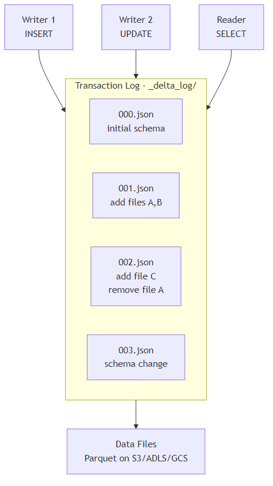

# Delta Lake Internals

## What problem does this solve?
Plain Parquet on S3/ADLS has no ACID guarantees. Two writers corrupt data. No rollback. No schema enforcement. Delta Lake adds a transaction log on top of Parquet to provide full ACID semantics.

## How it works



### The Transaction Log
Every write creates a new JSON commit file in `_delta_log/`. Each file records:
- **Add actions**: new Parquet files added
- **Remove actions**: files logically deleted (not physically)
- **Metadata actions**: schema changes, table properties
- **Protocol actions**: min reader/writer version requirements

```bash
# Inspect transaction log
ls /mnt/datalake/silver/orders/_delta_log/
# 00000000000000000000.json
# 00000000000000000001.json
# 00000000000000000010.checkpoint.parquet  ← checkpoint every 10 commits

cat /mnt/datalake/silver/orders/_delta_log/00000000000000000001.json
```

```json
{
  "add": {
    "path": "part-00000-abc.snappy.parquet",
    "partitionValues": {"event_date": "2024-01-15"},
    "size": 15234567,
    "modificationTime": 1705276800000,
    "dataChange": true,
    "stats": "{\"numRecords\":125000,\"minValues\":{\"order_id\":1},\"maxValues\":{\"order_id\":999999}}"
  }
}
```

### ACID via optimistic concurrency
Delta uses optimistic concurrency control:
1. Writer reads current version N
2. Writer makes changes locally
3. Writer attempts to commit as version N+1
4. If another writer committed first (version N+1 exists), conflict detection logic runs
5. If no conflict (different partitions), both commits succeed. If conflict, retry.

### MERGE (upsert)

```python
from delta.tables import DeltaTable
from pyspark.sql import functions as F

delta_table = DeltaTable.forName(spark, "silver.orders")
updates = spark.table("bronze.orders_updates")

delta_table.alias("target").merge(
    updates.alias("source"),
    "target.order_id = source.order_id"
) \
.whenMatchedUpdate(set={
    "status": "source.status",
    "updated_at": "source.updated_at"
}) \
.whenNotMatchedInsert(values={
    "order_id": "source.order_id",
    "customer_id": "source.customer_id",
    "status": "source.status",
    "amount": "source.amount",
    "created_at": "source.created_at",
    "updated_at": "source.updated_at"
}) \
.execute()
```

### Time Travel

```python
# Read table as of a specific version
df_v5 = spark.read.format("delta").option("versionAsOf", 5).table("silver.orders")

# Read table as of a specific timestamp
df_yesterday = spark.read.format("delta") \
    .option("timestampAsOf", "2024-01-14 00:00:00") \
    .table("silver.orders")

# Restore to a previous version
from delta.tables import DeltaTable
DeltaTable.forName(spark, "silver.orders").restoreToVersion(5)

# View table history
spark.sql("DESCRIBE HISTORY silver.orders").show()
```

### Schema Evolution

```python
# Fail on schema mismatch (default)
df.write.format("delta").mode("append").saveAsTable("silver.orders")

# Merge schema (add new columns)
df.write.format("delta").mode("append") \
    .option("mergeSchema", "true") \
    .saveAsTable("silver.orders")

# Overwrite schema entirely (DDL-like)
df.write.format("delta").mode("overwrite") \
    .option("overwriteSchema", "true") \
    .saveAsTable("silver.orders")
```

## Real-world scenario
Fintech: concurrent writers from 3 streaming jobs all writing to `silver.payments`. Without Delta: Parquet files partially written, readers see corrupt state. With Delta: each streaming batch atomically commits to the transaction log. Concurrent writers resolve conflicts via optimistic concurrency. Readers always see a consistent snapshot.

## What goes wrong in production
- **VACUUM too aggressive** — `VACUUM silver.orders RETAIN 0 HOURS` deletes all old Parquet files. Time travel is gone, and any concurrent readers that are mid-query on old snapshots will fail. Default retention is 7 days — respect it.
- **Too many small files** — each micro-batch streaming write creates small Parquet files. After a week, millions of files. Run `OPTIMIZE` + `ZORDER` nightly.
- **Checkpoint bloat** — `_delta_log` accumulates JSON files. Delta creates checkpoints every 10 commits (Parquet rollup). On very high-frequency writes, this can itself become large. Monitor log directory size.

## References
- [Delta Lake Documentation](https://docs.delta.io/latest/index.html)
- [Delta Lake Protocol Specification](https://github.com/delta-io/delta/blob/master/PROTOCOL.md)
- [Delta Lake VLDB 2020 Paper](https://dl.acm.org/doi/10.14778/3415478.3415560)
