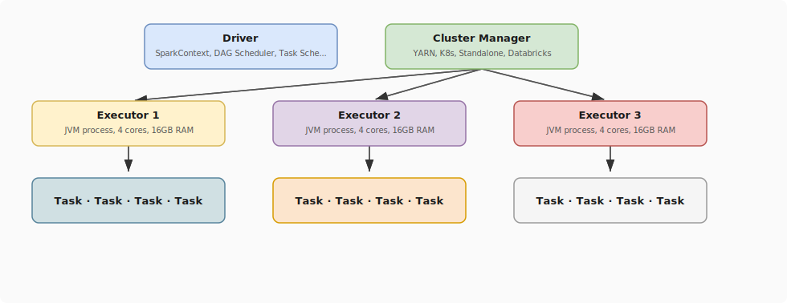
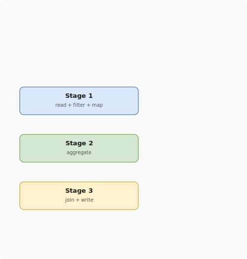

# Spark Architecture

## What problem does this solve?
Understanding Spark's execution model is required for tuning — knowing why a job is slow, why memory errors occur, and how to fix them. Without this, tuning is guesswork.

## How it works

<!-- Editable: open diagrams/05-databricks--03-spark-architecture-1.drawio.svg in draw.io -->



### Driver
- Runs your Python/Scala/SQL code
- Builds the DAG (directed acyclic graph) of transformations
- Splits DAG into stages at shuffle boundaries
- Schedules tasks on executors
- **Lives on: Databricks driver node or your notebook**

### Executor
- JVM process on worker nodes
- Runs tasks in parallel (one task per core)
- Stores RDD/DataFrame partitions in memory or disk
- Reports results back to driver

### Stages and Tasks
- **Stage**: set of transformations that can run without a shuffle
- **Shuffle**: exchange of data between executors (expensive — network + disk I/O)
- **Task**: one unit of work, processes one partition

<!-- Editable: open diagrams/05-databricks--03-spark-architecture-2.drawio.svg in draw.io -->



### Memory model

```
Executor JVM Memory
├── Execution Memory   (shuffle, join, sort buffers)     ~60%
├── Storage Memory     (RDD cache, broadcast vars)        ~40%
├── User Memory        (Python UDF overhead, objects)
└── Reserved           (JVM overhead)
```

```python
# Key Spark configurations for tuning
spark.conf.set("spark.executor.memory", "16g")
spark.conf.set("spark.executor.cores", "4")
spark.conf.set("spark.sql.shuffle.partitions", "200")  # default (often wrong)
spark.conf.set("spark.sql.adaptive.enabled", "true")   # AQE — always enable
spark.conf.set("spark.sql.adaptive.coalescePartitions.enabled", "true")
```

## Reading the Spark UI

Key metrics to check per stage:
- **Input size** — how much data was read
- **Shuffle write/read** — if huge, investigate the shuffle
- **Duration** — which stage is the bottleneck
- **GC time** — if >10% of task time, memory is too low

Key metrics to check per task:
- **Task duration distribution** — huge spread = data skew
- **Spill (memory/disk)** — executor ran out of memory, spilling to disk = slow

## Real-world scenario
Job runs 2 hours. Spark UI shows: Stage 2 (groupBy user_id) takes 1.8 hours, 200 tasks total but 3 tasks each take 40 minutes. Diagnosis: data skew — 3 bot user_ids account for 60% of events. Fix: salt the key, AQE skew join enabled, Stage 2 drops from 1.8h to 8 minutes.

## What goes wrong in production
- **Default 200 shuffle partitions** — for a 200GB shuffle, 200 partitions = 1GB per partition = slow merge sort. Set to `2x total cores` or use AQE to auto-tune.
- **Driver OOM** — `df.collect()` on a 10GB DataFrame. Never collect large datasets to driver. Use `display()` or write to storage.
- **Executor OOM** — join of two large tables without broadcast. Enable AQE and increase executor memory.

## References
- [Spark Cluster Overview](https://spark.apache.org/docs/latest/cluster-overview.html)
- [Spark Tuning Guide](https://spark.apache.org/docs/latest/tuning.html)
- [Spark Web UI Documentation](https://spark.apache.org/docs/latest/web-ui.html)
