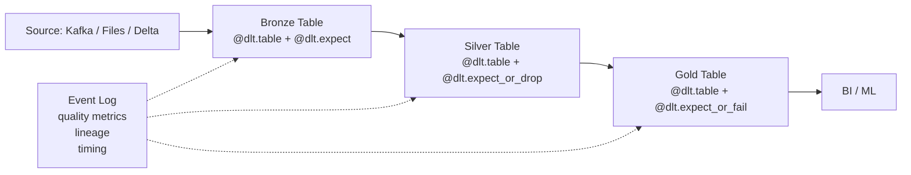

# Delta Live Tables (DLT)

## What problem does this solve?
Building production data pipelines requires wiring together ingestion, transformation, quality checks, monitoring, and retries. DLT is a declarative framework that handles all of that — you declare what the tables should contain, DLT figures out the execution order, handles dependencies, and manages quality.

## How it works



### Streaming vs materialised view

```python
import dlt
from pyspark.sql import functions as F

# Streaming table: processes new data incrementally
@dlt.table(
    name="bronze_payments",
    comment="Raw payments from Kafka",
    table_properties={"quality": "bronze"}
)
def bronze_payments():
    return spark.readStream \
        .format("kafka") \
        .option("kafka.bootstrap.servers", "broker:9092") \
        .option("subscribe", "payments") \
        .load() \
        .select(F.from_json(F.col("value").cast("string"), schema).alias("d")) \
        .select("d.*")

# Materialised view: recomputed on each pipeline run
@dlt.table(name="gold_daily_revenue")
def gold_daily_revenue():
    return dlt.read("silver_payments") \
        .groupBy(F.to_date("event_ts").alias("date"), "currency") \
        .agg(F.sum("amount").alias("total_revenue"))
```

### CDC with DLT (APPLY CHANGES INTO)

```python
# Automatically apply CDC events to a target table (SCD Type 1 or 2)
dlt.create_streaming_table("silver_customers")

dlt.apply_changes(
    target="silver_customers",
    source="bronze_customers_cdc",
    keys=["customer_id"],
    sequence_by="updated_at",
    stored_as_scd_type=1  # or 2 for full history
)
```

### Pipeline modes

| Mode | Behaviour | Use for |
|------|-----------|---------|
| Triggered | Run once, process available data, stop | Scheduled batch |
| Continuous | Run indefinitely, process as data arrives | Real-time streaming |
| Development | No recovery on failure, no retries | Testing |
| Production | Full recovery, retries, notifications | Live pipelines |

## Real-world scenario
Retail data pipeline: Kafka (Bronze) → cleaning + dedup (Silver) → star schema (Gold) → Tableau. Before DLT: 3 separate Spark jobs, each with custom error handling, no quality metrics, pipeline failures were silent. With DLT: one pipeline definition, quality expectations at every layer, event log shows pass/fail rates per table, auto-retry on transient failures, Slack notification on failure.

## What goes wrong in production
- **Development mode in production** — no checkpointing, full reprocessing on every run. Always deploy as Production pipeline.
- **Circular references** — `table_A` reads `table_B`, `table_B` reads `table_A`. DLT detects and fails. Break the cycle.
- **APPLY CHANGES without sequence_by** — out-of-order CDC events apply incorrectly. Always set `sequence_by` to a monotonically increasing column (`updated_at`, `lsn`).

## References
- [Delta Live Tables Documentation](https://docs.databricks.com/en/delta-live-tables/index.html)
- [DLT Expectations](https://docs.databricks.com/en/delta-live-tables/expectations.html)
- [DLT APPLY CHANGES](https://docs.databricks.com/en/delta-live-tables/cdc.html)
