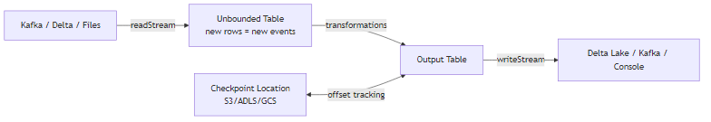

# Spark Structured Streaming

## What problem does this solve?
Writing correct, fault-tolerant streaming code from scratch is hard. Structured Streaming provides a high-level DataFrame API for streaming that behaves like batch — you write queries, Spark handles state, checkpointing, and exactly-once semantics.

## How it works



### Reading from Kafka

```python
payments_stream = spark.readStream \
    .format("kafka") \
    .option("kafka.bootstrap.servers", "broker:9092") \
    .option("subscribe", "payments") \
    .option("startingOffsets", "latest") \
    .option("maxOffsetsPerTrigger", 100000) \  # rate limiting
    .load()

# Deserialise JSON payload
from pyspark.sql.types import *
schema = StructType([
    StructField("payment_id", StringType()),
    StructField("amount", DoubleType()),
    StructField("currency", StringType()),
    StructField("event_ts", TimestampType())
])

payments = payments_stream \
    .select(F.from_json(F.col("value").cast("string"), schema).alias("d")) \
    .select("d.*")
```

### Trigger modes

```python
# Default: process as fast as possible (micro-batch)
query = payments.writeStream.format("delta").start()

# Fixed interval: process every 30 seconds
query = payments.writeStream \
    .trigger(processingTime="30 seconds") \
    .writeStream.format("delta").start()

# Once: process available data, then stop (good for scheduled jobs)
query = payments.writeStream \
    .trigger(once=True) \
    .format("delta").start()
query.awaitTermination()

# Available-now: like once, but processes all available in micro-batches
query = payments.writeStream \
    .trigger(availableNow=True) \
    .format("delta").start()
```

### foreachBatch (complex sink logic)

```python
from delta.tables import DeltaTable

def upsert_to_delta(batch_df, epoch_id):
    """MERGE each micro-batch into Delta target."""
    DeltaTable.forName(spark, "silver.payments").alias("t") \
        .merge(batch_df.alias("s"), "t.payment_id = s.payment_id") \
        .whenMatchedUpdateAll() \
        .whenNotMatchedInsertAll() \
        .execute()

payments.writeStream \
    .foreachBatch(upsert_to_delta) \
    .option("checkpointLocation", "/chk/payments_upsert") \
    .start()
```

### Monitoring streaming queries

```python
# Get query status
query = payments.writeStream.format("delta").start()
print(query.status)
# {'message': 'Processing new data', 'isDataAvailable': True, 'isTriggerActive': True}

# Get recent progress (lag, throughput)
for progress in query.recentProgress:
    print(f"Input rows/sec: {progress['inputRowsPerSecond']:.0f}")
    print(f"Process time: {progress['durationMs']['triggerExecution']}ms")
    print(f"Kafka lag: {progress['sources'][0]['endOffset']}")
```

## Checkpointing

Checkpoints store:
1. Kafka offsets (which messages have been processed)
2. Streaming state (for stateful operations like aggregations)
3. Committed offsets to output sink

```python
# Checkpoint on cloud storage — REQUIRED for production
.option("checkpointLocation", "abfss://checkpoints@storageacct.dfs.core.windows.net/payments")
# Or S3:
.option("checkpointLocation", "s3://my-bucket/checkpoints/payments")
```

**If you change the query** (add a column, change aggregation), the checkpoint is incompatible. Delete checkpoint and restart from earliest offsets.

## Real-world scenario
Fraud scoring pipeline: Kafka topic `payments` → Spark Structured Streaming → ML model inference → write fraud score to Delta. `maxOffsetsPerTrigger=50000` caps each batch to 50K records. `processingTime="10 seconds"` trigger gives consistent latency. Checkpoint on ADLS survives executor restarts. 99.9% uptime over 6 months with zero data loss.

## What goes wrong in production
- **Checkpoint on local disk** — node is replaced, checkpoint gone, Spark replays from earliest Kafka offset = reprocessing all historical data. Always use cloud storage.
- **Query change without deleting checkpoint** — Spark throws `StreamingQueryException: Schema of checkpoint doesn't match`. Always delete checkpoint after structural query changes.
- **No `maxOffsetsPerTrigger`** — during a Kafka backlog (e.g., after an outage), Spark ingests millions of records in one batch, causing executor OOM. Always set a rate limit.

## References
- [Spark Structured Streaming Guide](https://spark.apache.org/docs/latest/structured-streaming-programming-guide.html)
- [Databricks Structured Streaming](https://docs.databricks.com/en/structured-streaming/index.html)
- [Delta Lake Streaming](https://docs.delta.io/latest/delta-streaming.html)
