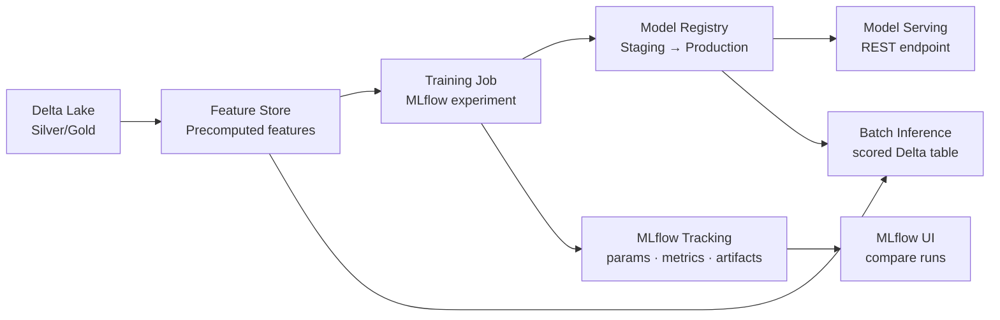

# Databricks ML Platform: MLflow & Feature Store

## What problem does this solve?
ML experiments are hard to reproduce. Models trained last Tuesday with "slightly different data" can't be compared against today's run without structured tracking. Feature engineering code gets duplicated between training pipelines and serving infrastructure, causing training-serving skew. The Databricks ML Platform (MLflow + Feature Store) solves both.

## How it works



### MLflow Tracking — log everything

```python
import mlflow
import mlflow.sklearn
from sklearn.ensemble import GradientBoostingClassifier
from sklearn.metrics import roc_auc_score, precision_score, recall_score
import pandas as pd

# Set experiment (creates if not exists)
mlflow.set_experiment("/Users/gour@company.com/fraud-detection-v3")

# Training run
with mlflow.start_run(run_name="gbm-baseline") as run:
    # Log hyperparameters
    params = {
        "n_estimators": 200,
        "max_depth": 5,
        "learning_rate": 0.05,
        "subsample": 0.8,
        "min_samples_leaf": 20,
        "feature_set": "v2-enriched"
    }
    mlflow.log_params(params)

    # Train model
    model = GradientBoostingClassifier(**{k: v for k, v in params.items()
                                          if k != "feature_set"})
    model.fit(X_train, y_train)

    # Log metrics
    y_pred_proba = model.predict_proba(X_test)[:, 1]
    metrics = {
        "auc_roc": roc_auc_score(y_test, y_pred_proba),
        "precision_at_01": precision_score(y_test, y_pred_proba > 0.1),
        "recall_at_01": recall_score(y_test, y_pred_proba > 0.1),
        "train_size": len(X_train),
        "test_size": len(X_test)
    }
    mlflow.log_metrics(metrics)

    # Log feature importance as artifact
    fi = pd.DataFrame({
        "feature": X_train.columns,
        "importance": model.feature_importances_
    }).sort_values("importance", ascending=False)
    fi.to_csv("/tmp/feature_importance.csv", index=False)
    mlflow.log_artifact("/tmp/feature_importance.csv", "feature_analysis")

    # Log the model (with signature and input example)
    signature = mlflow.models.infer_signature(X_train, y_pred_proba)
    mlflow.sklearn.log_model(
        model,
        artifact_path="fraud_model",
        signature=signature,
        input_example=X_train.head(5)
    )

    print(f"Run ID: {run.info.run_id}")
    print(f"AUC-ROC: {metrics['auc_roc']:.4f}")
```

### MLflow Model Registry — versioning and promotion

```python
from mlflow.tracking import MlflowClient

client = MlflowClient()
MODEL_NAME = "fraud-detector"

# Register model from a run
run_id = "abc123..."
model_uri = f"runs:/{run_id}/fraud_model"

registered = mlflow.register_model(
    model_uri=model_uri,
    name=MODEL_NAME,
    tags={"team": "data-science", "feature_set": "v2-enriched"}
)
print(f"Model version: {registered.version}")

# Add description
client.update_model_version(
    name=MODEL_NAME,
    version=registered.version,
    description="GBM trained on 6 months data. AUC-ROC: 0.923. Handles class imbalance via class_weight."
)

# Transition through stages
# None → Staging (after offline validation)
client.transition_model_version_stage(
    name=MODEL_NAME,
    version=registered.version,
    stage="Staging",
    archive_existing_versions=False
)

# Staging → Production (after A/B test or shadow mode validation)
client.transition_model_version_stage(
    name=MODEL_NAME,
    version=registered.version,
    stage="Production",
    archive_existing_versions=True  # archive previous Production version
)

# Load production model for inference
model = mlflow.sklearn.load_model(f"models:/{MODEL_NAME}/Production")
predictions = model.predict_proba(new_data)[:, 1]
```

### Feature Store — prevent training-serving skew

```python
from databricks.feature_store import FeatureStoreClient, FeatureLookup
import pyspark.sql.functions as F

fs = FeatureStoreClient()

# 1. Define and write features
# Features are computed from Silver tables and written to Feature Store
customer_features = spark.table("silver.customers") \
    .groupBy("customer_id") \
    .agg(
        F.count("order_id").alias("order_count_90d"),
        F.sum("amount").alias("total_spend_90d"),
        F.avg("amount").alias("avg_order_value"),
        F.max("order_date").alias("last_order_date"),
        (F.datediff(F.current_date(), F.max("order_date"))).alias("days_since_last_order")
    )

# Register feature table in UC
fs.create_table(
    name="prod.feature_store.customer_features",
    primary_keys=["customer_id"],
    df=customer_features,
    description="90-day customer behavioural features. Updated daily."
)

# Write features (append or merge)
fs.write_table(
    name="prod.feature_store.customer_features",
    df=customer_features,
    mode="merge"
)

# 2. Train with Feature Store (tracks feature lineage)
# Training set: join label data with features from store
feature_lookups = [
    FeatureLookup(
        table_name="prod.feature_store.customer_features",
        feature_names=["order_count_90d", "total_spend_90d", "avg_order_value",
                       "days_since_last_order"],
        lookup_key="customer_id"
    )
]

training_set = fs.create_training_set(
    df=labels_df,             # DataFrame with customer_id + label
    feature_lookups=feature_lookups,
    label="is_fraud",
    exclude_columns=["customer_id"]  # don't include key in features
)

training_df = training_set.load_df().toPandas()

with mlflow.start_run():
    model = GradientBoostingClassifier()
    model.fit(training_df.drop("is_fraud", axis=1), training_df["is_fraud"])

    # Log model with feature store metadata (tracks lineage)
    fs.log_model(
        model=model,
        artifact_path="fraud_model",
        flavor=mlflow.sklearn,
        training_set=training_set,
        registered_model_name="fraud-detector"
    )

# 3. Batch inference using Feature Store (same feature pipeline as training)
batch_data = spark.table("silver.new_customers").select("customer_id")

predictions = fs.score_batch(
    model_uri="models:/fraud-detector/Production",
    df=batch_data
)
# Feature Store automatically looks up features for each customer_id
# Same transformation code as training — no skew possible
predictions.write.format("delta").mode("overwrite").table("gold.fraud_scores")
```

### Model Serving (real-time inference)

```python
# Deploy model to a REST endpoint (Databricks Model Serving)
import databricks.sdk
from databricks.sdk.service.serving import EndpointCoreConfigInput, ServedModelInput

w = databricks.sdk.WorkspaceClient()

# Create serving endpoint
w.serving_endpoints.create(
    name="fraud-detector-v3",
    config=EndpointCoreConfigInput(
        served_models=[
            ServedModelInput(
                model_name="fraud-detector",
                model_version="5",
                workload_size="Small",  # Small / Medium / Large
                scale_to_zero_enabled=True
            )
        ]
    )
)

# Query the endpoint
import requests
import json

token = dbutils.secrets.get("databricks", "api-token")
endpoint_url = "https://<workspace>.azuredatabricks.net/serving-endpoints/fraud-detector-v3/invocations"

response = requests.post(
    endpoint_url,
    headers={"Authorization": f"Bearer {token}", "Content-Type": "application/json"},
    data=json.dumps({
        "dataframe_records": [
            {"customer_id": "CUST001", "amount": 4500.00, "merchant_category": "electronics"}
        ]
    })
)
print(response.json())  # {"predictions": [0.87]}
```

## Real-world scenario

Payments company fraud model: Data scientists trained 12 different models over 6 months. No one knew which version was in production. Feature engineering was duplicated in 3 places: training notebook, batch scoring job, and the real-time API (Python microservice). When the real-time API's feature computation was slightly different from training (different NULL handling), the production model had 15% lower AUC than in validation.

After MLflow + Feature Store:
- All experiments tracked, comparable in MLflow UI with side-by-side metrics
- Feature Store computes features once — `fs.score_batch()` and real-time endpoint both read the same feature table
- Model registry shows which version is in Production, when it was promoted, and by whom
- Training-serving skew eliminated: Feature Store guarantees same feature values at training and inference time

## What goes wrong in production

- **Not logging `input_example`** — model signature without an input example makes deployment harder and prevents the REST endpoint from auto-generating request schemas. Always log `input_example`.
- **Feature Store without primary key uniqueness** — `fs.write_table(mode="merge")` with duplicate primary keys causes unexpected overwrites. Deduplicate before writing to the Feature Store.
- **Promoting to Production without archiving Staging** — model accumulates versions in Staging. Set `archive_existing_versions=True` on promotion to keep the registry clean.
- **Model Serving scale-to-zero on low-latency requirements** — scale-to-zero = cold start of 5-10 seconds on first request. For sub-100ms latency SLAs, keep `min_provisioned_throughput > 0`.

## References
- [MLflow Documentation](https://mlflow.org/docs/latest/index.html)
- [Databricks Feature Store](https://docs.databricks.com/en/machine-learning/feature-store/index.html)
- [Databricks Model Serving](https://docs.databricks.com/en/machine-learning/model-serving/index.html)
- [MLflow Model Registry](https://mlflow.org/docs/latest/model-registry.html)
