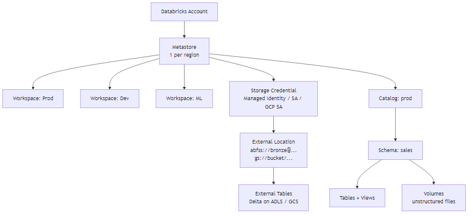

# Unity Catalog — Advanced Patterns

## What problem does this solve?
The Unity Catalog overview covers RBAC basics. This guide covers the patterns needed in real production deployments: multi-workspace setup, storage credential + external location wiring, Delta Sharing across organisations, audit monitoring, and the migration path from legacy Hive metastores.

## How it works



### Metastore and workspace assignment

```sql
-- One metastore per region per account
-- Assign metastore to workspace (done by account admin):
-- Account Console → Workspaces → [workspace] → Data → Assign metastore

-- Verify metastore in workspace
SELECT current_metastore();

-- Default catalog for workspace (users see this catalog first)
-- Set in workspace admin: Settings → Default catalog
```

### Storage Credentials → External Locations → Tables

This three-layer chain governs all cloud storage access in UC.

```sql
-- Step 1: Create Storage Credential (account admin)
-- Azure: Managed Identity (preferred) or Service Principal
CREATE STORAGE CREDENTIAL azure_prod_mi
    WITH AZURE_MANAGED_IDENTITY (CONNECTOR_ID =
        '/subscriptions/xxxx/resourceGroups/rg/providers/Microsoft.Databricks/accessConnectors/uc-connector');

-- GCP: GCP Service Account
CREATE STORAGE CREDENTIAL gcp_prod_sa
    WITH GCP_SERVICE_ACCOUNT_KEY (
        EMAIL = 'uc-sa@my-project.iam.gserviceaccount.com',
        PRIVATE_KEY_ID = 'key-id',
        PRIVATE_KEY = 'key'
    );

-- Step 2: Create External Locations
CREATE EXTERNAL LOCATION bronze_location
    URL 'abfss://bronze@mystorageacct.dfs.core.windows.net/'
    WITH (STORAGE CREDENTIAL azure_prod_mi)
    COMMENT 'Bronze raw landing zone';

CREATE EXTERNAL LOCATION silver_location
    URL 'abfss://silver@mystorageacct.dfs.core.windows.net/'
    WITH (STORAGE CREDENTIAL azure_prod_mi);

-- Validate location is accessible
VALIDATE STORAGE CREDENTIAL azure_prod_mi;
LIST 'abfss://bronze@mystorageacct.dfs.core.windows.net/';

-- Step 3: Grant location access to data engineers
GRANT READ FILES, WRITE FILES ON EXTERNAL LOCATION bronze_location TO `data_engineers`;
GRANT READ FILES ON EXTERNAL LOCATION silver_location TO `analysts`;

-- Step 4: Create external tables on those locations
CREATE TABLE prod.bronze.raw_payments
USING DELTA
LOCATION 'abfss://bronze@mystorageacct.dfs.core.windows.net/payments/';
```

### Volumes — unstructured file governance

Volumes extend UC governance to raw files (CSV, images, models, scripts) — not just Delta tables.

```sql
-- Managed Volume (UC controls storage location)
CREATE VOLUME prod.ml_platform.model_artifacts;

-- External Volume (you control the path)
CREATE EXTERNAL VOLUME prod.ml_platform.raw_uploads
    LOCATION 'abfss://uploads@mystorageacct.dfs.core.windows.net/ml/';

-- Access volumes in Python/SQL
-- Files at: /Volumes/catalog/schema/volume/path/to/file
import mlflow
mlflow.log_artifact("/Volumes/prod/ml_platform/model_artifacts/model.pkl")

spark.read.csv("/Volumes/prod/bronze_uploads/raw_uploads/2024/01/15/events.csv")
```

### Fine-grained access patterns

```sql
-- 1. Column masking: apply to sensitive column
CREATE FUNCTION prod.security.mask_email(email STRING)
RETURN CASE
    WHEN IS_ACCOUNT_GROUP_MEMBER('pii_admins') THEN email
    ELSE CONCAT(LEFT(email, 2), '****@', SPLIT(email, '@')[1])
END;

ALTER TABLE prod.silver.customers
ALTER COLUMN email SET MASK prod.security.mask_email;

-- 2. Row filter: region-specific access
CREATE FUNCTION prod.security.filter_by_region(region STRING)
RETURN IS_ACCOUNT_GROUP_MEMBER('global_analysts')
    OR region IN (
        SELECT allowed_region
        FROM prod.security.user_region_map
        WHERE user_email = current_user()
    );

ALTER TABLE prod.gold.fact_orders
SET ROW FILTER prod.security.filter_by_region ON (ship_region);

-- 3. Dynamic data masking at view level (alternative to column mask)
CREATE VIEW prod.silver.customers_masked AS
SELECT
    customer_id,
    name,
    CASE WHEN IS_ACCOUNT_GROUP_MEMBER('pii_admins')
         THEN email ELSE '****' END AS email,
    CASE WHEN IS_ACCOUNT_GROUP_MEMBER('pii_admins')
         THEN phone ELSE '****' END AS phone
FROM prod.silver.customers;
```

### Delta Sharing — cross-organisation data sharing

```sql
-- PROVIDER SIDE
-- Create a share
CREATE SHARE fintech_auditor_share
    COMMENT 'Read-only share for external auditors';

-- Add tables to the share
ALTER SHARE fintech_auditor_share
    ADD TABLE prod.gold.fact_payments
    WITH PARTITION FILTER (payment_date >= '2024-01-01');

ALTER SHARE fintech_auditor_share
    ADD TABLE prod.gold.dim_merchant;

-- Create a recipient (generates an activation link)
CREATE RECIPIENT external_auditor_org
    USING ID 'recipient-identifier';

-- Grant access
GRANT SELECT ON SHARE fintech_auditor_share TO RECIPIENT external_auditor_org;

-- View active shares
SHOW ALL IN SHARE fintech_auditor_share;

-- RECIPIENT SIDE (no Databricks needed)
import delta_sharing

# Recipient downloads the profile.json from the activation link
profile_file = "profile.json"
client = delta_sharing.SharingClient(profile_file)

# List available tables
client.list_all_tables()

# Load into Pandas (no Spark needed)
df = delta_sharing.load_as_pandas(f"{profile_file}#fintech_auditor_share.prod.fact_payments")
```

### Audit logging via system tables

```sql
-- Unity Catalog system tables (UC must be enabled on account)
-- system.access.audit: all data access events
-- system.billing.usage: DBU consumption by job/cluster
-- system.compute.clusters: cluster lifecycle events

-- Who accessed PII tables in the last 24 hours?
SELECT
    event_time,
    user_identity.email AS user,
    request_params.full_name_arg AS table_accessed,
    source_ip_address,
    action_name
FROM system.access.audit
WHERE action_name IN ('commandSubmit', 'getTable', 'runCommand')
  AND request_params.full_name_arg LIKE 'prod.silver.customers%'
  AND event_time >= CURRENT_TIMESTAMP - INTERVAL 24 HOURS
ORDER BY event_time DESC;

-- Failed access attempts (permission denied)
SELECT
    event_time,
    user_identity.email,
    request_params.full_name_arg,
    response.error_message
FROM system.access.audit
WHERE response.status_code = 403
  AND event_time >= CURRENT_TIMESTAMP - INTERVAL 7 DAYS;

-- Column lineage: trace where gold table data came from
SELECT *
FROM system.access.column_lineage
WHERE target_table_full_name = 'prod.gold.fact_orders'
ORDER BY event_time DESC
LIMIT 50;
```

### Migration from Hive metastore to Unity Catalog

```python
# Step 1: Inventory HMS tables
hms_tables = spark.sql("SHOW TABLES IN hive_metastore").collect()
# Export: table name, location, format, schema

# Step 2: Upgrade in-place (managed tables → UC external tables)
# For external Delta tables at known locations:
spark.sql("""
    CREATE TABLE prod.sales.orders
    USING DELTA
    LOCATION 'abfss://silver@storage.dfs.core.windows.net/orders/'
""")
-- Table now governed by UC, data unchanged

# Step 3: Sync permissions
# Old HMS table ACLs → UC GRANT statements
# Example mapping:
# HMS: GRANT SELECT ON TABLE hive_metastore.sales.orders TO analysts
# UC:  GRANT SELECT ON TABLE prod.sales.orders TO `analysts`

# Step 4: Update all SQL to 3-level namespace
# Old: SELECT * FROM sales.orders
# New: SELECT * FROM prod.sales.orders

# Step 5: Redirect jobs
# Update all job notebooks/scripts to use UC catalog
# Test in dev workspace first

# Step 6: Cutover
# Enable UC enforcement on workspace
# HMS becomes read-only, then decommission
```

## Real-world scenario

Global bank: 6 Databricks workspaces (Prod-EU, Prod-US, Dev, ML, Analytics, BI). Before UC: each workspace had its own Hive metastore with duplicated governance rules. Dev engineers could access Prod tables by switching workspaces. No cross-workspace lineage. PCI columns accessible to all engineers.

After UC: one metastore for the EU region. All workspaces attached. Column masking applied once in UC — takes effect everywhere. Dev workspace sees the same catalog but `dev.*` schemas. Cross-workspace lineage shows Bronze→Silver→Gold→ML model in one graph. External auditors access compliance tables via Delta Sharing without data egress.

## What goes wrong in production

- **Credential passthrough in UC** — legacy credential passthrough (user's Azure AD token passed to storage) is deprecated in UC. Migrate to storage credentials + external locations before upgrading to UC.
- **Forgetting `USE CATALOG`** — notebooks using 2-level namespace (`sales.orders`) hit the workspace's default catalog, not `prod`. Update all SQL to 3-level or set default catalog explicitly.
- **Metastore region mismatch** — UC metastore must be in the same region as storage. Cross-region lineage tracking adds latency; cross-region data access incurs egress charges.
- **Delta Sharing partition filter omission** — sharing a full table with billions of rows to an external auditor when only the last quarter is relevant. Always add partition filters to shares.

## References
- [Unity Catalog Documentation](https://docs.databricks.com/en/data-governance/unity-catalog/index.html)
- [Storage Credentials](https://docs.databricks.com/en/connect/unity-catalog/storage-credentials.html)
- [External Locations](https://docs.databricks.com/en/connect/unity-catalog/external-locations.html)
- [Delta Sharing](https://docs.databricks.com/en/delta-sharing/index.html)
- [UC System Tables](https://docs.databricks.com/en/admin/system-tables/index.html)
- [Volumes](https://docs.databricks.com/en/connect/unity-catalog/volumes.html)
