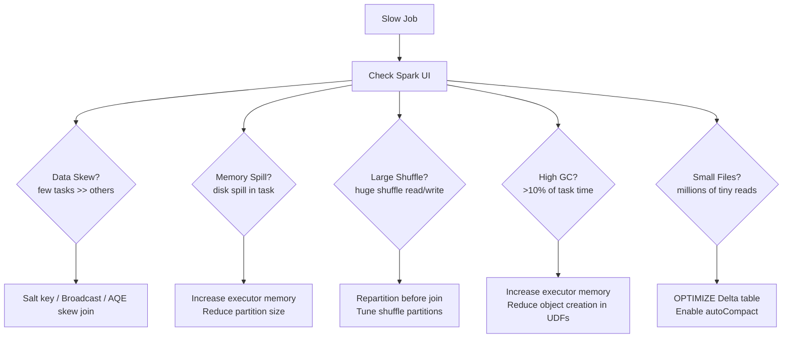

# Databricks Performance Tuning

## What problem does this solve?
A Spark job that takes 4 hours can often be reduced to 15 minutes with targeted tuning. Without a systematic approach, engineers guess at configuration knobs and get inconsistent results. This guide provides a repeatable diagnostic process and the specific fixes for each root cause.

## How it works



### Step 1 — Profile the job in Spark UI

**Jobs tab:** Identify which job is slow (check Duration column).

**Stages tab:** Find the bottleneck stage. Check:
- `Input Size` — how much data was read
- `Shuffle Write/Read` — larger than expected = investigate the shuffle
- `Duration` — which stage is the bottleneck

**Stage detail (click into the slow stage):**

```
Task duration histogram:
  ████████████  10s     ← most tasks
  █             40min   ← skewed tasks

If the histogram has a long tail → DATA SKEW

Metrics to check per task:
- Duration: spread > 5x = skew
- GC Time: > 10% of task duration = not enough memory
- Spill (memory): data spilled to JVM heap overflow buffer
- Spill (disk): executor OOM → writing to disk = very slow
- Shuffle Read/Write: identify the bottleneck stage
```

### Step 2 — Fix data skew

```python
# Symptom: 200 tasks, 3 tasks take 40min each, rest take 30sec

# Diagnosis: check which keys are skewed
df.groupBy("user_id").count().orderBy(F.desc("count")).show(10)
# user_id=BOT001: 50M rows, user_id=BOT002: 40M rows, rest < 1000 rows

# Fix 1: AQE (automatic, works for joins)
spark.conf.set("spark.sql.adaptive.enabled", "true")
spark.conf.set("spark.sql.adaptive.skewJoin.enabled", "true")
spark.conf.set("spark.sql.adaptive.skewJoin.skewedPartitionFactor", "5")
spark.conf.set("spark.sql.adaptive.skewJoin.skewedPartitionThresholdInBytes", "256m")

# Fix 2: Broadcast join (if one side is small)
from pyspark.sql.functions import broadcast
result = large_df.join(broadcast(small_lookup_df), "user_id")
# Threshold: spark.sql.autoBroadcastJoinThreshold (default 10MB)

# Fix 3: Salt the skewed key (for groupBy/aggregations)
import pyspark.sql.functions as F
SALT_BUCKETS = 20

# Add salt to the skewed table
skewed = df.withColumn("salt", (F.rand() * SALT_BUCKETS).cast("int")) \
           .withColumn("salted_key", F.concat(F.col("user_id"), F.lit("_"), F.col("salt")))

# First aggregation (with salt)
partial = skewed.groupBy("salted_key").agg(F.sum("amount").alias("partial_sum"))

# Remove salt and aggregate again
result = partial \
    .withColumn("user_id", F.split("salted_key", "_")[0]) \
    .groupBy("user_id").agg(F.sum("partial_sum").alias("total_amount"))
```

### Step 3 — Fix memory issues (OOM / spill)

```python
# Symptom: executor OOM error or large disk spill in Spark UI
# java.lang.OutOfMemoryError: Java heap space

# Fix 1: Increase executor memory
spark.conf.set("spark.executor.memory", "16g")       # heap
spark.conf.set("spark.executor.memoryOverhead", "4g") # off-heap (UDFs, native libs)

# Fix 2: Tune memory fractions
spark.conf.set("spark.memory.fraction", "0.8")         # 80% of heap for Spark
spark.conf.set("spark.memory.storageFraction", "0.3")  # 30% of Spark memory for caching

# Fix 3: More, smaller partitions (less data per task)
# If executor has 16g and shuffle has 200 partitions = 80MB/partition
# If shuffle is 400GB: 200 partitions = 2GB/partition → OOM
# Fix: increase partition count
spark.conf.set("spark.sql.shuffle.partitions", "800")  # 400GB / 800 = 500MB/partition

# Fix 4: Switch from Python UDF to Pandas UDF (vectorised)
# Python UDF: serialises each row to Python interpreter → high memory overhead
from pyspark.sql.functions import pandas_udf
import pandas as pd

# Bad: row-level Python UDF (high memory, slow)
@udf(returnType="double")
def score_row(amount, category):
    return complex_scoring_logic(amount, category)

# Good: Pandas UDF (vectorised, Arrow-backed)
@pandas_udf("double")
def score_batch(amount: pd.Series, category: pd.Series) -> pd.Series:
    return complex_scoring_logic_vectorised(amount, category)

df.withColumn("score", score_batch("amount", "category"))
```

### Step 4 — Fix shuffle performance

```python
# Symptom: stage with 400GB shuffle write, takes 90min

# Fix 1: AQE coalesces small shuffle partitions automatically
spark.conf.set("spark.sql.adaptive.enabled", "true")
spark.conf.set("spark.sql.adaptive.coalescePartitions.enabled", "true")
spark.conf.set("spark.sql.adaptive.coalescePartitions.minPartitionSize", "64m")

# Fix 2: Manually tune shuffle partition count
# Rule of thumb: aim for 100-200MB per partition after shuffle
# Total shuffle size / target partition size = shuffle partitions
# 400GB shuffle / 200MB = 2000 shuffle partitions
spark.conf.set("spark.sql.shuffle.partitions", "2000")

# Fix 3: Repartition BEFORE an expensive join to co-locate keys
# If both sides of a join will shuffle, pre-partition on the join key
df_orders = df_orders.repartition(400, "customer_id")
df_customers = df_customers.repartition(400, "customer_id")
result = df_orders.join(df_customers, "customer_id")  # no shuffle needed

# Fix 4: Eliminate unnecessary shuffles
# Bad: multiple groupBy operations on same key (each causes a shuffle)
result1 = df.groupBy("customer_id").agg(F.sum("amount"))
result2 = df.groupBy("customer_id").agg(F.count("*"))
final = result1.join(result2, "customer_id")  # 3 shuffles

# Good: combine into one aggregation
final = df.groupBy("customer_id").agg(
    F.sum("amount").alias("total_amount"),
    F.count("*").alias("order_count")
)  # 1 shuffle
```

### Step 5 — Fix small file reads from Delta

```python
# Symptom: reading a Delta table takes 30min despite small data (many tiny files)
# Spark UI shows thousands of tasks each reading < 1MB

# Diagnose: count files
spark.sql("DESCRIBE DETAIL silver.payments").select("numFiles", "sizeInBytes").show()

# Fix 1: OPTIMIZE compacts small files into target size (1GB default)
spark.sql("OPTIMIZE silver.payments")

# Fix 2: OPTIMIZE with Z-ORDER (also improves predicate pushdown)
spark.sql("OPTIMIZE silver.payments ZORDER BY (merchant_id, event_date)")

# Fix 3: Prevent small files from forming (streaming writes)
spark.conf.set("spark.databricks.delta.optimizeWrite.enabled", "true")
# OR set on table permanently:
spark.sql("""
    ALTER TABLE silver.payments
    SET TBLPROPERTIES (
        'delta.autoOptimize.optimizeWrite' = 'true',
        'delta.autoOptimize.autoCompact' = 'true'
    )
""")

# Fix 4: Tune Spark's file split size (merge small files at read time)
spark.conf.set("spark.sql.files.maxPartitionBytes", "134217728")  # 128MB per partition
spark.conf.set("spark.sql.files.openCostInBytes", "4194304")      # 4MB file open cost
```

### Step 6 — Caching strategy

```python
# Cache when: same DataFrame accessed 2+ times in same job
# Avoid cache when: DataFrame used once, or too large for executor memory

from pyspark import StorageLevel

# Cache in memory (fast, evicted if memory full)
df.cache()

# Cache in memory + disk (safer for large DataFrames)
df.persist(StorageLevel.MEMORY_AND_DISK)

# Check cache status in Spark UI → Storage tab
# Release when done
df.unpersist()

# When to cache in a pipeline:
lookup_df = spark.table("dim_customer")  # 500MB dimension table
lookup_df.cache()  # cache it

# Used 3 times — each join benefits from cache
result1 = orders_q1.join(lookup_df, "customer_id")
result2 = orders_q2.join(lookup_df, "customer_id")
result3 = returns.join(lookup_df, "customer_id")

lookup_df.unpersist()
```

### Step 7 — Key Spark configuration reference

```python
# ALWAYS set in production
spark.conf.set("spark.sql.adaptive.enabled", "true")
spark.conf.set("spark.sql.adaptive.coalescePartitions.enabled", "true")
spark.conf.set("spark.sql.adaptive.skewJoin.enabled", "true")

# Tune based on cluster size
# Rule: shuffle partitions = (total executor cores × 2) to (total executor cores × 3)
# 10 workers × 8 cores = 80 cores → set shuffle partitions to 160-240
spark.conf.set("spark.sql.shuffle.partitions", "200")  # tune to your cluster

# Broadcast join threshold (increase if memory allows)
spark.conf.set("spark.sql.autoBroadcastJoinThreshold", "50m")  # default 10MB

# File reading
spark.conf.set("spark.sql.files.maxPartitionBytes", "134217728")  # 128MB

# Memory (set per cluster, not in code)
# spark.executor.memory = 75% of worker VM RAM
# spark.executor.cores = 4 (sweet spot — more causes GC pressure)
# spark.executor.memoryOverhead = 10-15% of executor memory
```

## Real-world scenario

E-commerce platform: nightly order aggregation job runs for 4 hours on a 10-node cluster. Spark UI shows: Stage 2 (groupBy customer_id) takes 3.5 hours, 200 tasks but 5 tasks take 40 minutes each.

Diagnosis: 5 bot customer IDs generate 70% of all order events.

Fix applied:
1. `spark.sql.adaptive.skewJoin.enabled = true` — no code change, AQE splits skewed partitions automatically
2. Reduced `spark.sql.shuffle.partitions` from 200 to 400 (cluster has 80 cores, 400GB shuffle)
3. Added nightly `OPTIMIZE` on the orders Delta table (was 2M small files from streaming writes)

Result: job runtime 4 hours → 18 minutes.

## What goes wrong in production

- **Setting `spark.sql.shuffle.partitions = 200` forever** — the default is almost always wrong. For small jobs it's fine; for 500GB shuffles it means 2.5GB per partition → OOM. Tune per job or use AQE.
- **Caching huge DataFrames** — caching a 500GB table when the cluster only has 200GB executor memory causes constant eviction and recompute. Only cache what fits.
- **collect() on large results** — `df.collect()` sends all data to the driver. Driver has 8–16GB RAM. 100M rows → driver OOM. Use `.write()` to storage instead.
- **Python UDFs in hot paths** — a Python UDF called on 1B rows serialises each row between JVM and Python. 10–100x slower than native Spark functions. Use built-in functions or Pandas UDFs.
- **Not enabling AQE** — AQE is the single most impactful free optimisation. Every production cluster should have it enabled.

## References
- [Spark Tuning Guide](https://spark.apache.org/docs/latest/tuning.html)
- [Databricks Performance Tuning](https://docs.databricks.com/en/optimizations/index.html)
- [AQE Documentation](https://spark.apache.org/docs/latest/sql-performance-tuning.html#adaptive-query-execution)
- [Delta Lake Optimizations](https://docs.delta.io/latest/optimizations-oss.html)
