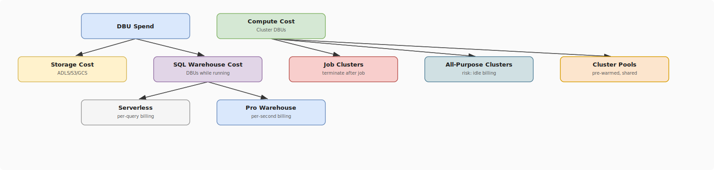

# Databricks Cost Governance

## What problem does this solve?
Databricks bills by DBU (Databricks Unit) per second. Without governance, engineers spin up oversized clusters, forget to terminate them, and run exploratory jobs on Premium compute. Monthly bills balloon unpredictably. Cost governance establishes controls, visibility, and incentives to keep spend proportional to value.

## How it works

<!-- Editable: open diagrams/05-databricks--09-cost-governance.drawio.svg in draw.io -->



### DBU pricing model

DBUs are consumed per second based on:
- **Instance type** (larger VMs = more DBUs per second)
- **Cluster type** (All-Purpose > Jobs > SQL Warehouse)
- **Runtime** (Photon = higher DBU rate but faster execution)

```
All-Purpose cluster:  ~$0.55/DBU  (interactive work)
Jobs cluster:         ~$0.30/DBU  (production pipelines — cheaper)
SQL Warehouse:        ~$0.22/DBU  (serverless SQL)
DLT Advanced:         ~$0.36/DBU  (pipeline framework)
```

> Running a jobs cluster (not all-purpose) for production ETL immediately saves ~45% on compute DBUs.

### Cluster policies — enforce cost controls

Cluster policies prevent over-provisioning by restricting what users can configure.

```json
{
    "node_type_id": {
        "type": "allowlist",
        "values": ["Standard_DS3_v2", "Standard_DS4_v2"],
        "defaultValue": "Standard_DS3_v2"
    },
    "autotermination_minutes": {
        "type": "range",
        "minValue": 10,
        "maxValue": 60,
        "defaultValue": 30
    },
    "num_workers": {
        "type": "range",
        "minValue": 1,
        "maxValue": 8,
        "defaultValue": 2
    },
    "spark_conf.spark.databricks.cluster.profile": {
        "type": "fixed",
        "value": "serverless"
    },
    "custom_tags.team": {
        "type": "fixed",
        "value": "data-engineering"
    }
}
```

Assign policies to groups:
- `analysts` → policy allowing only SQL Warehouses, max 2 clusters
- `data-engineers` → policy allowing job clusters, max 8 workers, forced auto-terminate
- `admins` → unrestricted

### Spot / Preemptible VMs for workers

```terraform
# Azure: use spot VMs for worker nodes (not driver)
resource "databricks_cluster" "etl_cluster" {
  cluster_name = "etl-prod"
  spark_version = "14.3.x-scala2.12"
  node_type_id = "Standard_DS4_v2"
  
  azure_attributes {
    availability = "SPOT_WITH_FALLBACK_AZURE"
    spot_bid_max_price = -1  # pay at most the on-demand price
  }
  
  driver_node_type_id = "Standard_DS3_v2"  # driver: on-demand (stability)
  num_workers = 4  # workers: spot (70-80% cheaper)
  
  autotermination_minutes = 30
}
```

```python
# GCP: use preemptible VMs for workers
{
    "gcp_attributes": {
        "use_preemptible_executors": True,
        "availability": "PREEMPTIBLE_WITH_FALLBACK_GCP"
    }
}
```

> **Rule:** Always use spot/preemptible for worker nodes. Use on-demand for the driver (driver loss = job failure). For Structured Streaming, use on-demand for all nodes (spot interruption mid-stream causes checkpoint issues).

### Cluster pools for cost + speed

Pools maintain pre-warmed idle VMs. Jobs acquire VMs from the pool instantly rather than waiting for cloud provisioning.

```python
# Create a pool via API / Terraform
{
    "instance_pool_name": "etl-workers-pool",
    "node_type_id": "Standard_DS4_v2",
    "min_idle_instances": 2,    # always keep 2 VMs warm
    "max_capacity": 20,          # pool ceiling
    "idle_instance_autotermination_minutes": 60,  # return to cloud after 1h idle
    "azure_attributes": {
        "availability": "SPOT_WITH_FALLBACK_AZURE"
    }
}

# Reference pool in cluster config
{
    "instance_pool_id": "pool-xxxx",
    "num_workers": 4
}
```

**Cost model:** Pool charges for idle VMs (VM cost, no DBU). Job clusters using pool: instant startup, DBU billed only during active use.

### SQL Warehouse sizing

```python
# SQL Warehouse configuration
{
    "name": "analysts-warehouse",
    "cluster_size": "Small",       # 1 cluster = 8 DBUs/hour
    "min_num_clusters": 1,
    "max_num_clusters": 3,         # scale out for concurrent queries
    "auto_stop_mins": 10,          # stop after 10min idle
    "warehouse_type": "PRO",       # PRO or SERVERLESS
    "enable_photon": True
}
```

**Sizing guide:**
| Cluster size | DBUs/hour | Use for |
|---|---|---|
| 2X-Small | 2 | Dev/test, single analyst |
| Small | 8 | Team of 5-10 analysts |
| Medium | 16 | Heavy concurrent BI workload |
| Large | 32 | Very high concurrency or huge queries |

> For most teams: **Small serverless** auto-scales for concurrency and charges only while queries run. No idle cost.

### Tagging and chargeback

Tag every cluster and warehouse for cost attribution:

```python
# In cluster policy: enforce tags
"custom_tags.team": {"type": "fixed", "value": "{{team}}"},
"custom_tags.project": {"type": "regex", "pattern": "^[a-z0-9-]+$"},
"custom_tags.env": {"type": "allowlist", "values": ["dev", "staging", "prod"]}
```

Query cost by tag using system tables (Databricks system tables, available Premium+):

```sql
-- Cost by team (last 30 days)
SELECT
    cluster_tags['team'] AS team,
    SUM(dbus) AS total_dbus,
    SUM(dbus * 0.55) AS estimated_cost_usd  -- adjust to your contract rate
FROM system.billing.usage
WHERE usage_date >= CURRENT_DATE - INTERVAL 30 DAYS
  AND billing_origin_product = 'JOBS'
GROUP BY 1
ORDER BY 2 DESC;

-- Top 10 most expensive jobs
SELECT
    usage_metadata.job_id,
    usage_metadata.job_name,
    SUM(dbus) AS total_dbus
FROM system.billing.usage
WHERE usage_date >= CURRENT_DATE - INTERVAL 7 DAYS
GROUP BY 1, 2
ORDER BY 3 DESC
LIMIT 10;
```

### Storage cost reduction

```sql
-- Remove stale Delta history (files older than 7 days default retention)
-- Run nightly to free storage
VACUUM silver.payments RETAIN 168 HOURS;

-- Check table storage size
SELECT
    table_schema,
    table_name,
    ROUND(SUM(partition_size_bytes) / 1e9, 2) AS size_gb
FROM information_schema.partitions
GROUP BY 1, 2
ORDER BY 3 DESC;

-- Archive old partitions to cheaper storage tier (ADLS lifecycle policies)
-- Or: convert old partitions to Parquet (read-only, no Delta overhead)
```

### Auto-termination non-negotiables

```python
# For interactive clusters: 30-60 min auto-terminate
# For job clusters: set in the job definition (terminates automatically after job)
# For SQL Warehouses: 10-15 min auto-stop

# Monitor idle clusters with alerts
# (Databricks system tables or Azure Monitor / GCP Cloud Monitoring)
SELECT
    cluster_id,
    cluster_name,
    state,
    last_restarted_time,
    TIMESTAMPDIFF(MINUTE, last_restarted_time, CURRENT_TIMESTAMP()) AS idle_minutes
FROM system.compute.clusters
WHERE state = 'RUNNING'
  AND TIMESTAMPDIFF(MINUTE, last_restarted_time, CURRENT_TIMESTAMP()) > 60;
```

## Real-world scenario

FinTech startup: Databricks bill grew from $8K to $47K in 3 months with no new data volume. Investigation:
- 3 data scientists left all-purpose clusters running overnight (22h × $50/h = $1,100/day each)
- Analysts using Large SQL Warehouse for simple queries that would run fine on Small
- Production ETL running on all-purpose clusters at $0.55/DBU instead of job clusters at $0.30/DBU

Remediation:
1. Cluster policies: max auto-terminate 30min for all-purpose, max 4 workers for analysts
2. SQL Warehouse downsize: Large → Small with auto-scaling to Medium for peak hours
3. All production jobs migrated to job clusters
4. Spot VMs for all worker nodes
5. System table dashboards built for weekly cost reviews by team

Result: $47K → $14K/month. Same workloads, same performance.

## What goes wrong in production

- **Cluster policies without enforcement** — policies only apply to clusters created after the policy is assigned. Existing clusters ignore them. Audit and delete non-compliant clusters when deploying policies.
- **Spot VMs for streaming jobs** — a spot interruption mid-batch corrupts the checkpoint if not handled. Use on-demand for Structured Streaming driver and workers.
- **Pool min_idle_instances too high** — keeping 10 idle VMs in a pool that's used 2h/day = paying for 22h of idle VM time. Set min_idle to 1-2 for most pools.
- **Forgetting storage costs** — Delta tables with OPTIMIZE disabled accumulate millions of small files. VACUUM never run. A 100GB table balloons to 1TB of storage. Run OPTIMIZE + VACUUM nightly.

## References
- [Databricks Pricing](https://www.databricks.com/product/pricing)
- [Cluster Policies](https://docs.databricks.com/en/administration-guide/clusters/policies.html)
- [System Tables (Billing)](https://docs.databricks.com/en/admin/system-tables/billing.html)
- [Instance Pools](https://docs.databricks.com/en/compute/pool-index.html)
- [SQL Warehouse Sizing](https://docs.databricks.com/en/compute/sql-warehouse/index.html)
