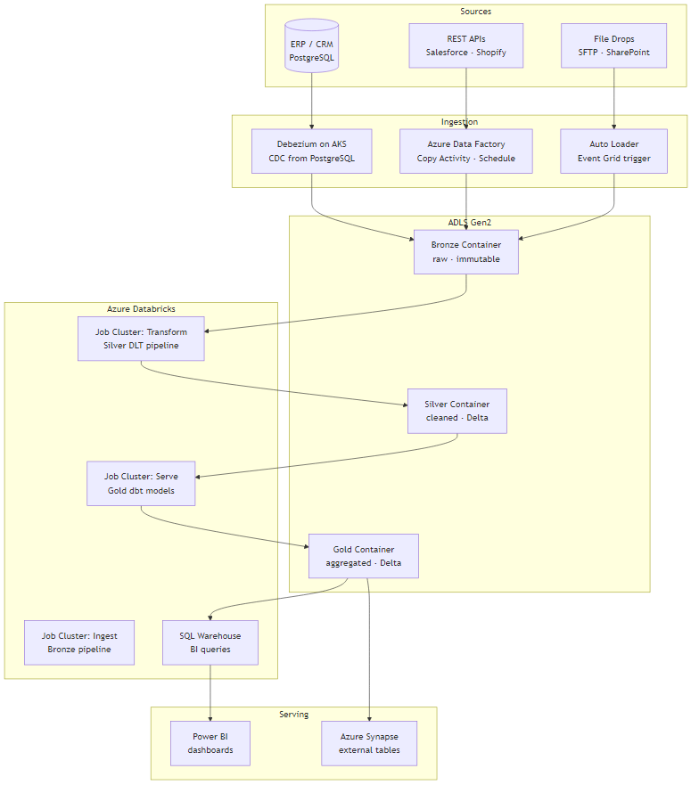
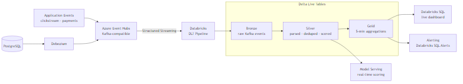
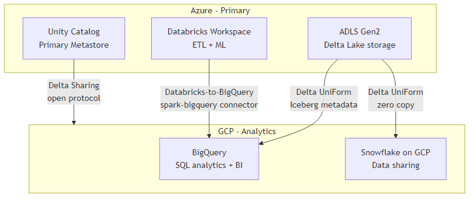
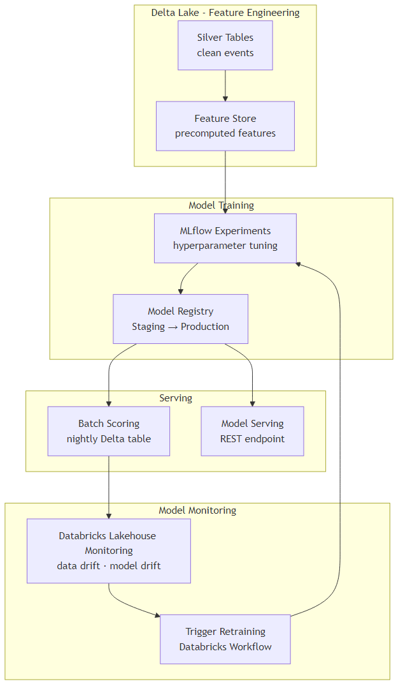

# Databricks Reference Architectures

## What problem does this solve?
Choosing how to wire together Databricks with cloud storage, streaming, orchestration, and serving layers is one of the highest-leverage decisions in platform design. Wrong choices early mean expensive rewrites later. This guide presents proven reference architectures for the three most common patterns.

## Architecture 1 — Batch Lakehouse (Azure)



**Key design decisions:**
- Debezium for operational DBs (real-time CDC), ADF for bulk/API sources
- Auto Loader with Event Grid for file-based sources (scales to millions of files)
- DLT for Bronze→Silver (built-in quality, lineage)
- dbt for Silver→Gold (SQL-first, version-controlled transformation logic)
- SQL Warehouse for analyst queries (serverless, no cluster management)
- Unity Catalog: single metastore governs all three layers

---

## Architecture 2 — Real-Time Streaming Lakehouse (Azure)



**SLA targets:**
| Stage | Latency |
|---|---|
| App event → Event Hubs | < 1s |
| Event Hubs → Bronze (DLT) | < 30s |
| Bronze → Silver (DLT) | < 2 min |
| Silver → Gold aggregations | < 5 min |
| Gold → Dashboard refresh | < 1 min |

**Key design decisions:**
- DLT Continuous mode for Bronze→Silver (sub-minute processing)
- DLT Triggered mode for Gold (5-min windows, more cost-efficient)
- `@expect_or_drop` on Silver for data quality, event log for monitoring
- Checkpoint stored on ADLS (never local disk)
- `maxOffsetsPerTrigger` set to prevent runaway batch sizes after outages

---

## Architecture 3 — Multi-Cloud Lakehouse (Azure primary + GCP analytics)



**Key design decisions:**
- Delta UniForm on Gold tables: write once in Delta, Snowflake/BigQuery read as Iceberg
- No data duplication between Azure and GCP
- Unity Catalog on Azure governs; BigQuery Policy Tags govern on GCP side
- Delta Sharing for cross-org data delivery (auditors, partners)

---

## Architecture 4 — ML Platform Lakehouse



**Key design decisions:**
- Feature Store as the single source of truth for features (no training-serving skew)
- MLflow Model Registry for versioning and promotion gates
- Batch scoring writes to Gold Delta (queryable, auditable)
- Model Serving for real-time (latency < 100ms)
- Lakehouse Monitoring detects data drift → triggers automated retraining workflow

---

## Cluster topology patterns

### Pattern A — Shared cluster (small team, cost priority)
```
1x All-Purpose cluster (4 workers, Standard_DS4_v2)
├── Interactive notebooks (analysts + engineers share)
├── Ad-hoc queries
└── Auto-terminate: 30 min idle

Cost: ~$50-80/day depending on usage
Risk: one person's runaway query impacts everyone
```

### Pattern B — Separated by workload (medium team)
```
1x SQL Warehouse (Small, serverless)     ← analysts only
1x All-Purpose cluster (engineers only)  ← exploration, dev
N× Job Clusters (production pipelines)  ← each job gets own cluster

Cost: pay per query (SQL Warehouse) + pay per job run
Risk: low — workloads isolated
```

### Pattern C — Enterprise production
```
Cluster Pool (8 pre-warmed spot VMs)
├── ETL Job Clusters (acquire from pool)     ← Bronze/Silver pipelines
├── ML Job Clusters (GPU, on-demand)         ← model training
├── Multiple SQL Warehouses                  ← per team, sized appropriately
└── Cluster Policies (enforce per group)

Cost: pool idle cost + DBU for active jobs
Risk: spot interruption on workers (handled by restart policy)
```

## Orchestration patterns

### Pattern A — Databricks Workflows only
Use when: all work is within Databricks (Spark, DLT, SQL, ML)

```
Daily Pipeline Job:
  Task 1: ingest_bronze       (Auto Loader, job cluster)
  Task 2a: dlt_silver         (DLT pipeline, after task 1)
  Task 2b: validate_quality   (notebook, after task 1)
  Task 3: build_gold          (dbt, after task 2a + 2b)
  Task 4: notify_slack        (Python, always runs)
```

### Pattern B — Airflow orchestrates Databricks
Use when: pipeline includes non-Databricks systems (Fivetran, Snowflake, dbt Cloud)

```python
# Cloud Composer / MWAA DAG
from airflow.providers.databricks.operators.databricks import DatabricksRunNowOperator
from airflow.providers.fivetran.operators.fivetran import FivetranOperator

fivetran_sync = FivetranOperator(task_id="sync_sources", connector_id="...")
run_silver = DatabricksRunNowOperator(task_id="transform_silver", job_id=12345)
run_dbt = DbtCloudRunJobOperator(task_id="dbt_gold", job_id=67890)

fivetran_sync >> run_silver >> run_dbt
```

## What goes wrong in production

- **Tight coupling between ingest and transform** — running Bronze ingest and Silver transform in the same Spark session. If Silver fails, Bronze must rerun too. Separate into distinct jobs with clear checkpoints.
- **No environment separation** — running exploratory ML experiments in the same workspace as production ETL. A mis-configured experiment job consumes all cluster resources. Separate dev/staging/prod workspaces.
- **Hardcoded cluster configuration** — cluster node type hardcoded in notebooks. When the team migrates from Azure to GCP, every notebook needs editing. Parameterise via cluster policies and job configs.
- **Missing alerting on Gold freshness** — Gold tables are 4 hours stale because an upstream DLT pipeline silently stalled. No alert fired. Always set SLA alerts on Gold table `_metadata.file_modification_time`.

## References
- [Databricks Reference Architectures](https://docs.databricks.com/en/lakehouse-architecture/index.html)
- [Azure Databricks Modern Analytics Architecture](https://learn.microsoft.com/en-us/azure/architecture/solution-ideas/articles/azure-databricks-modern-analytics-architecture)
- [Delta UniForm](https://docs.databricks.com/en/delta/uniform.html)
- [Lakehouse Monitoring](https://docs.databricks.com/en/lakehouse-monitoring/index.html)
