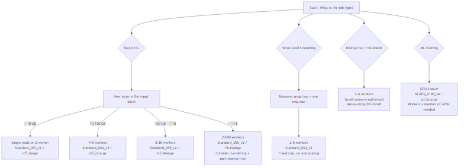

# Databricks Cluster Sizing — Practical Guide

## What problem does this solve?
Guessing cluster size leads to two failure modes: under-sized clusters OOM or run 5x slower than needed; over-sized clusters waste thousands of dollars per month. This guide gives you a repeatable decision framework to size correctly from the start, then right-size after the first run using Spark UI data.

---

## The Sizing Decision Framework



---

## Instance Type Reference

### Azure (most common in enterprise Databricks)

| Instance | vCPU | RAM | DBUs/hr | $/hr (spot est.) | Best for |
|---|---|---|---|---|---|
| `Standard_DS3_v2` | 4 | 14 GB | 0.75 | ~$0.08 | Driver, small dev clusters |
| `Standard_DS4_v2` | 8 | 28 GB | 1.5 | ~$0.16 | General ETL (sweet spot) |
| `Standard_DS5_v2` | 16 | 56 GB | 3.0 | ~$0.32 | Large shuffles, wide joins |
| `Standard_E8s_v3` | 8 | 64 GB | 2.0 | ~$0.20 | Memory-heavy (wide DataFrames, caching) |
| `Standard_E16s_v3` | 16 | 128 GB | 4.0 | ~$0.40 | Very wide tables, ML feature prep |
| `Standard_L8s_v2` | 8 | 64 GB + NVMe SSD | 2.0 | ~$0.22 | Spill-heavy workloads (sort, large joins) |

**Rule: always use DS4_v2 as your default starting point.** It has the best price/performance ratio for typical ETL. Upgrade to E-series only when you see spill to disk in Spark UI.

### AWS

| Instance | vCPU | RAM | DBUs/hr | Best for |
|---|---|---|---|---|
| `m5.xlarge` | 4 | 16 GB | 1.0 | Driver, small jobs |
| `m5.2xlarge` | 8 | 32 GB | 2.0 | General ETL (sweet spot) |
| `m5.4xlarge` | 16 | 64 GB | 4.0 | Large shuffles |
| `r5.2xlarge` | 8 | 64 GB | 2.0 | Memory-heavy workloads |
| `r5.4xlarge` | 16 | 128 GB | 4.0 | Wide tables, large aggregations |
| `i3.2xlarge` | 8 | 61 GB + NVMe | 2.0 | Spill-heavy, sort-heavy |

### GCP

| Instance | vCPU | RAM | DBUs/hr | Best for |
|---|---|---|---|---|
| `n2-standard-4` | 4 | 16 GB | 1.0 | Driver |
| `n2-standard-8` | 8 | 32 GB | 2.0 | General ETL |
| `n2-standard-16` | 16 | 64 GB | 4.0 | Large shuffles |
| `n2-highmem-8` | 8 | 64 GB | 2.0 | Memory-heavy |
| `n2-highmem-16` | 16 | 128 GB | 4.0 | Very wide aggregations |

---

## The Core Sizing Formulas

### Formula 1 — Partition count (shuffle partitions)

```
default spark.sql.shuffle.partitions = 200  ← almost always wrong

correct value = total_vCPUs × 2  (for memory-bound jobs)
             = total_vCPUs × 3  (for CPU-bound jobs / small partitions)

Example: 8 workers × 8 vCPU (DS4_v2) = 64 vCPUs
  → shuffle.partitions = 128 (memory-bound) to 192 (CPU-bound)
```

```python
# Set dynamically based on actual cluster size
total_cores = sc.defaultParallelism  # = workers × cores per worker
spark.conf.set("spark.sql.shuffle.partitions", total_cores * 2)

# Or use Adaptive Query Execution (DBR 7.0+) — let Spark auto-tune
spark.conf.set("spark.sql.adaptive.enabled", "true")
spark.conf.set("spark.sql.adaptive.coalescePartitions.enabled", "true")
# AQE will shrink large partition counts automatically after shuffle
```

### Formula 2 — Workers from data volume

```
Rule of thumb: each DS4_v2 worker can comfortably process 5–10 GB per stage

workers_needed = input_data_GB / 5   (conservative, for complex transformations)
workers_needed = input_data_GB / 10  (aggressive, for simple projections/filters)

Add 20% headroom for intermediate data growth.

Example: 80 GB parquet → 80/5 = 16 workers minimum
         80 GB parquet with simple filter → 80/10 = 8 workers
```

### Formula 3 — Memory per executor

```
executor memory = worker RAM × 0.75  (leave 25% for OS and overhead)
executor overhead = executor memory × 0.10  (add for OOM safety)

Example: DS4_v2 = 28 GB RAM
  → spark.executor.memory = 21g
  → spark.executor.memoryOverhead = 2g
  → Total consumed = 23 GB (5 GB left for OS)
```

```python
# These are set automatically in Databricks — you rarely need to override.
# Only override if you're seeing OOM errors or excessive GC time in Spark UI.
spark.conf.set("spark.executor.memory", "21g")
spark.conf.set("spark.executor.memoryOverhead", "2g")
```

---

## Worked Examples — End to End

### Example 1 — Small daily ETL (10 GB CSV → Delta)

**Scenario:** Daily file from a vendor. 10 GB compressed CSV. Simple transformations: rename columns, cast types, add partition column. Write to Delta Silver table.

**Sizing decision:**
```
Data: 10 GB compressed → ~30 GB uncompressed
Workers needed: 30 GB / 10 (simple job) = 3 workers → round up to 4
Instance: Standard_DS4_v2 (8 vCPU, 28 GB)
Total vCPUs: 4 × 8 = 32
Shuffle partitions: 32 × 2 = 64

Cluster config:
  Driver: Standard_DS3_v2 (save cost on driver)
  Workers: 4 × Standard_DS4_v2 spot
  Runtime: 45 minutes estimated
  Cost: 4 workers × 1.5 DBU × 0.75hr × $0.30/DBU = $1.35 per run
```

```python
# Job cluster config (JSON)
{
  "cluster_name": "daily-vendor-etl",
  "spark_version": "14.3.x-scala2.12",
  "driver_node_type_id": "Standard_DS3_v2",
  "node_type_id": "Standard_DS4_v2",
  "num_workers": 4,
  "azure_attributes": {
    "availability": "SPOT_WITH_FALLBACK_AZURE",  # spot workers, fallback to on-demand
    "spot_bid_max_price": -1  # pay up to on-demand price
  },
  "spark_conf": {
    "spark.sql.shuffle.partitions": "64",
    "spark.sql.adaptive.enabled": "true"
  }
}
```

```python
# The actual job
df = (spark.read
      .option("header", True)
      .option("inferSchema", False)  # always specify schema explicitly
      .schema(vendor_schema)
      .csv("abfss://raw@storage.dfs.core.windows.net/vendor/2024-01-15/")
)

df_clean = (df
    .select(
        F.col("CUST_ID").alias("customer_id"),
        F.col("TXN_AMT").cast("decimal(18,2)").alias("transaction_amount"),
        F.to_date("TXN_DATE", "yyyyMMdd").alias("transaction_date"),
        F.lit("vendor_x").alias("source")
    )
    .withColumn("year_month", F.date_format("transaction_date", "yyyy-MM"))
)

# Write partitioned by year_month
(df_clean.write
    .format("delta")
    .mode("append")
    .partitionBy("year_month")
    .option("mergeSchema", "false")
    .saveAsTable("silver.vendor_transactions")
)
```

**After first run — Spark UI validation:**
- Stages: 2 stages, max task time 45s, no spill → sizing is correct
- If tasks < 10s each → cluster is over-provisioned, reduce workers
- If spill > 10 GB → upgrade to E-series (more RAM), or reduce partition size

---

### Example 2 — Large shuffle-heavy join (500 GB)

**Scenario:** Daily reconciliation. Join `fact_orders` (400 GB) with `dim_customer` (100 GB) on `customer_id`. Compute 50 aggregations. Write to Gold table.

**Sizing decision:**
```
Data: 400 GB fact + 100 GB dim = 500 GB total read
Is dim small enough to broadcast? 100 GB >> 10 GB broadcast threshold → NO, use sort-merge join

Workers needed: 500 GB / 5 (complex job, large shuffle) = 100 workers
               → That's expensive. Can we reduce with partitioning?

Better approach:
  fact_orders is already partitioned by order_date
  Process date-by-date in a loop → each iteration is 400GB/365 ≈ 1.1 GB per day
  → 8 workers handles 1.1 GB easily

Or if full table join is required:
  Workers: 20 × Standard_DS5_v2 (16 vCPU, 56 GB) = 320 vCPUs
  Shuffle partitions: 320 × 2 = 640
  Runtime: ~45 min
  Cost: 20 × 3 DBU × 0.75hr × $0.30/DBU = $13.50 per run
```

```python
# Cluster config for large join
{
  "num_workers": 20,
  "node_type_id": "Standard_DS5_v2",   # 16 vCPU, 56 GB — needed for sort-merge shuffle
  "driver_node_type_id": "Standard_DS4_v2",
  "spark_conf": {
    "spark.sql.shuffle.partitions": "640",
    "spark.sql.adaptive.enabled": "true",
    "spark.sql.adaptive.skewJoin.enabled": "true",  # handle customer_id skew
    "spark.databricks.delta.optimizeWrite.enabled": "true"
  },
  "azure_attributes": {"availability": "SPOT_WITH_FALLBACK_AZURE"}
}
```

```python
# The join — key optimisations for large joins
from pyspark.sql import functions as F

fact = spark.table("silver.fact_orders")
dim  = spark.table("silver.dim_customer")

# Check if dim can be broadcast (it cannot at 100 GB, but check anyway)
dim_size_mb = spark.sql("DESCRIBE DETAIL silver.dim_customer") \
    .select("sizeInBytes").first()[0] / 1e6
print(f"dim_customer size: {dim_size_mb:.0f} MB")
# Output: dim_customer size: 102400 MB → too large to broadcast

# Option A: bucket both tables on customer_id (eliminates shuffle entirely)
# (requires pre-bucketing at write time — best for recurring joins)
fact.write.format("delta").bucketBy(200, "customer_id") \
    .sortBy("customer_id").saveAsTable("silver.fact_orders_bucketed")

dim.write.format("delta").bucketBy(200, "customer_id") \
    .sortBy("customer_id").saveAsTable("silver.dim_customer_bucketed")

# Bucketed join: no shuffle, much faster
result = spark.table("silver.fact_orders_bucketed") \
    .join(spark.table("silver.dim_customer_bucketed"), "customer_id") \
    .groupBy("region", "acquisition_channel") \
    .agg(
        F.sum("order_value").alias("total_revenue"),
        F.countDistinct("customer_id").alias("unique_customers"),
        F.avg("order_value").alias("avg_order_value")
    )

# Option B: if bucketing not available, use AQE + skew handling
spark.conf.set("spark.sql.adaptive.skewJoin.skewedPartitionThresholdInBytes", "256m")
result = fact.join(dim, "customer_id") \
    .groupBy("region", "acquisition_channel") \
    .agg(F.sum("order_value"), F.countDistinct("customer_id"))
```

**Spark UI signals to watch:**
- Shuffle read/write > 500 GB → consider bucketing or partitioned processing
- Any task running > 10x median → data skew, enable `skewJoin.enabled`
- Spill to disk > 20 GB → increase workers or upgrade to E-series

---

### Example 3 — Structured Streaming (Kafka → Delta)

**Scenario:** Ingest payment events from Kafka. 5,000 messages/sec average, 50,000 messages/sec peak. Each message is ~2 KB. 5-minute micro-batch trigger. Apply enrichment join with a 500 MB lookup table.

**Sizing decision:**
```
Throughput: 5,000 msg/sec × 2 KB = 10 MB/sec average
Per micro-batch (5 min): 10 MB/sec × 300 sec = 3 GB per batch (average)
Peak micro-batch: 50,000 × 2 KB × 300 sec = 30 GB

Memory needed: 30 GB data + 500 MB lookup (broadcast) + overhead
Workers: 4 × Standard_DS4_v2 (28 GB each = 112 GB total capacity) — sufficient for peak

CRITICAL: Do NOT use autoscaling for streaming.
  Autoscaling adds workers mid-batch → confuses Spark executor registration
  → tasks hang waiting for new executors → micro-batch latency spikes
  Use FIXED cluster size sized for PEAK throughput.

Also: use on-demand (not spot) for streaming workers.
  Spot interruption mid-batch = checkpoint corruption = data loss or reprocessing.
```

```python
# Streaming cluster config — fixed size, on-demand
{
  "num_workers": 4,
  "node_type_id": "Standard_DS4_v2",
  "driver_node_type_id": "Standard_DS4_v2",  # also on-demand
  "azure_attributes": {"availability": "ON_DEMAND_AZURE"},  # NOT spot
  "autoscale": None,   # explicitly no autoscaling
  "spark_conf": {
    "spark.sql.shuffle.partitions": "64",   # 4 workers × 8 cores × 2
    "spark.streaming.kafka.maxRatePerPartition": "1000",  # backpressure
    "spark.databricks.delta.optimizeWrite.enabled": "true"
  }
}
```

```python
from pyspark.sql import functions as F
from pyspark.sql.types import *

# Schema for Kafka message value
payment_schema = StructType([
    StructField("payment_id", StringType()),
    StructField("customer_id", StringType()),
    StructField("amount", DecimalType(18, 2)),
    StructField("currency", StringType()),
    StructField("merchant_id", StringType()),
    StructField("event_time", TimestampType())
])

# Broadcast the small lookup table (500 MB — fits in memory)
merchant_df = spark.table("silver.dim_merchant")
merchant_broadcast = F.broadcast(merchant_df)

# Streaming pipeline
stream_df = (
    spark.readStream
    .format("kafka")
    .option("kafka.bootstrap.servers", "broker1:9092,broker2:9092")
    .option("subscribe", "payments.events")
    .option("startingOffsets", "latest")
    .option("maxOffsetsPerTrigger", 1_000_000)  # cap per micro-batch for backpressure
    .load()
    .select(F.from_json(F.col("value").cast("string"), payment_schema).alias("data"))
    .select("data.*")
    .withWatermark("event_time", "10 minutes")  # late data tolerance
    .join(merchant_broadcast, "merchant_id", "left")
)

# Write to Delta with 5-minute micro-batches
(stream_df.writeStream
    .format("delta")
    .outputMode("append")
    .trigger(processingTime="5 minutes")
    .option("checkpointLocation", "/chk/payments-stream/")
    .table("silver.payment_events")
)
```

**Monitoring streaming cluster health:**
```python
# Key metrics to watch in Spark UI → Streaming tab:
# - Input rate: messages/sec being consumed
# - Processing rate: messages/sec being written
# If processing rate < input rate → cluster is under-sized → add workers
# Batch duration consistently > trigger interval → cluster is under-sized

# Also track:
# - Kafka consumer group lag (in Kafka monitoring)
# - If lag grows over time → cluster cannot keep up → scale up
```

---

### Example 4 — Interactive Analytics / Notebook Cluster

**Scenario:** Data science team, 5 engineers, ad-hoc queries on 50 GB Gold tables, exploratory analysis.

**Sizing decision:**
```
Interactive work is bursty: idle 70% of the time, heavy for 30%
Autoscaling is ideal here — scale to 0 when idle, up to 6 workers under load

Workers: min=0, max=6 × Standard_DS4_v2
Auto-terminate: 30 minutes (kills cluster after idle period)
Cost: pay only for active time — typically 2-3 active hours/day per engineer
```

```python
# All-purpose cluster with autoscaling — for interactive / notebook use
{
  "cluster_name": "datascience-interactive",
  "spark_version": "14.3.x-scala2.12",
  "node_type_id": "Standard_DS4_v2",
  "driver_node_type_id": "Standard_DS4_v2",
  "autoscale": {
    "min_workers": 0,   # scale to 0 when idle (saves cost during meetings etc.)
    "max_workers": 6
  },
  "autotermination_minutes": 30,
  "spark_conf": {
    "spark.sql.adaptive.enabled": "true",
    "spark.sql.shuffle.partitions": "auto"  # AQE manages this
  },
  "azure_attributes": {
    "availability": "SPOT_WITH_FALLBACK_AZURE"  # spot is fine for interactive
  }
}
```

**When to cache in interactive sessions:**

```python
# Cache when you query the same DataFrame multiple times
gold_df = spark.table("gold.sales_summary").cache()
gold_df.count()  # trigger the cache

# Check cache size
spark.catalog.isCached("gold.sales_summary")

# Clear cache when done (free memory for next query)
gold_df.unpersist()

# For very large tables: use DISK_ONLY persistence if RAM is tight
from pyspark import StorageLevel
large_df.persist(StorageLevel.DISK_ONLY)
```

---

### Example 5 — ML Training (XGBoost on 50 GB features)

**Scenario:** Weekly churn model training. Feature table: 50 GB, 200 columns, 10M rows. Training XGBoost. Then log to MLflow.

**Sizing decision:**
```
XGBoost in Spark (SparkXGBoost) uses all cores across workers for parallel tree building.
More workers = faster training BUT communication overhead increases beyond ~8 workers.

Sweet spot for XGBoost: 4-8 workers, memory-optimised
Training data 50 GB × 2 (feature matrix + gradient buffers) = 100 GB working set

Workers: 4 × Standard_E16s_v3 (16 vCPU, 128 GB) = 64 vCPUs, 512 GB total RAM
Runtime: ~25 minutes for 500 trees, depth 6
Cost: 4 × 4 DBU × 0.42hr × $0.30 = $2.02 per training run
```

```python
import mlflow
import mlflow.xgboost
from xgboost.spark import SparkXGBClassifier
from pyspark.ml import Pipeline
from pyspark.ml.feature import VectorAssembler

# Cluster config for ML training
{
  "num_workers": 4,
  "node_type_id": "Standard_E16s_v3",  # 16 vCPU, 128 GB — memory for feature matrix
  "driver_node_type_id": "Standard_E8s_v3",
  "spark_conf": {
    "spark.sql.shuffle.partitions": "128",
    "spark.databricks.delta.preview.enabled": "true"
  }
}

# Training pipeline
features_df = spark.table("gold.churn_features")
feature_cols = [c for c in features_df.columns if c not in ["customer_id", "label", "snapshot_date"]]

assembler = VectorAssembler(inputCols=feature_cols, outputCol="features")
train_df, test_df = features_df.randomSplit([0.8, 0.2], seed=42)

xgb = SparkXGBClassifier(
    featuresCol="features",
    labelCol="label",
    num_round=500,
    max_depth=6,
    learning_rate=0.05,
    subsample=0.8,
    colsample_bytree=0.8,
    n_estimators=500,
    num_workers=4,         # match your worker count
    use_gpu=False
)

pipeline = Pipeline(stages=[assembler, xgb])

with mlflow.start_run(run_name="xgb-churn-weekly"):
    mlflow.autolog()
    model = pipeline.fit(train_df)
    predictions = model.transform(test_df)
    # metrics auto-logged to MLflow
```

---

## Autoscaling: When to Use It and When Not To

| Workload | Use Autoscaling? | Reason |
|---|---|---|
| Interactive notebooks | ✅ Yes | Bursty, idle most of the time — saves cost |
| Batch ETL (consistent volume) | ❌ No | Adds worker spin-up latency mid-job; fixed is faster |
| Batch ETL (variable daily volume) | ⚠️ Maybe | Set min=base load, max=3× base |
| Structured Streaming | ❌ Never | Mid-batch scaling causes executor confusion, latency spikes |
| DLT pipelines | ✅ Enhanced autoscaling | DLT's own enhanced autoscaling is well-optimised for pipelines |
| ML training | ❌ No | Communication pattern requires stable executor count |

### How Databricks autoscaling actually works

```
Standard autoscaling: Spark-native
  - Scale up: when tasks are pending AND no free slots
  - Scale down: when workers idle for spark.dynamicAllocation.executorIdleTimeout (60s default)
  - Problem: workers removed mid-stage can cause task retries → latency spikes

Enhanced autoscaling (DLT only):
  - Databricks-managed, not Spark-native
  - Uses pipeline metrics to predict load, scales proactively
  - Smarter scale-down: waits until stage boundary
  - Only available in Delta Live Tables pipelines
```

---

## Reading the Spark UI for Right-Sizing

After every first run, open **Spark UI → Stages tab** and check:

### Signal 1 — Task duration distribution

```
Healthy:  Median 45s, Max 50s, Min 40s → uniform, well-partitioned
Problem:  Median 45s, Max 300s, Min 2s  → data skew → enable AQE skewJoin

Fix for skew:
spark.conf.set("spark.sql.adaptive.skewJoin.enabled", "true")
spark.conf.set("spark.sql.adaptive.skewJoin.skewedPartitionFactor", "5")
# Split partitions > 5× median size automatically
```

### Signal 2 — Spill to disk

```
Executor Summary tab: look for "Shuffle Spill (Disk)"
0 GB spill   → sizing is good
1–10 GB spill → marginal, acceptable
> 10 GB spill → memory pressure, action needed

Fix options (in order of preference):
1. Increase shuffle partitions (more, smaller partitions = less memory per task)
2. Upgrade to memory-optimised instance (E-series / r5) 
3. Add more workers
```

### Signal 3 — Task count vs vCPU count

```
Stage with 64 tasks on 32 vCPUs → 2 waves of tasks → efficient
Stage with 34 tasks on 32 vCPUs → 2 waves, last wave = 2 tasks → 30 vCPUs idle

Fix: repartition to nearest multiple of total vCPUs
df = df.repartition(64)   # or use AQE to coalesce automatically
```

### Signal 4 — Executor GC time

```
Executor tab: look for "GC Time" column
< 5% of task time  → healthy
5–10%              → memory pressure, consider upgrade
> 10%              → serious memory pressure, must fix
  → Increase spark.executor.memory
  → Reduce spark.sql.shuffle.partitions (fewer, larger partitions = less GC pressure)
  → Switch to G1GC: spark.executor.extraJavaOptions=-XX:+UseG1GC
```

---

## Cluster Sizing Decision Cheat Sheet

```
┌─────────────────────────────────────────────────────────────────┐
│                   CLUSTER SIZING QUICK REFERENCE                 │
├──────────────┬──────────────────┬────────────┬─────────────────┤
│ Data Volume  │ Job Type         │ Workers    │ Instance        │
├──────────────┼──────────────────┼────────────┼─────────────────┤
│ < 10 GB      │ Any batch        │ 2–4        │ DS3_v2 / m5.xl  │
│ 10–50 GB     │ Simple ETL       │ 4          │ DS4_v2 / m5.2xl │
│ 10–50 GB     │ Complex joins    │ 8          │ DS4_v2 / m5.2xl │
│ 50–200 GB    │ Simple ETL       │ 8          │ DS4_v2 / m5.2xl │
│ 50–200 GB    │ Complex joins    │ 16         │ DS5_v2 / m5.4xl │
│ 200 GB–1 TB  │ Any batch        │ 20–40      │ DS5_v2 / m5.4xl │
│ > 1 TB       │ Any batch        │ 40–80      │ DS5_v2 / r5.4xl │
│ Any          │ Streaming        │ 4–8 FIXED  │ DS4_v2 / m5.2xl │
│ Any          │ Interactive      │ 0–6 auto   │ DS4_v2 / m5.2xl │
│ 50+ GB       │ ML training      │ 4–8        │ E16s_v3 / r5.4xl│
├──────────────┴──────────────────┴────────────┴─────────────────┤
│ SHUFFLE PARTITIONS: total_vCPUs × 2                             │
│ EXECUTOR MEMORY: worker_RAM × 0.75                              │
│ SPOT VMs: always for batch workers, NEVER for streaming         │
│ AUTOSCALING: interactive only, never for streaming/ML           │
└─────────────────────────────────────────────────────────────────┘
```

---

## Common Sizing Mistakes

### Mistake 1 — Leaving shuffle.partitions at 200

```python
# Default: spark.sql.shuffle.partitions = 200
# On a 4-worker × 8-core cluster (32 vCPUs):
# 200 partitions → 7 waves of 32 tasks = 6 full waves + 1 partial (8 tasks)
# Last wave: 8/32 = 25% efficiency

# Fix: set to total_vCPUs × 2 = 64
spark.conf.set("spark.sql.shuffle.partitions", "64")
# Or enable AQE to auto-tune:
spark.conf.set("spark.sql.adaptive.enabled", "true")
spark.conf.set("spark.sql.adaptive.coalescePartitions.enabled", "true")
```

### Mistake 2 — Autoscaling on streaming

```python
# Wrong: autoscaling enabled on streaming cluster
{
  "autoscale": {"min_workers": 2, "max_workers": 10}  # NEVER for streaming
}

# Right: fixed cluster sized for peak throughput
{
  "num_workers": 6  # sized for peak, not average
}

# Why: when Spark adds a worker mid-micro-batch, the new executor
# registers AFTER the stage starts. Tasks already assigned to existing
# executors can't be redistributed → new worker sits idle for that batch.
# Net effect: you pay for more workers but get no speedup.
```

### Mistake 3 — Running production ETL on all-purpose clusters

```python
# All-purpose cluster:  $0.55/DBU  (interactive, pre-warmed)
# Job cluster:          $0.30/DBU  (single-use, auto-terminates)
# Savings: 45% just by using the right cluster type

# Wrong: scheduling a Databricks Workflow to run on an existing all-purpose cluster
{
  "existing_cluster_id": "0101-123456-abcde"  # reusing all-purpose = expensive
}

# Right: use a new job cluster per run
{
  "new_cluster": {
    "node_type_id": "Standard_DS4_v2",
    "num_workers": 4,
    "spark_version": "14.3.x-scala2.12"
  }
}
```

### Mistake 4 — Over-sizing to avoid OOM errors

```python
# Engineer gets OOM → doubles workers → OOM gone → leaves it
# Often the real fix is to tune partitions, not add workers

# Diagnosis: is OOM from data size or partition count?
# Check: Executor memory tab in Spark UI
# If "Storage Memory" is low but "Execution Memory" is high → partition issue
# If both are high → legitimately need more memory

# Partition fix (try before adding workers):
spark.conf.set("spark.sql.shuffle.partitions", "256")  # more, smaller partitions
# Each task handles less data → less memory per task → no OOM
```

### Mistake 5 — Using driver node too small

```python
# Driver collects results for collect(), toPandas(), show()
# If your code calls df.toPandas() on a 10 GB DataFrame → driver OOM

# Symptoms: driver OOM but executor memory fine

# Fix 1: Never call toPandas() on large DataFrames — use .limit(1000).toPandas()
# Fix 2: If driver OOM unavoidable, upsize driver (not workers)
{
  "driver_node_type_id": "Standard_DS5_v2",  # larger driver
  "node_type_id": "Standard_DS4_v2",         # workers unchanged
  "num_workers": 4
}
```

---

## Interview Questions — Cluster Sizing

**Q: How do you determine the number of workers needed for a 200 GB Parquet file processing job?**

Start with the formula: `workers = data_GB / 5` for complex transforms = 40 workers. But first ask: is the 200 GB already partitioned in Delta? If it's partitioned by date and you're processing one month at a time, that's 200/12 ≈ 17 GB per run → 4 workers. Always prefer processing partitioned subsets over throwing more workers at the full dataset. Then right-size after the first run using Spark UI spill and task duration metrics.

---

**Q: Why should you never use autoscaling for Structured Streaming?**

When a new worker is added mid-micro-batch, it registers with the driver after task assignment has already happened. Spark can't redistribute already-assigned tasks to the new executor in the current stage. The new worker sits idle until the next batch, so you pay for it with no throughput benefit. Additionally, if autoscaling removes a worker mid-batch, any tasks running on that executor fail and must be retried — adding latency. For streaming, size for peak load with a fixed cluster.

---

**Q: A job that processes 50 GB of data is running in 3 hours but needs to run in 30 minutes. What's your approach?**

First, check Spark UI before adding resources:
1. **Skew?** One task taking 2 hours while others take 5 minutes → fix skew with AQE or salting, not more workers
2. **Too few shuffle partitions?** 200 partitions on 64 vCPUs → only 3 full waves → set to 128
3. **Spill to disk?** Upgrade instance type (memory-optimised), not worker count
4. **CPU bottleneck with no skew/spill?** Then add workers — 10× speedup target needs ~10× more vCPUs

If all Spark UI metrics look healthy and CPU is the bottleneck → scale from 4 to 16 workers (4× vCPUs) → expect 3–4× speedup (not 4× due to Amdahl's law overhead).

---

**Q: What is the difference between executor memory and executor memory overhead? When do you need to increase overhead?**

- `spark.executor.memory`: JVM heap memory used by Spark for storing data (RDD partitions, shuffle buffers, broadcast variables)
- `spark.executor.memoryOverhead`: off-heap memory for JVM overhead, Python worker processes, native libraries (Arrow, Pandas UDFs)

Increase overhead when:
- Using PySpark with Pandas UDFs (Python process runs off-heap) — set to 20% of executor.memory
- Getting "Container killed by YARN for exceeding memory limits" or equivalent Azure/k8s OOM — this is an overhead OOM, not heap OOM
- Using Arrow-based operations or ML libraries that allocate native memory

```python
spark.conf.set("spark.executor.memory", "21g")
spark.conf.set("spark.executor.memoryOverhead", "4g")  # 20% for Pandas UDF workloads
```

---

**Q: When would you choose a memory-optimised instance (E-series / r5) over a general-purpose instance (DS-series / m5)?**

Use memory-optimised when Spark UI shows:
- Shuffle spill to disk > 5 GB (tasks don't have enough RAM to hold shuffle buffers)
- High GC time > 10% of task time (heap is full, GC runs constantly)
- Wide DataFrames (hundreds of columns) — more columns = more RAM per row
- Caching large DataFrames in memory
- ML feature matrices that don't fit in general-purpose RAM

General-purpose (DS/m5) is sufficient for most ETL: filter → join → aggregate → write. The rule: start with general-purpose, switch to memory-optimised only when Spark UI evidence shows memory pressure.

---

## References
- [Databricks Cluster Configuration Best Practices](https://docs.databricks.com/en/compute/cluster-config-best-practices.html)
- [Spark Performance Tuning Guide](https://spark.apache.org/docs/latest/sql-performance-tuning.html)
- [Databricks Instance Types — Azure](https://docs.databricks.com/en/compute/azure-compute.html)
- [Databricks Instance Types — AWS](https://docs.databricks.com/en/compute/aws-compute.html)
- [AQE Documentation](https://docs.databricks.com/en/optimizations/aqe.html)
- [Databricks Autoscaling](https://docs.databricks.com/en/compute/autoscaling.html)
