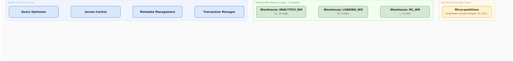

# Snowflake Architecture

## What problem does this solve?
Traditional data warehouses coupled storage and compute — scale one, you scale both. Snowflake separates them completely, enabling independent scaling, multiple compute clusters reading the same data, and pay-per-second compute billing.

## How it works

<!-- Editable: open diagrams/06-snowflake--01-snowflake-architecture.drawio.svg in draw.io -->



### Three Layers

**Cloud Services Layer**
- Query parsing, optimisation, compilation
- Authentication, access control
- Metadata (table statistics, partition info)
- Transaction management
- Always on, Snowflake-managed, no compute cost to you

**Virtual Warehouse Layer (Compute)**
- MPP clusters of EC2/Azure VMs
- Spin up in ~5 seconds, suspend after inactivity
- Billed per second when running
- Multiple warehouses read same data simultaneously — zero contention

**Database Storage Layer**
- Proprietary micro-partitioned columnar format (Parquet-like)
- 50–500MB uncompressed per micro-partition
- Automatic compression (4–10x typical)
- Stored on S3/Azure Blob/GCS managed by Snowflake

### Virtual Warehouse sizing

| Size | Credits/hour | Nodes | Use for |
|------|-------------|-------|---------|
| XS | 1 | 1 | Dev, small queries |
| S | 2 | 2 | Small teams |
| M | 4 | 4 | Analytics workloads |
| L | 8 | 8 | Complex queries, dbt |
| XL | 16 | 16 | Large transforms |
| 2XL | 32 | 32 | Very large datasets |

```sql
-- Create and size a warehouse
CREATE WAREHOUSE analytics_wh
    WAREHOUSE_SIZE = 'LARGE'
    AUTO_SUSPEND = 300          -- suspend after 5 min idle
    AUTO_RESUME = TRUE
    MIN_CLUSTER_COUNT = 1
    MAX_CLUSTER_COUNT = 3       -- multi-cluster for concurrency
    SCALING_POLICY = 'ECONOMY'; -- ECONOMY or STANDARD

-- Switch warehouse size at runtime (no downtime)
ALTER WAREHOUSE analytics_wh SET WAREHOUSE_SIZE = 'XLARGE';
```

### Result Cache
Snowflake caches query results for 24 hours. Identical query (same SQL, same data unchanged) returns instantly at zero compute cost.

```sql
-- This runs instantly if same query ran in last 24h and data unchanged
SELECT SUM(revenue) FROM fact_orders WHERE order_date >= '2024-01-01';
```

## Real-world scenario
Media company: BI team (50 analysts) and ELT pipeline share one warehouse. Analysts complain queries are slow during daily dbt run. Fix: create separate `BI_WH` and `ELT_WH`. Each warehouse gets dedicated compute. dbt runs full speed, analysts unaffected. Both warehouses read same storage — one copy of data.

## What goes wrong in production
- **AUTO_SUSPEND = 0** — warehouse never suspends. A large warehouse left running 24/7 costs $3,000–$25,000/month. Always set AUTO_SUSPEND.
- **Wrong warehouse size** — using XL for ad-hoc queries that run every hour. Right-size: start Small, scale up only when query is bottlenecked on compute (not cache miss or network).
- **Multi-cluster when not needed** — multi-cluster handles concurrency (many users querying simultaneously), not query complexity. Single large warehouse is cheaper for complex queries.

## References
- [Snowflake Architecture Documentation](https://docs.snowflake.com/en/user-guide/intro-key-concepts)
- [Virtual Warehouse Documentation](https://docs.snowflake.com/en/user-guide/warehouses-overview)
- [Snowflake Architecture Guide](https://www.snowflake.com/resource/snowflake-architecture-guide/)
