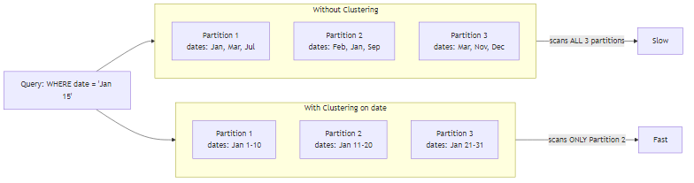

# Micro-partitions and Clustering

## What problem does this solve?
Snowflake stores data in micro-partitions (50–500MB). Without clustering, a query filtering on `order_date` must scan all micro-partitions. Clustering tells Snowflake to co-locate rows with similar `order_date` values, enabling partition pruning — scanning only the relevant micro-partitions.

## How it works



### Clustering Key

```sql
-- Set clustering key at table creation
CREATE TABLE fact_orders (
    order_id VARCHAR,
    customer_id VARCHAR,
    order_date DATE,
    region VARCHAR,
    revenue DECIMAL(10,2)
)
CLUSTER BY (order_date, region);

-- Add clustering to existing table
ALTER TABLE fact_orders CLUSTER BY (order_date, region);

-- Check clustering effectiveness
SELECT SYSTEM$CLUSTERING_INFORMATION('fact_orders', '(order_date, region)');
```

### Auto-clustering
Snowflake automatically maintains clustering in the background for a credit cost.

```sql
-- Enable auto-clustering (on by default when CLUSTER BY is set)
ALTER TABLE fact_orders RESUME RECLUSTER;

-- Disable (to control costs)
ALTER TABLE fact_orders SUSPEND RECLUSTER;

-- Manual RECLUSTER (one-time)
ALTER TABLE fact_orders RECLUSTER;
```

### Clustering depth metric
Lower = better. 1.0 = perfectly clustered. >4 = inefficient, consider recluster.

```sql
SELECT
    table_name,
    clustering_key,
    average_depth,
    total_partition_count,
    total_constant_partition_count
FROM snowflake.account_usage.table_storage_metrics
WHERE table_name = 'FACT_ORDERS';
```

### When to cluster

| Scenario | Cluster? | Key |
|----------|---------|-----|
| Table >500GB with date filter in 80%+ queries | Yes | date column |
| Table <50GB | No — overhead not worth it | N/A |
| High-cardinality join column (customer_id, many distinct values) | Maybe | test first |
| Random access patterns, no dominant filter | No | N/A |
| Frequently updated table | Maybe — auto-clustering helps | date |

## Real-world scenario
800GB `fact_orders` table. Query: `WHERE order_date >= '2024-01-01' AND region = 'APAC'`. Without clustering: scans 1,600 micro-partitions (800GB), 45 seconds, 15 credits. After clustering on `(order_date, region)`: scans 42 micro-partitions (~20GB), 3 seconds, 0.4 credits. 97% cost reduction.

## What goes wrong in production
- **Clustering a small table** — auto-clustering costs credits. Tables < 500GB usually don't need it; query result cache + micro-partition pruning on natural insert order is sufficient.
- **Wrong clustering key** — clustering on `customer_id` when 80% of queries filter on `order_date`. Always choose the most common filter column.
- **Clustering but running `DATE(order_date)` in WHERE clause** — `DATE()` function prevents partition pruning even with clustering. Use direct date comparison: `order_date >= '2024-01-01'` not `DATE(order_date) >= '2024-01-01'`.

## References
- [Snowflake Micro-partitions Documentation](https://docs.snowflake.com/en/user-guide/tables-clustering-micropartitions)
- [Snowflake Clustering Keys](https://docs.snowflake.com/en/user-guide/tables-clustering-keys)
- [Snowflake Auto-clustering](https://docs.snowflake.com/en/user-guide/tables-auto-reclustering)
