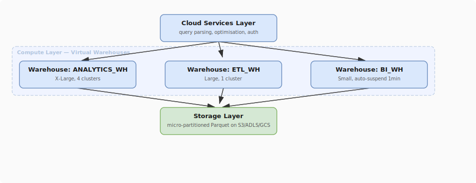

# Snowflake Compute Layer: Virtual Warehouses

## What problem does this solve?
Snowflake separates storage from compute. Understanding how virtual warehouses work — sizing, scaling, credit consumption, and multi-cluster warehouses — is essential for both performance and cost management.

## How it works

<!-- Editable: open diagrams/06-snowflake--03-virtual-warehouses.drawio.svg in draw.io -->



### Virtual Warehouse sizes and credits

Each size doubles the compute resources and credit consumption:

| Size | Credits/hour | Use case |
|------|-------------|----------|
| X-Small | 1 | Dev/test, small ad-hoc queries |
| Small | 2 | Analyst workloads, small ETL |
| Medium | 4 | Moderate concurrent BI |
| Large | 8 | Heavy ETL, complex joins |
| X-Large | 16 | Very large transformations |
| 2X-Large | 32 | Massive batch loads |
| 4X-Large | 64 | Exceptional workloads |

> **Credit ≠ cost directly.** Credits × your contracted $/credit = cost. Enterprise contracts typically $2-3/credit.

### Creating and configuring warehouses

```sql
-- Create a warehouse for BI workloads
CREATE WAREHOUSE analytics_wh
    WAREHOUSE_SIZE = 'SMALL'
    AUTO_SUSPEND = 60          -- suspend after 60s idle (cost control)
    AUTO_RESUME = TRUE         -- auto-starts on query
    MIN_CLUSTER_COUNT = 1
    MAX_CLUSTER_COUNT = 3      -- multi-cluster: scale out for concurrency
    SCALING_POLICY = 'ECONOMY' -- ECONOMY (wait before scaling) or STANDARD
    COMMENT = 'BI analyst warehouse';

-- Resize at any time (zero downtime, running queries complete on old size)
ALTER WAREHOUSE analytics_wh SET WAREHOUSE_SIZE = 'MEDIUM';

-- Suspend manually (e.g., at end of business day)
ALTER WAREHOUSE analytics_wh SUSPEND;

-- Resume (happens automatically on query if AUTO_RESUME=TRUE)
ALTER WAREHOUSE analytics_wh RESUME;
```

### Multi-Cluster Warehouses (MCW)

MCW solves **concurrency** not individual query performance. When many users query simultaneously, Snowflake scales out to additional clusters automatically.

```sql
-- Single-cluster warehouse: all queries queue behind each other
-- Symptoms: users see "queued" status, dashboards timeout

-- Multi-cluster warehouse: additional clusters handle overflow
CREATE WAREHOUSE production_bi_wh
    WAREHOUSE_SIZE = 'MEDIUM'
    MIN_CLUSTER_COUNT = 1      -- at least 1 cluster always running
    MAX_CLUSTER_COUNT = 5      -- scale out to 5 clusters when busy
    AUTO_SUSPEND = 120
    SCALING_POLICY = 'STANDARD'; -- STANDARD: add cluster immediately when queued

-- Scaling policies:
-- STANDARD: starts additional cluster immediately when queries queue
-- ECONOMY: starts cluster only after queue builds for ~6 minutes (cost-focused)
```

### Warehouse performance monitoring

```sql
-- Credit consumption by warehouse (last 7 days)
SELECT
    warehouse_name,
    SUM(credits_used) AS total_credits,
    SUM(credits_used) * 2.5 AS estimated_cost_usd, -- adjust to your rate
    COUNT(DISTINCT start_time::DATE) AS days_active
FROM snowflake.account_usage.warehouse_metering_history
WHERE start_time >= DATEADD(DAY, -7, CURRENT_TIMESTAMP())
GROUP BY warehouse_name
ORDER BY total_credits DESC;

-- Query performance by warehouse (identify slow queries)
SELECT
    warehouse_name,
    query_id,
    query_text,
    total_elapsed_time / 1000 AS elapsed_seconds,
    bytes_scanned / 1e9 AS gb_scanned,
    partitions_scanned,
    partitions_total,
    ROUND(partitions_scanned * 100.0 / partitions_total, 1) AS pct_scanned
FROM snowflake.account_usage.query_history
WHERE warehouse_name = 'ANALYTICS_WH'
  AND start_time >= DATEADD(HOUR, -24, CURRENT_TIMESTAMP())
  AND total_elapsed_time > 60000  -- queries taking > 60 seconds
ORDER BY total_elapsed_time DESC
LIMIT 20;

-- Queuing analysis (are users waiting for a cluster?)
SELECT
    warehouse_name,
    COUNT(*) AS queries_queued,
    AVG(queued_provisioning_time + queued_repair_time + queued_overload_time) / 1000
        AS avg_queue_seconds
FROM snowflake.account_usage.query_history
WHERE queued_overload_time > 0  -- queued because warehouse was busy
  AND start_time >= DATEADD(HOUR, -24, CURRENT_TIMESTAMP())
GROUP BY warehouse_name;
```

### Warehouse resource monitors

Prevent runaway credit consumption with resource monitors:

```sql
-- Create a resource monitor
CREATE RESOURCE MONITOR monthly_cap
    WITH CREDIT_QUOTA = 500  -- 500 credits per month
    FREQUENCY = MONTHLY
    START_TIMESTAMP = IMMEDIATELY
    TRIGGERS
        ON 75 PERCENT DO NOTIFY         -- email alert at 75%
        ON 90 PERCENT DO NOTIFY         -- email alert at 90%
        ON 100 PERCENT DO SUSPEND       -- suspend warehouse at 100%
        ON 110 PERCENT DO SUSPEND_IMMEDIATE; -- suspend + kill running queries

-- Assign monitor to warehouse
ALTER WAREHOUSE analytics_wh SET RESOURCE_MONITOR = monthly_cap;

-- Assign monitor to account level (caps all warehouses combined)
ALTER ACCOUNT SET RESOURCE_MONITOR = monthly_cap;
```

### Query result caching

Snowflake has two cache layers that eliminate compute entirely:

```sql
-- Result cache: identical query returns cached result (24h TTL)
-- No warehouse needed, 0 credits consumed
-- Resets on: table data change, query text change, 24h expiry

-- Check if a query hit the result cache
SELECT query_id, query_text, execution_status,
       result_from_cache  -- TRUE = served from result cache
FROM snowflake.account_usage.query_history
WHERE start_time >= DATEADD(HOUR, -1, CURRENT_TIMESTAMP())
  AND result_from_cache = TRUE;

-- Local disk cache: warehouse caches data pages in SSD after first scan
-- Subsequent queries on same data scan SSD instead of S3 (much faster)
-- Cleared when warehouse suspends — keep busy warehouses running for hot data
```

## Real-world scenario

Analytics team at a media company: 50 analysts all running Tableau dashboards against a single Medium warehouse. During morning rush (9-10am), queries queue for 5-10 minutes. Individual query performance is fine — it's a concurrency problem.

Solution: upgrade to Multi-Cluster Warehouse, Medium size, min=1, max=4, `SCALING_POLICY=STANDARD`. During off-hours, only 1 cluster runs (1× credit consumption). During peak, scales to 4 clusters automatically (4× credit consumption for ~90 minutes). Average monthly cost increase: +30%, but dashboard load time went from 10 minutes → 30 seconds. 

## What goes wrong in production

- **No AUTO_SUSPEND** — warehouse runs idle all weekend at 16 credits/hour. Set AUTO_SUSPEND to 60-120 seconds for interactive warehouses.
- **Oversizing for concurrency** — upgrading from Medium to X-Large doesn't help when the problem is 50 concurrent users. X-Large doubles the cost for each query, but still serialises them. Multi-cluster is the right fix for concurrency.
- **Single warehouse for ETL + BI** — a large ETL job runs at 9am and consumes all resources of the shared warehouse. BI analysts wait. Separate ETL_WH and BI_WH.
- **MCW MIN_CLUSTER_COUNT = 3** — keeping 3 clusters always running when only 1 is needed 90% of the time. Set MIN_CLUSTER_COUNT = 1 unless you have strict cold-start latency requirements.

## References
- [Snowflake Virtual Warehouses](https://docs.snowflake.com/en/user-guide/warehouses-overview)
- [Multi-Cluster Warehouses](https://docs.snowflake.com/en/user-guide/warehouses-multicluster)
- [Resource Monitors](https://docs.snowflake.com/en/user-guide/resource-monitors)
- [Query History](https://docs.snowflake.com/en/sql-reference/account-usage/query_history)
