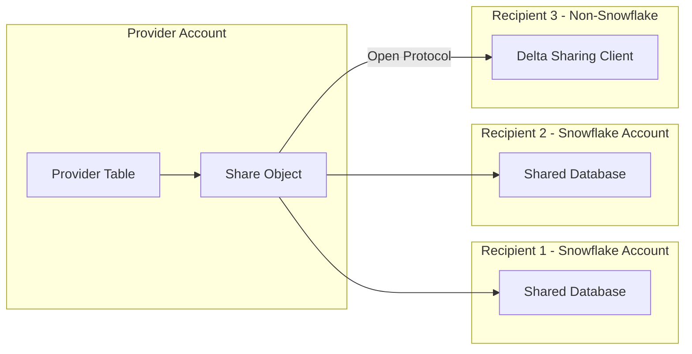

# Snowflake Data Sharing

## What problem does this solve?
Traditional data sharing requires extracting data, transferring it, and loading it into the recipient's system — creating stale copies, egress costs, and security risk. Snowflake Data Sharing lets providers share live, read-only access to their data without any data movement.

## How it works



| Node | Details |
|------|---------|
| **Provider Table** | fact_orders, dim_product |
| **Share Object** | tables + views |
| **Shared Database** | read-only |
| **Delta Sharing Client** | Python, Spark, Power BI |

No data is copied. Recipients query provider's storage directly via Snowflake's metadata layer.

### Creating and managing shares

```sql
-- PROVIDER SIDE
-- Step 1: Create a share
CREATE SHARE supplier_performance_share
    COMMENT = 'Supplier KPI data — read-only, refreshed nightly';

-- Step 2: Grant usage on database and schema
GRANT USAGE ON DATABASE prod TO SHARE supplier_performance_share;
GRANT USAGE ON SCHEMA prod.gold TO SHARE supplier_performance_share;

-- Step 3: Add tables/views to the share
GRANT SELECT ON TABLE prod.gold.fact_supplier_performance
    TO SHARE supplier_performance_share;

GRANT SELECT ON TABLE prod.gold.dim_supplier
    TO SHARE supplier_performance_share;

-- Share a view (hides sensitive columns from recipients)
CREATE SECURE VIEW prod.gold.supplier_kpis_public AS
SELECT
    supplier_id,
    supplier_name,
    on_time_delivery_rate,
    quality_score,
    performance_date
    -- NOTE: cost and margin columns intentionally excluded
FROM prod.gold.fact_supplier_performance;

GRANT SELECT ON VIEW prod.gold.supplier_kpis_public
    TO SHARE supplier_performance_share;

-- Step 4: Add recipient account
ALTER SHARE supplier_performance_share
    ADD ACCOUNTS = SUPPLIER_ABC_ACCOUNT_LOCATOR;

-- Or create a listing on Snowflake Marketplace (for public/commercial sharing)

-- RECIPIENT SIDE
-- Create a database from the share
CREATE DATABASE supplier_data FROM SHARE PROVIDER_ACCOUNT.supplier_performance_share;

-- Query shared data (read-only)
SELECT * FROM supplier_data.gold.supplier_kpis_public
WHERE performance_date >= DATEADD(MONTH, -3, CURRENT_DATE());
```

### Row-level filtering with secure views

```sql
-- Provider: share only the recipient's own data
CREATE SECURE VIEW prod.gold.my_supplier_performance AS
SELECT *
FROM prod.gold.fact_supplier_performance
WHERE supplier_id = CURRENT_ACCOUNT(); -- each recipient only sees their rows

GRANT SELECT ON VIEW prod.gold.my_supplier_performance
    TO SHARE supplier_performance_share;
-- Each supplier account queries the same view but sees only their rows
```

### Snowflake Marketplace

Publish data as a listing for external customers or public consumption:

```sql
-- Data providers can monetise data via Marketplace
-- Listing types: Free, Paid (through Snowflake billing), Private

-- As a consumer: discover and mount a data product
-- Snowflake UI: Data → Marketplace → search and request
-- Once approved:
CREATE DATABASE weather_data FROM SHARE WEATHER_PROVIDER.daily_weather_share;
```

## Real-world scenario

Retailer sharing weekly sell-through data with 35 suppliers. Old process: extract CSV per supplier, email attachments or SFTP uploads. Problems: stale data, PII exposure risk, 3-hour Friday process to generate all 35 files.

After Snowflake Data Sharing: one Secure View filters by `CURRENT_ACCOUNT()`. Each supplier has a Snowflake account and mounts the share. Data is always live (same underlying table). No extract, no SFTP, no stale files. Retailer revokes access in seconds when a supplier contract ends.

## What goes wrong in production

- **Sharing non-secure views** — regular views in shares expose the view definition to recipients. Always use `CREATE SECURE VIEW` for shared objects to protect business logic.
- **Sharing without row filtering** — sharing `fact_orders` directly exposes all suppliers' data to each other. Always add `WHERE supplier_id = CURRENT_ACCOUNT()` or use separate shares per recipient.
- **Recipient not in same cloud region** — cross-region sharing adds latency and may incur data transfer costs. Check that recipient Snowflake account is in the same cloud provider + region for best performance.

## References
- [Snowflake Data Sharing](https://docs.snowflake.com/en/user-guide/data-sharing-intro)
- [Secure Views](https://docs.snowflake.com/en/user-guide/views-secure)
- [Snowflake Marketplace](https://docs.snowflake.com/en/user-guide/data-marketplace)
