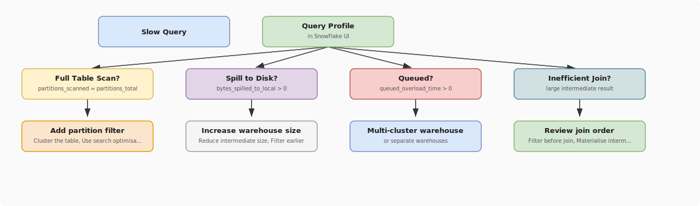

# Snowflake Performance Tuning

## What problem does this solve?
Snowflake auto-optimises many things (micro-partition pruning, result cache), but poorly written SQL or missing clustering keys can still scan terabytes unnecessarily. This guide covers the systematic approach to diagnosing and fixing slow Snowflake queries.

## How it works

<!-- Editable: open diagrams/06-snowflake--07-snowflake-performance-tuning.drawio.svg in draw.io -->



### Query Profile — the primary diagnostic tool

Every query in Snowflake generates a Query Profile. Open it: Query History → click query → View Query Profile.

**Key metrics to check:**

```sql
-- Identify expensive queries programmatically
SELECT
    query_id,
    query_text,
    total_elapsed_time / 1000 AS elapsed_sec,
    bytes_scanned / 1e9 AS gb_scanned,
    partitions_scanned,
    partitions_total,
    ROUND(partitions_scanned * 100.0 / partitions_total, 1) AS pct_partitions_scanned,
    bytes_spilled_to_local_storage / 1e9 AS gb_spilled_local,
    bytes_spilled_to_remote_storage / 1e9 AS gb_spilled_remote,
    queued_overload_time / 1000 AS queued_sec
FROM snowflake.account_usage.query_history
WHERE warehouse_name = 'ANALYTICS_WH'
  AND start_time >= DATEADD(HOUR, -24, CURRENT_TIMESTAMP())
  AND total_elapsed_time > 30000  -- > 30 seconds
ORDER BY total_elapsed_time DESC
LIMIT 20;
```

**Healthy query:** `pct_partitions_scanned < 20%`, `gb_spilled = 0`, `queued_sec = 0`

### Fix 1 — Micro-partition pruning (most impactful)

Snowflake stores min/max values per micro-partition per column. Queries with equality or range filters on those columns skip irrelevant partitions automatically.

```sql
-- Check pruning effectiveness
SELECT
    partitions_scanned,
    partitions_total,
    ROUND(partitions_scanned * 100.0 / partitions_total, 1) AS scan_pct
FROM snowflake.account_usage.query_history
WHERE query_id = '01ab2c3d-...';

-- Bad: scans 100% of partitions (no filter or filter on unindexed column)
SELECT * FROM fact_orders WHERE customer_segment = 'Enterprise';
-- customer_segment has low min/max correlation with physical order = poor pruning

-- Good: filter on columns with natural sort order (dates, sequential IDs)
SELECT * FROM fact_orders WHERE order_date = '2024-01-15';
-- order_date inserted chronologically → very good pruning

-- To improve pruning on non-date columns: use clustering keys
```

### Fix 2 — Clustering keys

Clustering physically re-orders micro-partitions by the specified column(s), dramatically improving pruning for filters on those columns.

```sql
-- Check current clustering information
SELECT SYSTEM$CLUSTERING_INFORMATION('prod.gold.fact_orders', '(order_date, region)');
-- Returns: average_depth (lower = better clustered)
-- average_depth < 2: well clustered
-- average_depth > 5: needs reclustering

-- Add clustering key (runs async in background — no downtime)
ALTER TABLE prod.gold.fact_orders
CLUSTER BY (order_date, region);

-- For high-volume tables: automatic clustering (Snowflake maintains it)
ALTER TABLE prod.gold.fact_orders
CLUSTER BY (order_date, region);  -- auto-clustering enabled by default on Enterprise+

-- Check auto-clustering history and cost
SELECT *
FROM snowflake.account_usage.automatic_clustering_history
WHERE start_time >= DATEADD(DAY, -7, CURRENT_TIMESTAMP())
ORDER BY credits_used DESC;

-- When to use clustering keys:
-- Table > 1TB (smaller tables benefit less)
-- Column used in WHERE/JOIN in > 50% of queries
-- Good candidates: date columns, region/country, status (if filtering by status)
-- Bad candidates: high-cardinality random columns (user_id, UUID) — no natural order
```

### Fix 3 — Search Optimisation Service (point lookups)

For queries searching by specific values (not ranges), the Search Optimisation Service builds a per-column access path:

```sql
-- Good for: equality filters on high-cardinality columns, LIKE searches
-- Bad for: full table scans, range filters (clustering is better)

-- Enable on table
ALTER TABLE prod.silver.customers ADD SEARCH OPTIMIZATION;

-- Enable on specific columns only (more cost-effective)
ALTER TABLE prod.silver.customers
    ADD SEARCH OPTIMIZATION ON EQUALITY(email, customer_id)
                              ON SUBSTRING(name);

-- Check usage and cost
SELECT * FROM snowflake.account_usage.search_optimization_history
WHERE start_time >= DATEADD(DAY, -7, CURRENT_TIMESTAMP());

-- Test effectiveness: run query before and after, compare partitions_scanned
-- Before: SELECT * FROM customers WHERE email = 'alice@example.com' → scans 100%
-- After: same query → scans < 1%
```

### Fix 4 — Spill to disk

Spill happens when a query's intermediate data exceeds the warehouse's memory.

```sql
-- Identify spilling queries
SELECT
    query_id, total_elapsed_time / 1000 AS elapsed_sec,
    bytes_spilled_to_local_storage / 1e9 AS local_spill_gb,
    bytes_spilled_to_remote_storage / 1e9 AS remote_spill_gb
FROM snowflake.account_usage.query_history
WHERE bytes_spilled_to_local_storage > 0
  AND start_time >= DATEADD(DAY, -1, CURRENT_TIMESTAMP())
ORDER BY bytes_spilled_to_local_storage DESC;
```

**Fixes:**
```sql
-- Option 1: Increase warehouse size temporarily
ALTER WAREHOUSE analytics_wh SET WAREHOUSE_SIZE = 'LARGE';
-- run query, then scale back
ALTER WAREHOUSE analytics_wh SET WAREHOUSE_SIZE = 'SMALL';

-- Option 2: Reduce intermediate size (filter before aggregation)
-- Bad: aggregates first, then filters
SELECT * FROM (
    SELECT customer_id, SUM(amount) AS total
    FROM fact_orders
    GROUP BY customer_id
) WHERE total > 1000;

-- Good: filter before aggregation
SELECT customer_id, SUM(amount) AS total
FROM fact_orders
WHERE amount > 0  -- filter at scan time
GROUP BY customer_id
HAVING total > 1000;

-- Option 3: Break large queries into steps using TEMP tables
CREATE TEMP TABLE order_agg AS
SELECT customer_id, SUM(amount) AS total_spend
FROM fact_orders
WHERE order_date >= '2024-01-01'
GROUP BY customer_id;

SELECT c.name, o.total_spend
FROM dim_customer c
JOIN order_agg o ON c.customer_id = o.customer_id;

DROP TABLE order_agg;
```

### Fix 5 — JOIN optimisation

```sql
-- Snowflake's query optimiser chooses join order, but hints can help
-- Always filter before joining

-- Bad: join first, filter after
SELECT o.*, c.name
FROM fact_orders o
JOIN dim_customer c ON o.customer_id = c.customer_id
WHERE o.order_date >= '2024-01-01' AND c.country = 'SG';

-- Good: subquery filter before join (let optimiser see smaller cardinality)
SELECT o.*, c.name
FROM (SELECT * FROM fact_orders WHERE order_date >= '2024-01-01') o
JOIN (SELECT * FROM dim_customer WHERE country = 'SG') c
    ON o.customer_id = c.customer_id;

-- Check join type in Query Profile
-- Hash Join: for large table joins (expected)
-- Nested Loop: for small tables (expected)
-- CartesianProduct: unexpected — check for missing join condition

-- Avoid CROSS JOIN unless intentional
-- If you see cartesian product in Query Profile with large output → missing join condition
```

### Fix 6 — Materialised views

For expensive aggregations queried frequently, materialise them:

```sql
-- Create materialised view (Snowflake maintains automatically)
CREATE MATERIALIZED VIEW daily_revenue_mv AS
SELECT
    order_date,
    region,
    SUM(amount) AS total_revenue,
    COUNT(*) AS order_count
FROM fact_orders
GROUP BY order_date, region;

-- Query the view (uses pre-computed result if base table unchanged recently)
SELECT * FROM daily_revenue_mv
WHERE order_date >= DATEADD(DAY, -30, CURRENT_DATE());

-- Check staleness and maintenance cost
SELECT *
FROM snowflake.account_usage.materialized_view_refresh_history
WHERE start_time >= DATEADD(DAY, -7, CURRENT_TIMESTAMP())
ORDER BY credits_used DESC;

-- When to use:
-- Aggregation query runs many times/day on large table
-- Aggregation logic doesn't change often
-- Base table updates are infrequent (each update triggers refresh)
```

## Real-world scenario

E-commerce company: daily revenue dashboard takes 8 minutes to load. Query scans `fact_orders` (5TB, 3 years of data). Profile shows: 95% of partitions scanned despite `WHERE order_date >= CURRENT_DATE - 7`.

Root cause: table has no clustering key. Data was loaded from 10 different source systems in random order — date values are scattered across all micro-partitions.

Fix:
1. `ALTER TABLE fact_orders CLUSTER BY (order_date)` — automatic reclustering runs overnight
2. Added materialised view for the 7-day aggregation
3. Result: 8 minutes → 12 seconds. Partition scan: 95% → 2%.

## What goes wrong in production

- **Clustering on low-cardinality columns** — clustering `status` (3 values) barely helps. Snowflake needs columns where different values are frequently queried independently. High-cardinality + frequently filtered = good clustering candidate.
- **Search Optimisation on every table** — Search Optimisation has a continuous credit cost. Only enable it on tables where point lookups are a known bottleneck.
- **Oversizing to fix spill** — upgrading to X-Large for a 30GB intermediate is overkill (and expensive). First try query rewriting to reduce the intermediate set size.
- **Result cache invalidated by non-deterministic functions** — `SELECT * FROM orders WHERE order_date = CURRENT_DATE` invalidates at midnight. Parameterise the date to preserve cache hit across runs.

## References
- [Snowflake Query Profile](https://docs.snowflake.com/en/user-guide/ui-query-profile)
- [Table Clustering](https://docs.snowflake.com/en/user-guide/tables-clustering-keys)
- [Search Optimisation Service](https://docs.snowflake.com/en/user-guide/search-optimization-service)
- [Materialized Views](https://docs.snowflake.com/en/user-guide/views-materialized)
- [Account Usage Query History](https://docs.snowflake.com/en/sql-reference/account-usage/query_history)
