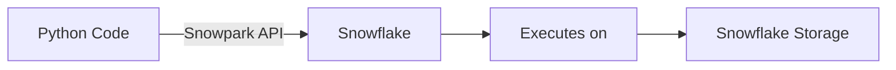

# Snowpark: Python/Java/Scala in Snowflake

## What problem does this solve?
Data engineers want to use Python (pandas, scikit-learn, custom libraries) but running Python outside Snowflake means extracting data, transforming externally, and loading back — defeating the purpose of a cloud DWH. Snowpark executes Python/Java/Scala code directly inside Snowflake's compute layer.

## How it works



| Node | Details |
|------|---------|
| **Python Code** | local or notebook |
| **Snowflake** | query plan |
| **Executes on** | Virtual Warehouse |
| **Snowflake Storage** | no data egress |

Snowpark translates Python DataFrame operations into SQL query plans executed inside Snowflake. Data never leaves Snowflake.

### Snowpark DataFrame API

```python
from snowflake.snowpark import Session
from snowflake.snowpark.functions import col, sum as sf_sum, avg, when, lit
from snowflake.snowpark.types import IntegerType, StringType

# Connect
session = Session.builder.configs({
    "account": "myaccount.us-east-1",
    "user": "engineer@company.com",
    "authenticator": "externalbrowser",  # SSO
    "warehouse": "ETL_WH",
    "database": "PROD",
    "schema": "SILVER"
}).create()

# Read table as Snowpark DataFrame (lazy — no data moved yet)
orders = session.table("PROD.SILVER.FACT_ORDERS")
customers = session.table("PROD.SILVER.DIM_CUSTOMER")

# Transformations (lazy — builds query plan)
enriched = orders \
    .join(customers, orders["customer_id"] == customers["customer_id"]) \
    .filter(col("order_date") >= lit("2024-01-01")) \
    .select(
        orders["order_id"],
        orders["amount"],
        customers["tier"],
        orders["order_date"]
    ) \
    .with_column("revenue_tier",
        when(col("amount") >= 1000, lit("high"))
        .when(col("amount") >= 100, lit("medium"))
        .otherwise(lit("low"))
    )

# Aggregate
summary = enriched \
    .group_by("tier", "revenue_tier") \
    .agg(
        sf_sum("amount").alias("total_revenue"),
        avg("amount").alias("avg_order"),
        col("order_id").count().alias("order_count")
    )

# Write result (triggers execution)
summary.write.mode("overwrite").save_as_table("PROD.GOLD.REVENUE_SUMMARY")

# View the generated SQL (for debugging)
print(summary.queries["queries"][0])
```

### Snowpark User-Defined Functions (UDFs)

```python
from snowflake.snowpark.functions import udf
from snowflake.snowpark.types import FloatType, StringType

# Scalar UDF (Python runs inside Snowflake)
@udf(name="calculate_loyalty_score", is_permanent=True,
     stage_location="@prod.etl.udf_stage",
     replace=True, session=session)
def calculate_loyalty_score(order_count: int, total_spend: float,
                             days_since_last_order: int) -> float:
    recency = max(0, 1 - days_since_last_order / 365)
    frequency = min(1, order_count / 50)
    monetary = min(1, total_spend / 10000)
    return (recency * 0.3 + frequency * 0.4 + monetary * 0.3) * 100

# Use in DataFrame
customers_scored = customers.with_column(
    "loyalty_score",
    calculate_loyalty_score(col("order_count"), col("total_spend"), col("days_since_last_order"))
)

# Vectorised UDF (batch processing with pandas — much faster for ML)
from snowflake.snowpark.functions import pandas_udf
import pandas as pd

@pandas_udf(name="batch_score_fraud", is_permanent=True,
            stage_location="@prod.etl.udf_stage", replace=True)
def batch_score_fraud(amount: pd.Series, merchant_category: pd.Series,
                       hour_of_day: pd.Series) -> pd.Series:
    import joblib
    model = joblib.load("/tmp/fraud_model.pkl")  # loaded once per worker
    features = pd.DataFrame({
        "amount": amount,
        "merchant_category_encoded": merchant_category.map(CATEGORY_ENCODING),
        "hour_of_day": hour_of_day
    })
    return pd.Series(model.predict_proba(features)[:, 1])
```

### Snowpark Stored Procedures

```python
from snowflake.snowpark.functions import sproc

# Stored procedure: runs as a unit in Snowflake, can use session + DataFrame API
def refresh_customer_segments(session: Session, as_of_date: str) -> str:
    from snowflake.snowpark.functions import col, when, lit

    customers = session.table("silver.dim_customer")
    orders = session.table("silver.fact_orders") \
        .filter(col("order_date") >= as_of_date)

    order_summary = orders.group_by("customer_id").agg(
        col("amount").sum().alias("total_spend"),
        col("order_id").count().alias("order_count")
    )

    segmented = customers.join(order_summary, "customer_id", "left") \
        .with_column("segment",
            when(col("total_spend") >= 10000, lit("VIP"))
            .when(col("total_spend") >= 1000, lit("Regular"))
            .otherwise(lit("New"))
        )

    segmented.write.mode("overwrite").save_as_table("gold.customer_segments")
    return f"Segments refreshed as of {as_of_date}: {segmented.count()} customers"

# Register and call
sp = session.sproc.register(
    func=refresh_customer_segments,
    name="refresh_customer_segments",
    is_permanent=True,
    stage_location="@prod.etl.sproc_stage",
    replace=True
)

# Call from Python
result = sp("2024-01-01")

# Or call from SQL
# CALL refresh_customer_segments('2024-01-01');
```

## Real-world scenario

Data science team: feature engineering pipeline in Python/pandas. Process: export 10GB from Snowflake → pandas on EC2 → upload features back. Total: 45 minutes, $0.50 in EC2 costs, security review flagged data egress.

After Snowpark: feature engineering runs inside Snowflake. No data leaves. Runtime: 8 minutes (Snowflake's optimised execution). No EC2, no data egress, no security risk.

## What goes wrong in production

- **Importing heavy packages in UDF without stage** — `import pandas, scikit-learn` inside a UDF that isn't pre-deployed to a stage causes the package to be uploaded on every call. Pre-deploy dependencies to a Snowflake stage.
- **Scalar UDF on billions of rows** — scalar UDFs run row-by-row. For high-volume tables use vectorised Pandas UDFs (batch processing with Arrow).
- **Session not closed** — Snowpark sessions hold a database connection. In long-running processes, unclosed sessions exhaust connection pool. Always `session.close()` in a finally block.

## References
- [Snowpark Python Documentation](https://docs.snowflake.com/en/developer-guide/snowpark/python/index)
- [Snowpark UDFs](https://docs.snowflake.com/en/developer-guide/udf/python/udf-python-introduction)
- [Snowpark Stored Procedures](https://docs.snowflake.com/en/developer-guide/stored-procedure/stored-procedures-python)
