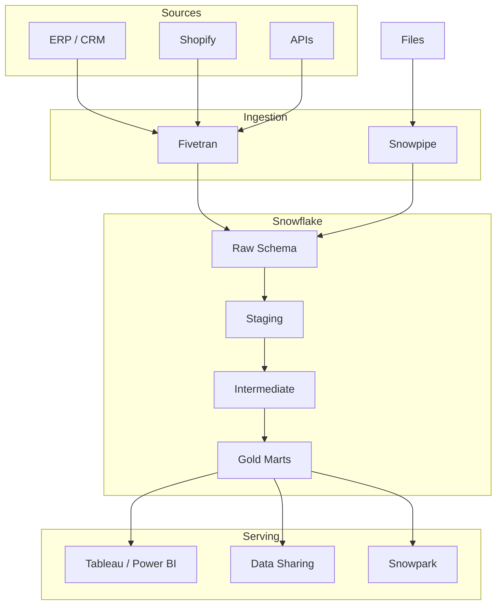
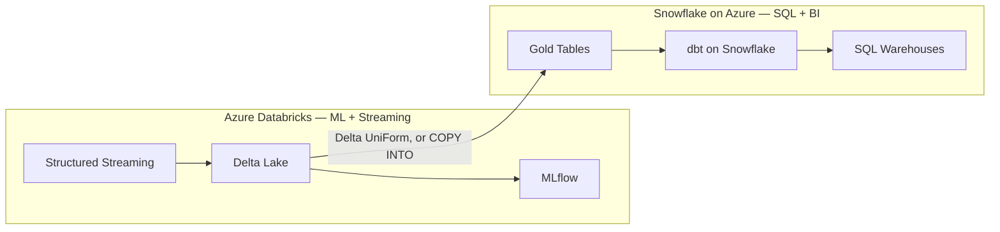

# Snowflake Reference Architectures

## Architecture 1 — Modern ELT Lakehouse (Snowflake-primary)



| Node | Details |
|------|---------|
| **Fivetran** | managed connectors |
| **Snowpipe** | continuous file loading |
| **Raw Schema** | per-source landing |
| **Staging** | dbt staging models |
| **Intermediate** | dbt cross-source |
| **Gold Marts** | dbt marts |
| **Tableau / Power BI** | Looker |
| **Data Sharing** | partners, suppliers |
| **Snowpark** | Python ML |

**Key design decisions:**
- Fivetran handles all source connectors (no custom ingestion code)
- dbt owns all transformation logic (version-controlled, tested)
- Separate warehouses: `ETL_WH` for dbt runs, `BI_WH` for Tableau, `ADMIN_WH` for maintenance
- Snowflake Data Sharing for partner/supplier data distribution
- Snowpark for Python-based ML feature engineering (no data egress)

---

## Architecture 2 — Hybrid Databricks + Snowflake



| Node | Details |
|------|---------|
| **Structured Streaming** | Kafka ingestion |
| **Delta Lake** | Bronze, Silver |
| **MLflow** | model training |
| **Gold Tables** | via UniForm / external |
| **dbt on Snowflake** | mart models |
| **SQL Warehouses** | Tableau, Power BI |

**When to use this pattern:**
- Streaming ingestion volume too high for Snowpipe → use Databricks Structured Streaming
- Need ML on the same data as BI → Databricks for ML, Snowflake for BI
- Cost: Databricks compute cheaper for Spark-scale transforms, Snowflake better for SQL-only BI

---

## Architecture 3 — Snowflake as Data Mesh Node

```mermaid
graph TD
    subgraph Domain A — Finance
        SF_A[Snowflake — Finance]
        DBT_A[dbt Finance models]
    end
    subgraph Domain B — Marketing
        SF_B[Snowflake — Marketing]
        DBT_B[dbt Marketing models]
    end
    subgraph Shared Platform
        SHARE_A[Snowflake Data Share]
        SHARE_B[Snowflake Data Share]
        DH[DataHub]
    end

    SF_A -->|publish contract| SHARE_A
    SF_B -->|publish contract| SHARE_B
    SHARE_A --> DH
    SHARE_B --> DH
```

| Node | Details |
|------|---------|
| **Snowflake — Finance** | fact_gl_entries, dim_cost_center |
| **Snowflake — Marketing** | fact_campaigns, dim_segment |
| **Snowflake Data Share** (Finance) | from Finance domain |
| **Snowflake Data Share** (Marketing) | from Marketing domain |
| **DataHub** | cross-domain catalogue |

**Data mesh principles applied:**
- Each domain owns its Snowflake schema and dbt models
- Cross-domain data access via Snowflake Data Sharing (not ETL copies)
- Data contracts defined as dbt model tests + freshness checks
- DataHub as the federated data catalogue

## References
- [Snowflake Modern Data Stack](https://www.snowflake.com/workloads/data-engineering/)
- [Fivetran + Snowflake + dbt](https://fivetran.com/docs/destinations/snowflake)
- [Snowflake Data Mesh](https://www.snowflake.com/blog/data-mesh-snowflake/)
- [dbt + Snowflake Best Practices](https://docs.getdbt.com/guides/best-practices)
