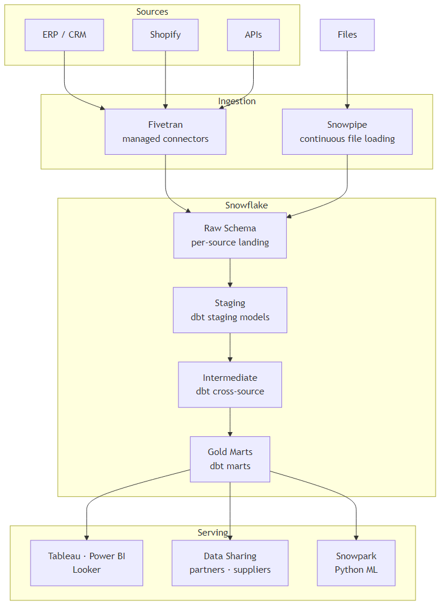
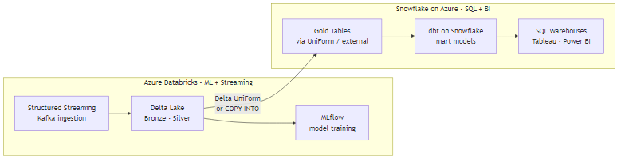
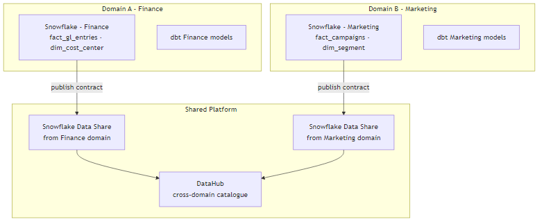

# Snowflake Reference Architectures

## Architecture 1 — Modern ELT Lakehouse (Snowflake-primary)

**Key design decisions:**
- Fivetran handles all source connectors (no custom ingestion code)
- dbt owns all transformation logic (version-controlled, tested)
- Separate warehouses: `ETL_WH` for dbt runs, `BI_WH` for Tableau, `ADMIN_WH` for maintenance
- Snowflake Data Sharing for partner/supplier data distribution
- Snowpark for Python-based ML feature engineering (no data egress)

---

## Architecture 2 — Hybrid Databricks + Snowflake

**When to use this pattern:**
- Streaming ingestion volume too high for Snowpipe → use Databricks Structured Streaming
- Need ML on the same data as BI → Databricks for ML, Snowflake for BI
- Cost: Databricks compute cheaper for Spark-scale transforms, Snowflake better for SQL-only BI

---

## Architecture 3 — Snowflake as Data Mesh Node

**Data mesh principles applied:**
- Each domain owns its Snowflake schema and dbt models
- Cross-domain data access via Snowflake Data Sharing (not ETL copies)
- Data contracts defined as dbt model tests + freshness checks
- DataHub as the federated data catalogue

## References
- [Snowflake Modern Data Stack](https://www.snowflake.com/workloads/data-engineering/)
- [Fivetran + Snowflake + dbt](https://fivetran.com/docs/destinations/snowflake)
- [Snowflake Data Mesh](https://www.snowflake.com/blog/data-mesh-snowflake/)
- [dbt + Snowflake Best Practices](https://docs.getdbt.com/guides/best-practices)
