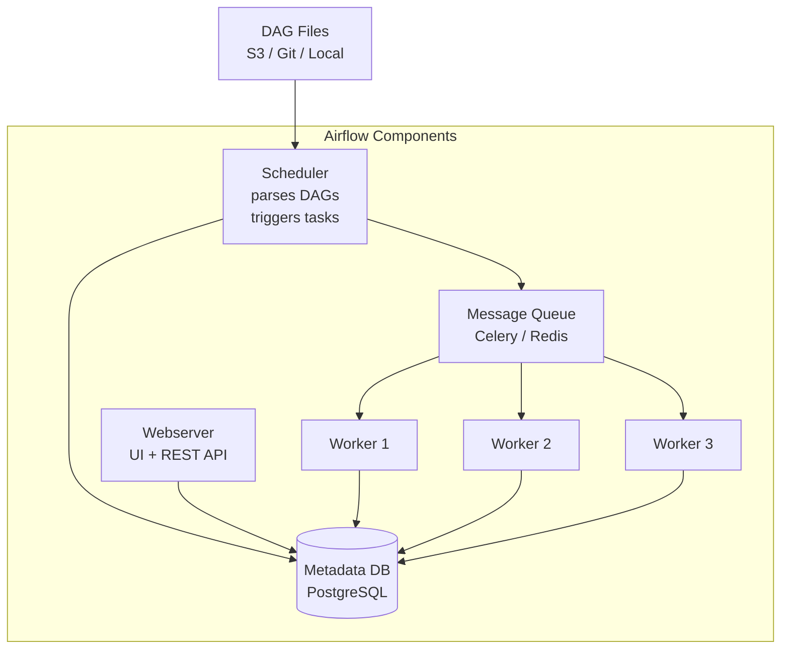

# Apache Airflow Architecture

## What problem does this solve?
Data pipelines have dependencies — run job B only after job A succeeds, retry on failure, alert on SLA breach, run on schedule. Airflow orchestrates complex workflows declaratively as Python DAGs with a full UI for monitoring.

## How it works



### Core Concepts

| Concept | Description |
|---------|-------------|
| **DAG** | Directed Acyclic Graph — the workflow definition |
| **Task** | One step in the DAG (Operator instance) |
| **Operator** | Template for a task type (PythonOperator, BashOperator, etc.) |
| **TaskFlow API** | Python decorator API — cleaner than Operator classes |
| **XCom** | Cross-task communication (small data only) |
| **Connection** | Stored credentials for external systems |
| **Variable** | Stored config values |

### Simple DAG with TaskFlow

```python
from airflow.decorators import dag, task
from airflow.providers.databricks.operators.databricks import DatabricksRunNowOperator
from airflow.providers.snowflake.operators.snowflake import SnowflakeOperator
from datetime import datetime, timedelta

@dag(
    schedule_interval="0 6 * * *",  # daily at 6am
    start_date=datetime(2024, 1, 1),
    catchup=False,
    default_args={
        "retries": 2,
        "retry_delay": timedelta(minutes=5),
        "email_on_failure": True,
        "email": ["data-oncall@company.com"]
    },
    tags=["sales", "daily"]
)
def sales_pipeline():

    # Step 1: run Databricks ingestion job
    ingest = DatabricksRunNowOperator(
        task_id="ingest_orders",
        databricks_conn_id="databricks_prod",
        job_id=12345,
        notebook_params={"date": "{{ ds }}"}  # Jinja: execution date
    )

    # Step 2: run dbt transformations
    @task
    def run_dbt():
        import subprocess
        result = subprocess.run(
            ["dbt", "run", "--select", "tag:daily", "--vars", f"{{run_date: {datetime.today().date()}}}"],
            capture_output=True, text=True
        )
        if result.returncode != 0:
            raise Exception(f"dbt failed: {result.stderr}")

    # Step 3: refresh Snowflake aggregation
    refresh_gold = SnowflakeOperator(
        task_id="refresh_daily_revenue",
        snowflake_conn_id="snowflake_prod",
        sql="CALL prod.sales.refresh_daily_revenue('{{ ds }}')"
    )

    # Set dependencies
    ingest >> run_dbt() >> refresh_gold

dag = sales_pipeline()
```

### SLA miss alert

```python
from airflow.models import DAG
from datetime import timedelta

def sla_miss_callback(dag, task_list, blocking_task_list, slas, blocking_tis):
    print(f"SLA missed for: {task_list}")
    # Send to PagerDuty / Slack

dag = DAG(
    "sales_pipeline",
    sla_miss_callback=sla_miss_callback,
    default_args={"sla": timedelta(hours=2)}  # each task must complete within 2h
)
```

### Executors comparison

| Executor | Parallelism | Best for |
|----------|------------|---------|
| SequentialExecutor | 1 task at a time | Dev / testing |
| LocalExecutor | Multi-process on one machine | Small deployments |
| CeleryExecutor | Multi-worker distributed | Production |
| KubernetesExecutor | One pod per task | Cloud-native, isolation |

## Real-world scenario
E-commerce: 200 DAGs, 50 running daily. 08:00 kickoff: ingest from 12 sources (Fivetran triggers), Databricks dbt run, Snowflake refresh, email report by 08:30. Without Airflow: cron jobs with no dependency tracking, a failed ingest causes downstream dbt to run on stale data, nobody knows. With Airflow: ingest failure pauses dbt via task dependency, SLA breach alerts fire at 08:25, engineer investigates in Airflow UI.

## What goes wrong in production
- **DAG file import errors** — one bad DAG file can crash the Scheduler. Always test DAGs with `airflow dags test` before deploying.
- **XCom for large data** — XComs store in Metadata DB. Pushing DataFrames via XCom kills the DB. Use cloud storage for data, XCom for metadata only.
- **Too many DAGs in one file** — Scheduler parses all DAG files on every heartbeat (30s default). 500 DAGs in one file = slow parse = scheduler lag. One DAG per file.

## References
- [Airflow Architecture Documentation](https://airflow.apache.org/docs/apache-airflow/stable/core-concepts/overview.html)
- [Airflow Databricks Provider](https://airflow.apache.org/docs/apache-airflow-providers-databricks/stable/index.html)
- [Airflow Snowflake Provider](https://airflow.apache.org/docs/apache-airflow-providers-snowflake/stable/index.html)
- [Astronomer Cosmos (dbt + Airflow)](https://astronomer.github.io/astronomer-cosmos/)
- [Amazon MWAA](https://docs.aws.amazon.com/mwaa/)
- [GCP Cloud Composer](https://cloud.google.com/composer/docs)
- [Azure Managed Airflow](https://learn.microsoft.com/en-us/azure/data-factory/concept-managed-airflow)
