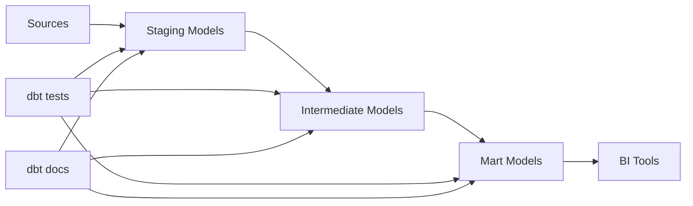

# dbt (data build tool) — Core Patterns

## What problem does this solve?
SQL transformation logic lives in ad-hoc scripts, stored procedures, or BI tool calculated fields with no version control, no tests, no documentation, and no dependency management. dbt brings software engineering practices (Git, CI/CD, testing, documentation) to SQL transformations.

## How it works



| Node | Details |
|------|---------|
| **Sources** | raw schema tables |
| **Staging Models** | one-to-one source, light casting |
| **Intermediate Models** | cross-source joins, dedup logic |
| **Mart Models** | fact + dim tables, business logic |
| **BI Tools** | Tableau, Power BI |
| **dbt tests** | not_null, unique, accepted_values |
| **dbt docs** | auto-generated |

### Project structure

```
my_dbt_project/
├── dbt_project.yml          ← project config, materialisation defaults
├── profiles.yml             ← connection config (not in Git)
├── models/
│   ├── staging/
│   │   ├── salesforce/
│   │   │   ├── _salesforce__sources.yml    ← source definitions + tests
│   │   │   ├── stg_salesforce__accounts.sql
│   │   │   └── stg_salesforce__opportunities.sql
│   │   └── postgres/
│   │       ├── _postgres__sources.yml
│   │       └── stg_postgres__orders.sql
│   ├── intermediate/
│   │   └── int_orders_unified.sql
│   └── marts/
│       ├── finance/
│       │   ├── _finance__models.yml        ← model docs + tests
│       │   ├── fct_orders.sql
│       │   └── dim_customer.sql
│       └── marketing/
│           └── fct_campaigns.sql
├── tests/
│   └── assert_revenue_positive.sql         ← singular test
├── macros/
│   └── generate_surrogate_key.sql
└── seeds/
    └── country_codes.csv
```

### Materialisation types

```sql
-- dbt_project.yml defaults
models:
  my_project:
    staging:
      +materialized: view        -- lightweight, no storage
    intermediate:
      +materialized: ephemeral   -- CTE, no object created
    marts:
      +materialized: table       -- full refresh each run
      finance:
        +materialized: incremental  -- append only new rows
```

```sql
-- models/staging/stg_postgres__orders.sql
WITH source AS (
    SELECT * FROM {{ source('postgres', 'raw_orders') }}  -- references source
),
renamed AS (
    SELECT
        order_id::VARCHAR AS order_id,
        customer_id::VARCHAR AS customer_id,
        amount::NUMERIC(18,2) AS amount_usd,
        status::VARCHAR AS status,
        created_at::TIMESTAMP AS created_at,
        updated_at::TIMESTAMP AS updated_at
    FROM source
    WHERE order_id IS NOT NULL
)
SELECT * FROM renamed
```

```sql
-- models/marts/finance/fct_orders.sql
{{
    config(
        materialized='incremental',
        unique_key='order_id',
        on_schema_change='append_new_columns'
    )
}}

WITH orders AS (
    SELECT * FROM {{ ref('stg_postgres__orders') }}  -- ref creates dependency
),
customers AS (
    SELECT * FROM {{ ref('dim_customer') }}
)
SELECT
    o.order_id,
    o.customer_id,
    c.tier AS customer_tier,
    c.region,
    o.amount_usd,
    o.status,
    o.created_at,
    o.updated_at
FROM orders o
LEFT JOIN customers c ON o.customer_id = c.customer_id


WHERE o.updated_at > (SELECT MAX(updated_at) FROM {{ this }})

```

### Testing

```yaml
# models/marts/finance/_finance__models.yml
version: 2

models:
  - name: fct_orders
    description: "One row per order. Source of truth for revenue reporting."
    columns:
      - name: order_id
        description: "Primary key — unique per order"
        tests:
          - not_null
          - unique
      - name: status
        tests:
          - accepted_values:
              values: ['placed', 'shipped', 'delivered', 'cancelled', 'refunded']
      - name: amount_usd
        tests:
          - not_null
          - dbt_utils.expression_is_true:
              expression: ">= 0"
      - name: customer_id
        tests:
          - not_null
          - relationships:
              to: ref('dim_customer')
              field: customer_id
```

```sql
-- tests/assert_total_revenue_matches_source.sql (singular test — must return 0 rows to pass)
SELECT
    'Revenue mismatch' AS issue,
    ABS(dbt_revenue - source_revenue) AS delta
FROM (
    SELECT SUM(amount_usd) AS dbt_revenue FROM {{ ref('fct_orders') }}
),
(
    SELECT SUM(amount) AS source_revenue FROM {{ source('postgres', 'raw_orders') }}
)
WHERE ABS(dbt_revenue - source_revenue) > 0.01  -- tolerance for rounding
```

### Running dbt

```bash
# Run all models
dbt run

# Run specific model and its dependencies
dbt run --select fct_orders+          # fct_orders + all downstream
dbt run --select +fct_orders          # all upstream + fct_orders
dbt run --select +fct_orders+         # full DAG around fct_orders

# Run tests
dbt test
dbt test --select fct_orders

# Generate and serve documentation
dbt docs generate
dbt docs serve  # opens browser at localhost:8080

# Check freshness of sources
dbt source freshness

# CI run (validate before merge)
dbt run --target staging --full-refresh
dbt test --target staging
```

## Real-world scenario

Analytics team: 200 SQL scripts in a Google Drive folder, each run manually in order. No tests. Last month a source column was renamed from `order_amount` to `total_amount` — 12 downstream scripts silently started returning NULLs. Nobody noticed for 3 weeks.

After dbt: `ref()` creates the dependency graph. Renaming the source column breaks `stg_postgres__orders` — dbt `compile` fails immediately. `not_null` tests on `amount_usd` would have caught NULLs on the first run. `dbt docs` shows every downstream model affected by a source change.

## What goes wrong in production

- **`{{ ref() }}` mixing with hardcoded table names** — `SELECT * FROM prod.silver.orders` bypasses dbt's dependency graph. dbt won't know this model depends on `orders`. Use `{{ ref('stg_orders') }}` everywhere.
- **Full refresh incremental models in production** — `dbt run --full-refresh` on a 10TB incremental model reprocesses everything. Only run full-refresh when schema changes require it.
- **Too many incremental models without proper `unique_key`** — without `unique_key`, incremental models only append and never update matching rows. Always set `unique_key` for upsert behaviour.

## References
- [dbt Documentation](https://docs.getdbt.com/)
- [dbt Best Practices](https://docs.getdbt.com/best-practices/how-we-structure/1-guide-overview)
- [dbt-utils package](https://hub.getdbt.com/dbt-labs/dbt_utils/latest/)
- [dbt Semantic Layer](https://docs.getdbt.com/docs/use-dbt-semantic-layer/dbt-sl)
