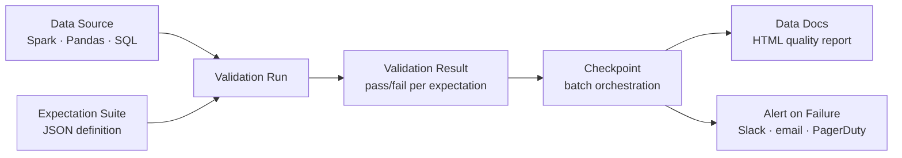

# Great Expectations — Data Quality Framework

## What problem does this solve?
Data quality rules spread across ad-hoc SQL checks, notebook assertions, and undocumented tribal knowledge. When data breaks, nobody knows which downstream consumers are affected or what the quality baseline was. Great Expectations provides a declarative framework for defining, running, and documenting data quality expectations.

## How it works



### Core concepts

- **Expectation:** A verifiable assertion about data. E.g., "column `amount` must be > 0"
- **Expectation Suite:** A collection of expectations for a dataset
- **Validator:** Runs expectations against actual data
- **Checkpoint:** Orchestrates validation + actions (save results, send alerts, update docs)
- **Data Docs:** Auto-generated HTML documentation of all expectations and validation history

### Setting up and writing expectations

```python
import great_expectations as gx

# Create or load data context (project configuration)
context = gx.get_context()

# Add a data source (Spark DataFrame)
datasource = context.sources.add_spark("payments_datasource")
data_asset = datasource.add_dataframe_asset(name="silver_payments")

batch_request = data_asset.build_batch_request(dataframe=payments_df)

# Create expectation suite
suite_name = "silver_payments.critical"
suite = context.add_or_update_expectation_suite(suite_name)
validator = context.get_validator(batch_request=batch_request, expectation_suite=suite)

# --- Define expectations ---

# Completeness
validator.expect_column_values_to_not_be_null("payment_id")
validator.expect_column_values_to_not_be_null("amount")
validator.expect_column_values_to_not_be_null("merchant_id")

# Uniqueness
validator.expect_column_values_to_be_unique("payment_id")

# Validity
validator.expect_column_values_to_be_between("amount", min_value=0.01, max_value=1000000)
validator.expect_column_values_to_be_in_set(
    "currency",
    value_set=["USD", "EUR", "GBP", "SGD", "JPY"]
)
validator.expect_column_values_to_match_regex(
    "payment_id",
    regex=r"^PAY-[0-9]{8}-[A-Z]{3}$"
)

# Timeliness (event_ts should be within last 24 hours)
validator.expect_column_values_to_be_between(
    "event_ts",
    min_value="2024-01-01T00:00:00",
    max_value="now"  # dynamic
)

# Volume (catch upstream failures early)
validator.expect_table_row_count_to_be_between(
    min_value=100000,   # at least 100K rows = data is flowing
    max_value=10000000  # not more than 10M = no duplication explosion
)

# Distribution (catch data drift)
validator.expect_column_mean_to_be_between(
    "amount", min_value=50, max_value=500
)
validator.expect_column_proportion_of_unique_values_to_be_between(
    "currency", min_value=0.00001, max_value=0.01  # few currencies, low uniqueness
)

# Schema
validator.expect_table_columns_to_match_set(
    column_set=["payment_id", "amount", "currency", "merchant_id", "event_ts", "status"],
    exact_match=True
)

# Save suite
validator.save_expectation_suite(discard_failed_expectations=False)
```

### Running validations with Checkpoints

```python
# Define a checkpoint: run suite against data + take actions on result
checkpoint = context.add_or_update_checkpoint(
    name="silver_payments_daily_checkpoint",
    validations=[
        {
            "batch_request": batch_request,
            "expectation_suite_name": "silver_payments.critical"
        }
    ]
)

# Run checkpoint
result = checkpoint.run()

# Check overall pass/fail
if not result.success:
    failed = [
        (v["expectation_config"]["expectation_type"],
         v["expectation_config"]["kwargs"])
        for v in result.list_validation_results()[0]["results"]
        if not v["success"]
    ]
    print(f"FAILED expectations: {failed}")
    # Raise exception to fail the pipeline
    raise ValueError(f"Data quality check failed: {len(failed)} expectations violated")

# Build and view Data Docs (HTML report)
context.build_data_docs()
context.open_data_docs()  # opens browser
```

### Integration with Databricks / Spark

```python
# In a Databricks notebook (as part of DLT or job)
from pyspark.sql import SparkSession
import great_expectations as gx

spark = SparkSession.getActiveSession()

# Read the table to validate
df = spark.table("silver.payments").toPandas()  # for small tables
# OR use Spark datasource for large tables (avoids toPandas)

context = gx.get_context(project_root_dir="/dbfs/great_expectations/")

datasource = context.sources.add_or_update_pandas("payments_ds")
asset = datasource.add_dataframe_asset("silver_payments")
batch_request = asset.build_batch_request(dataframe=df)

result = context.run_checkpoint(
    checkpoint_name="silver_payments_daily_checkpoint",
    batch_request=batch_request
)

assert result.success, f"Quality check failed: {result}"
```

## Real-world scenario

Data team: pipeline outputs wrong revenue numbers quarterly. Post-mortems always reveal the same root causes: a source dropped a column, an upstream system sent records with `amount=0`, or duplicate rows appeared. Each incident took 2-3 hours to diagnose.

After GX: expectations defined for every Silver table. Checkpoints run in Databricks Workflows after each ingestion job. `expect_column_values_to_not_be_null("amount")` catches the zero-amount bug on the same day it appears. `expect_table_row_count_to_be_between` detects the duplication issue before it reaches Gold. Data Docs give a historical view of expectation pass rates.

## What goes wrong in production

- **Expectations set on sample data and never updated** — expectations generated from a small sample may be too narrow (mean too precise, row count too tight). Baseline expectations on at least 30 days of data.
- **Failing the entire pipeline on warnings** — `expect_column_values_to_be_between(amount, 0, 500)` — what if a legitimate order is $501? Use `mostly=0.99` parameter to pass if 99% of values comply.
- **GX context stored on local filesystem in Databricks** — cluster restarts delete `/tmp/great_expectations`. Store context on DBFS or cloud storage.

## References
- [Great Expectations Documentation](https://docs.greatexpectations.io/)
- [GX with Spark](https://docs.greatexpectations.io/docs/guides/connecting_to_your_data/database/spark/)
- [Checkpoints](https://docs.greatexpectations.io/docs/guides/validation/checkpoints/how_to_create_a_new_checkpoint_with_the_cli)
