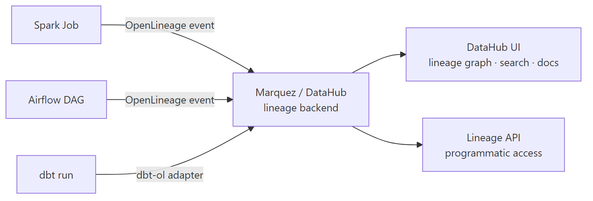

# OpenLineage & DataHub — Lineage and Data Catalogue

## What problem does this solve?
When a dashboard shows wrong numbers, how do you find the root cause? Without lineage, you manually trace through dozens of notebooks and SQL scripts. OpenLineage captures data lineage automatically as pipelines run. DataHub (or Marquez) stores and visualises it — giving you a searchable catalogue with column-level lineage from source to BI.

## How it works



### OpenLineage — the open standard

OpenLineage is a **vendor-neutral open standard** for capturing lineage events. It defines a JSON schema for `RunEvent` objects emitted when jobs start, complete, or fail.

```json
{
  "eventType": "COMPLETE",
  "eventTime": "2024-01-15T10:30:00Z",
  "run": {
    "runId": "uuid-of-this-run",
    "facets": {
      "spark_version": {"_producer": "openlineage-spark", "version": "3.5.0"}
    }
  },
  "job": {
    "namespace": "databricks-prod",
    "name": "silver.transform_payments"
  },
  "inputs": [
    {
      "namespace": "databricks-prod",
      "name": "bronze.raw_payments",
      "facets": {
        "schema": {
          "fields": [
            {"name": "payment_id", "type": "string"},
            {"name": "amount", "type": "double"}
          ]
        }
      }
    }
  ],
  "outputs": [
    {
      "namespace": "databricks-prod",
      "name": "silver.payments",
      "facets": {
        "columnLineage": {
          "fields": {
            "masked_pan": {
              "inputFields": [{"namespace": "databricks-prod",
                               "name": "bronze.raw_payments",
                               "field": "card_number"}]
            }
          }
        }
      }
    }
  ]
}
```

### Integrating OpenLineage with Spark / Databricks

```python
# Add to cluster init script or Spark config
# spark.jars.packages io.openlineage:openlineage-spark_2.12:1.9.0

# Spark config (in cluster configuration or spark_submit)
spark_conf = {
    "spark.extraListeners": "io.openlineage.spark.agent.OpenLineageSparkListener",
    "spark.openlineage.transport.type": "http",
    "spark.openlineage.transport.url": "http://datahub-gms:8080",
    "spark.openlineage.transport.auth.type": "api_key",
    "spark.openlineage.transport.auth.apiKey": "${DATAHUB_TOKEN}",
    "spark.openlineage.namespace": "databricks-prod",
    "spark.openlineage.parentJobName": "daily_payment_pipeline"
}

# No code changes needed — OpenLineage listener intercepts Spark events automatically
# Every read/write operation emits a lineage event
df = spark.table("bronze.raw_payments")       # emits input lineage event
df.write.format("delta").saveAsTable("silver.payments")  # emits output lineage event
```

### Integrating with Airflow

```python
# Install: pip install apache-airflow-providers-openlineage

# airflow.cfg
[openlineage]
transport = {"type": "http", "url": "http://datahub-gms:8080", "auth": {"type": "api_key", "apiKey": "token"}}
namespace = airflow-prod

# Automatic: Airflow automatically emits START/COMPLETE/FAIL events for every task
# No DAG code changes needed
```

### Integrating with dbt

```bash
# Install dbt-openlineage adapter
pip install openlineage-dbt

# Run dbt with lineage emission
OPENLINEAGE_URL=http://datahub-gms:8080 \
OPENLINEAGE_API_KEY=your-token \
dbt run --select +fct_orders+
```

### DataHub — metadata catalogue

DataHub is an open-source data catalogue that ingests lineage, schema, ownership, and usage metadata from many sources.

```python
# DataHub Python SDK: programmatic metadata management
from datahub.emitter.mce_builder import make_dataset_urn
from datahub.emitter.rest_emitter import DatahubRestEmitter
from datahub.metadata.schema_classes import (
    DatasetPropertiesClass, OwnershipClass, OwnerClass, OwnershipTypeClass
)

emitter = DatahubRestEmitter(gms_server="http://datahub-gms:8080",
                              token="your-token")

dataset_urn = make_dataset_urn(
    platform="databricks",
    name="prod.silver.payments",
    env="PROD"
)

# Add description and custom properties
emitter.emit_mcp(
    MetadataChangeProposalWrapper(
        entityUrn=dataset_urn,
        aspect=DatasetPropertiesClass(
            description="Cleaned payment events from Kafka. Updated every 5 minutes.",
            customProperties={
                "sla": "5 minutes",
                "owner_team": "data-engineering",
                "pii": "true"
            }
        )
    )
)

# Add ownership
emitter.emit_mcp(
    MetadataChangeProposalWrapper(
        entityUrn=dataset_urn,
        aspect=OwnershipClass(
            owners=[OwnerClass(
                owner="urn:li:corpuser:gour@company.com",
                type=OwnershipTypeClass.DATAOWNER
            )]
        )
    )
)
```

### DataHub ingestion via recipes (declarative)

```yaml
# datahub-recipe-databricks.yml
source:
  type: databricks
  config:
    workspace_url: https://myworkspace.azuredatabricks.net
    token: ${DATABRICKS_TOKEN}
    workspace_name: prod-workspace
    metastore_id: my-metastore-id
    catalog_pattern:
      allow:
        - "prod"
    include_usage_stats: true
    include_table_lineage: true
    include_column_lineage: true

sink:
  type: datahub-rest
  config:
    server: http://datahub-gms:8080
    token: ${DATAHUB_TOKEN}

# Run ingestion
# datahub ingest -c datahub-recipe-databricks.yml
```

## Real-world scenario

Data team: BI dashboard shows incorrect revenue. `fact_orders.revenue` is wrong. Without lineage: engineers spend 2 hours reading through 15 notebooks to trace where `revenue` comes from.

After DataHub + OpenLineage: open DataHub, search `fact_orders`, click `revenue` column, view column-level lineage graph: `raw_orders.amount` → `stg_orders.amount_usd` → `int_orders.net_amount` (after discount applied) → `fct_orders.revenue`. Click on `int_orders` transformation job → see the Spark run that produced it → find the discount logic bug in 5 minutes.

## What goes wrong in production

- **OpenLineage listener not in cluster init** — lineage events only fire if the Spark listener is loaded at cluster startup. Adding it to a running cluster doesn't work. Always put it in init scripts.
- **Namespace inconsistency** — Spark emits `databricks-prod.silver.payments` but dbt emits `snowflake.prod.silver.payments`. DataHub treats these as different assets. Standardise namespace conventions across tools.
- **DataHub ingestion not scheduled** — running the recipe once gives a snapshot. Schedule it daily (Airflow or cron) to keep metadata fresh.

## References
- [OpenLineage Specification](https://openlineage.io/)
- [OpenLineage Spark Integration](https://openlineage.io/docs/integrations/spark/)
- [DataHub Documentation](https://datahubproject.io/docs/)
- [DataHub Databricks Integration](https://datahubproject.io/docs/generated/ingestion/sources/databricks/)
- [Marquez (alternative backend)](https://marquezproject.ai/)
