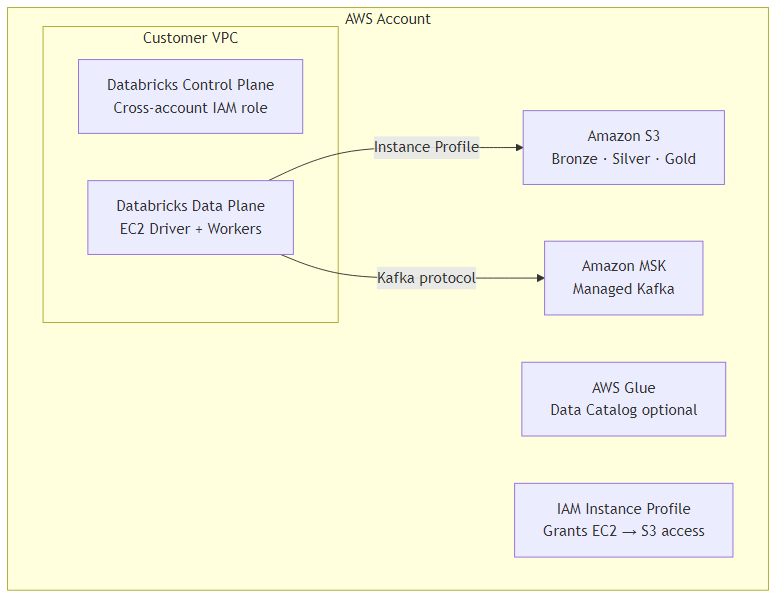

# AWS: Databricks & Snowflake Integration

## Databricks on AWS



**S3 access via instance profile (Unity Catalog)**
```terraform
resource "aws_iam_role" "databricks_s3_role" {
  name = "databricks-s3-access"
  assume_role_policy = jsonencode({
    Statement = [{
      Action = "sts:AssumeRole"
      Effect = "Allow"
      Principal = { Service = "ec2.amazonaws.com" }
    }]
  })
}

resource "aws_iam_role_policy" "s3_policy" {
  role = aws_iam_role.databricks_s3_role.id
  policy = jsonencode({
    Statement = [{
      Effect = "Allow"
      Action = ["s3:GetObject", "s3:PutObject", "s3:DeleteObject", "s3:ListBucket"]
      Resource = ["arn:aws:s3:::my-datalake-bucket", "arn:aws:s3:::my-datalake-bucket/*"]
    }]
  })
}
```

**Kinesis → Structured Streaming**
```python
kinesis_stream = spark.readStream \
    .format("kinesis") \
    .option("streamName", "payments-stream") \
    .option("region", "ap-southeast-1") \
    .option("initialPosition", "LATEST") \
    .load()
```

## Snowflake on AWS
```sql
-- Create S3 external stage for bulk loading
CREATE STAGE my_s3_stage
    URL='s3://my-datalake-bucket/snowflake-loads/'
    CREDENTIALS=(AWS_ROLE='arn:aws:iam::123456789:role/snowflake-s3-role')
    FILE_FORMAT=(TYPE='PARQUET');

-- Load from S3
COPY INTO fact_orders FROM @my_s3_stage/fact_orders/
    FILE_FORMAT=(TYPE='PARQUET')
    MATCH_BY_COLUMN_NAME=CASE_INSENSITIVE;
```

## References
- [Databricks on AWS Documentation](https://docs.databricks.com/en/getting-started/overview.html)
- [S3 Integration Guide](https://docs.databricks.com/en/connect/storage/amazon-s3.html)
- [Databricks Kinesis Integration](https://docs.databricks.com/en/structured-streaming/kinesis.html)
- [Snowflake on AWS](https://docs.snowflake.com/en/user-guide/organizations-connect-aws)
- [Amazon MWAA (Managed Airflow)](https://docs.aws.amazon.com/mwaa/)
