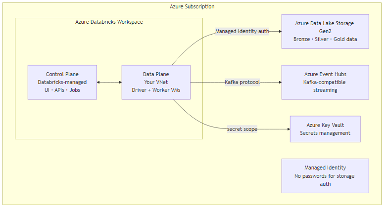

# Azure Databricks: Architecture & Setup

## How it works



### Key Azure-specific features

**ADLS Gen2 integration**
```python
# Mount ADLS Gen2 using Unity Catalog storage credential (preferred)
# No mounting needed — access directly via abfss://
df = spark.read.format("delta").load(
    "abfss://silver@mystorageacct.dfs.core.windows.net/orders"
)

# Or configure service principal (if not using UC)
spark.conf.set(
    "fs.azure.account.auth.type.mystorageacct.dfs.core.windows.net",
    "OAuth"
)
spark.conf.set(
    "fs.azure.account.oauth.provider.type.mystorageacct.dfs.core.windows.net",
    "org.apache.hadoop.fs.azurebfs.oauth2.ClientCredsTokenProvider"
)
```

**VNet injection**
```terraform
resource "azurerm_databricks_workspace" "this" {
  name                = "databricks-prod"
  resource_group_name = azurerm_resource_group.this.name
  location            = "southeastasia"
  sku                 = "premium"

  custom_parameters {
    virtual_network_id                                  = azurerm_virtual_network.this.id
    public_subnet_name                                  = "public-subnet"
    private_subnet_name                                 = "private-subnet"
    no_public_ip                                        = true  # workers get no public IP
    public_subnet_network_security_group_association_id = azurerm_subnet_network_security_group_association.public.id
    private_subnet_network_security_group_association_id = azurerm_subnet_network_security_group_association.private.id
  }
}
```

**Entra ID (AAD) integration**
```python
# Unity Catalog: assign Entra ID groups to roles
# In Databricks admin console or via API:
# GRANT USE CATALOG ON CATALOG prod TO `data-engineers@company.com`

# Entra ID SCIM provisioning auto-syncs groups from Azure AD to Databricks
# Configure in: Databricks Admin Console → Settings → Identity & access → SCIM provisioning
```

**Event Hubs as Kafka source**
```python
payments_stream = spark.readStream \
    .format("kafka") \
    .option("kafka.bootstrap.servers", "my-eventhub.servicebus.windows.net:9093") \
    .option("subscribe", "payments") \
    .option("kafka.security.protocol", "SASL_SSL") \
    .option("kafka.sasl.mechanism", "PLAIN") \
    .option("kafka.sasl.jaas.config",
        f'org.apache.kafka.common.security.plain.PlainLoginModule required '
        f'username="$ConnectionString" password="{event_hub_conn_str}";') \
    .load()
```

## What goes wrong in production
- **No VNet injection** — worker nodes get public IPs, data traverses public internet. Always use VNet injection + private endpoints in production.
- **Using storage account access keys** — rotate a key → all jobs break. Use Managed Identity or service principal via Unity Catalog storage credentials.
- **Single subnet for all workloads** — Databricks requires two subnets (public + private). Plan VNet CIDR ranges before deployment.

## References
- [Azure Databricks Documentation](https://learn.microsoft.com/en-us/azure/databricks/)
- [ADLS Gen2 Integration](https://learn.microsoft.com/en-us/azure/databricks/connect/storage/azure-storage)
- [VNet Injection](https://learn.microsoft.com/en-us/azure/databricks/security/network/classic/vnet-inject)
- [Azure Event Hubs Kafka Endpoint](https://learn.microsoft.com/en-us/azure/event-hubs/event-hubs-for-kafka-ecosystem-overview)
- [Azure Modern Analytics Architecture](https://learn.microsoft.com/en-us/azure/architecture/solution-ideas/articles/azure-databricks-modern-analytics-architecture)
