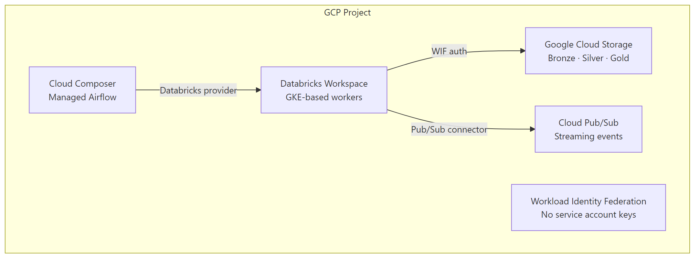

# GCP: Databricks & Snowflake Integration

## Databricks on GCP



**GCS access via Workload Identity**
```python
# No keys needed — Workload Identity Federation handles auth
df = spark.read.format("delta").load("gs://my-datalake-bucket/silver/orders/")

# Configure GCS connector (add to cluster init script)
# spark.hadoop.fs.gs.auth.type = APPLICATION_DEFAULT
```

**Pub/Sub → Structured Streaming**
```python
pubsub_stream = spark.readStream \
    .format("pubsub") \
    .option("subscriptionId", "projects/my-project/subscriptions/payments-sub") \
    .option("topic", "projects/my-project/topics/payments") \
    .load()
```

**Cloud Composer (Airflow) → Databricks**
```python
# In Cloud Composer DAG
from airflow.providers.databricks.operators.databricks import DatabricksRunNowOperator

run_databricks = DatabricksRunNowOperator(
    task_id="run_silver_transform",
    databricks_conn_id="databricks_gcp_prod",
    job_id=67890
)
```

## Snowflake on GCP
```sql
-- GCS external stage
CREATE STAGE my_gcs_stage
    URL='gcs://my-datalake-bucket/snowflake-loads/'
    STORAGE_INTEGRATION=my_gcs_integration;

-- Snowflake on GCP uses Private Service Connect for network isolation
```

## References
- [Databricks on GCP Documentation](https://docs.gcp.databricks.com/)
- [GCS Integration](https://docs.gcp.databricks.com/storage/gcs.html)
- [Workload Identity Federation](https://cloud.google.com/iam/docs/workload-identity-federation)
- [Databricks + Pub/Sub](https://docs.gcp.databricks.com/structured-streaming/pub-sub.html)
- [Cloud Composer Documentation](https://cloud.google.com/composer/docs)
- [Snowflake on GCP](https://docs.snowflake.com/en/user-guide/organizations-connect-gcp)
