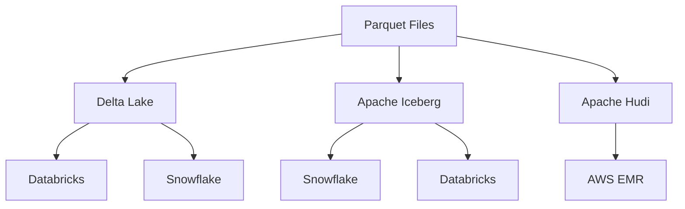

# Table Formats: Delta vs Iceberg vs Hudi

## What problem does this solve?
Three open table formats compete for the lakehouse. Choosing wrong means ecosystem lock-in, incompatible engines, or missing features for your use case.

## How they work

All three add a metadata layer on top of Parquet files on object storage to provide:
- ACID transactions
- Schema evolution
- Time travel / snapshots
- Partition management



| Node | Details |
|------|---------|
| **Parquet Files** | on S3/ADLS/GCS |
| **Delta Lake** | _delta_log/ JSON+Parquet |
| **Apache Iceberg** | metadata/ JSON+Avro |
| **Apache Hudi** | .hoodie/ avro+parquet |
| **Databricks** | native |
| **Snowflake** | via External Iceberg Tables |
| **Snowflake** | native Iceberg |
| **Databricks** | native |
| **AWS EMR** | Spark on Hadoop |

## Feature Comparison

| Feature | Delta Lake | Apache Iceberg | Apache Hudi |
|---------|-----------|---------------|-------------|
| ACID | Yes | Yes | Yes |
| Time travel | Yes | Yes | Yes |
| Schema evolution | Yes | Yes | Yes |
| Hidden partitioning | No | Yes ✓ | No |
| Branching / tagging | Yes (DBR 12.2+) | Yes ✓ | No |
| Merge-on-read | No | Yes | Yes ✓ |
| Copy-on-write | Yes ✓ | Yes | Yes |
| Snowflake native | Via UniForm/Iceberg | Native ✓ | No |
| Databricks native | Native ✓ | Native (read+write) | Limited |
| dbt support | Yes | Yes | Limited |
| Streaming | Best ✓ | Good | Good |
| Greenfield recommendation | ✓ Databricks-primary | ✓ Multi-engine | Legacy Hadoop |

## Delta Lake UniForm (the bridge)

Delta UniForm writes Delta tables that are simultaneously readable as Iceberg (and Hudi) without data copies. This is the key to zero-copy Databricks → Snowflake sharing.

```python
# Enable UniForm on new table
spark.sql("""
    CREATE TABLE prod.sales.fact_orders
    TBLPROPERTIES (
        'delta.universalFormat.enabledFormats' = 'iceberg'
    )
""")

# Enable on existing table
spark.sql("""
    ALTER TABLE prod.sales.fact_orders
    SET TBLPROPERTIES ('delta.universalFormat.enabledFormats' = 'iceberg')
""")
```

**Snowflake reads Delta table as Iceberg (zero copy):**
```sql
-- Snowflake: create external Iceberg table pointing to Delta/UniForm table
CREATE ICEBERG TABLE snowflake_fact_orders
    EXTERNAL_VOLUME = 'my_adls_volume'
    CATALOG = 'GLUE'
    CATALOG_TABLE_NAME = 'prod.sales.fact_orders'
    BASE_LOCATION = 'silver/fact_orders/';
```

## Decision guide

```
Starting fresh?
├── Primary engine: Databricks → Delta Lake
├── Primary engine: Snowflake → Iceberg
├── Multi-engine (Spark + Snowflake + Trino) → Iceberg
└── AWS EMR + legacy Hadoop ecosystem → Hudi (or migrate to Iceberg)

Need Databricks + Snowflake on same data?
└── Delta with UniForm enabled → Snowflake reads as Iceberg (zero copy)
```

## Real-world scenario
Media company: Databricks for ML + Snowflake for BI, both on same customer data. Without UniForm: two copies of data (one Delta for Databricks, one Parquet copy for Snowflake), 2x storage cost, data sync delay. With Delta UniForm + Snowflake External Iceberg Table: one copy on ADLS, Databricks writes Delta, Snowflake reads Iceberg metadata from same files. Zero duplication, always consistent.

## What goes wrong in production
- **Iceberg without a catalog** — Iceberg requires an external catalog (Glue, Hive, Nessie, REST). Iceberg without catalog = tables not discoverable. Delta doesn't need an external catalog.
- **UniForm for high-frequency streaming** — UniForm generates Iceberg metadata on every Delta commit. High-frequency streaming (sub-second commits) creates metadata overhead. Batch UniForm refresh is planned but check current DBR release notes.

## References
- [Delta Lake Documentation](https://docs.delta.io/latest/index.html)
- [Apache Iceberg Documentation](https://iceberg.apache.org/docs/latest/)
- [Apache Hudi Documentation](https://hudi.apache.org/docs/overview/)
- [Delta UniForm](https://docs.databricks.com/en/delta/uniform.html)
- [Snowflake Iceberg Tables](https://docs.snowflake.com/en/user-guide/tables-iceberg)
